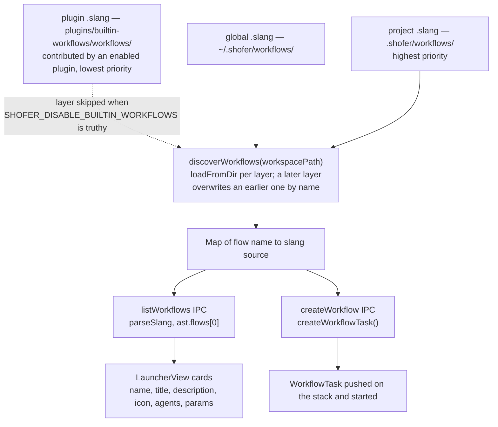

# Built-in Workflows — Design

## Purpose

Ship Shofer's two multi-agent workflows — **Debug** and **Implement a Feature** — as
plain `.slang` sources a user or project can read, copy and override. A workflow is a
declarative multi-agent program: a `flow` with typed params and one or more `agent`
blocks, executed by core's `WorkflowTask`.

This document covers the plugin: what it contributes, and the core-side machinery
(discovery, precedence, validation, launch) that turns a contributed `.slang` file into
a running task. The workflow _specifications_ themselves — phases, agents, budgets,
message topology — live in the `.slang` files, which are commented. For the
`WorkflowTask` executor architecture, mode mapping, UI integration, public API and
persistence, see [`docs/workflow_design.md`](../../docs/workflow_design.md); for the
language, [`docs/slang_specs.md`](../../docs/slang_specs.md).

## The shipped workflows

| Flow name           | Title               | Description                                                                                                                                                         | Icon     | Source                                                                     |
| ------------------- | ------------------- | ------------------------------------------------------------------------------------------------------------------------------------------------------------------- | -------- | -------------------------------------------------------------------------- |
| `debug`             | Collaborative Debug | Two developers independently triage, converge on root cause through peer review, get user sign-off, then one fixes and the other reviews.                           | `bug`    | [`workflows/debug.slang`](./workflows/debug.slang)                         |
| `implement-feature` | Implement a Feature | Multi-agent feature implementation pipeline. Architect orchestrates exploration, design approval, implementation, and review with Developer + Reviewer specialists. | `wrench` | [`workflows/implement-feature.slang`](./workflows/implement-feature.slang) |

Both are declared in [`plugin.json`](./plugin.json) under `contributes.workflows`, with
`permissions.workflows: true` and `defaultEnabled: true`.

Each `.slang` file contains exactly one `flow` declaration with optional `title`,
`description` and `icon` meta fields, plus one or more `agent` blocks. The `flow` name is
the machine identifier; `title` is the human-readable label shown in the UI.

Workflows are **orthogonal to modes**. A Workflow Task has no mode — its mode string is
the flow name (e.g. `"debug"`). Modes apply to the **agent Tasks** the workflow spawns,
giving them their system prompt, API configuration, model, and tool access.

## Why a plugin

The `.slang` sources are a `contributes.workflows` contribution, not files inside the
extension bundle. That makes the shipped set a unit an organization can remove wholesale
(see [Governance](#governance-suppressing-the-built-ins)) and a user can fork file by
file, without core carrying any knowledge of which workflows exist. Core owns the
_mechanism_ — discovery, precedence, parsing, launch — and nothing about Debug or
Implement a Feature in particular.

## What core keeps — the seams this plugin uses

### `contributes.workflows` and `discoverWorkflows()`

**File:** [`src/core/workflow/WorkflowTask.ts`](../../src/core/workflow/WorkflowTask.ts)

`discoverWorkflows(workspacePath)` is the single entry point for workflow discovery. It
returns a `Map<string, string>` of flow name → `.slang` source. Priority order, lowest to
highest:

| Priority    | Directory                        | Scope                        |
| ----------- | -------------------------------- | ---------------------------- |
| 1 (lowest)  | [`workflows/`](./workflows/)     | Plugin-contributed (shipped) |
| 2           | `~/.shofer/workflows/`           | Global (per-user)            |
| 3 (highest) | `<workspace>/.shofer/workflows/` | Project (per-workspace)      |

The plugin layer is the `workflows/` dir of every enabled plugin that declares
`contributes.workflows`, read through `PluginManager.getContributedWorkflowDirs()`. Each
directory is loaded by the private helper `loadFromDir()`, which reads all `.slang` files
and inserts them keyed by filename minus the `.slang` extension. Later layers overwrite
earlier ones on name collision — there is no partial merging of agent declarations or
parameters: a project's `.shofer/workflows/debug.slang` replaces the shipped `debug`
entirely.

`discoverWorkflows` is re-exported from [`src/core/workflow/index.ts`](../../src/core/workflow/index.ts).

### Workflows are not namespaced — deliberately

Plugin modes, skills and commands are namespaced `<plugin>:<name>` so contributions
cannot collide. Workflows are the exception: a workflow is addressed by the flow name
inside its source, and discovery is a plain priority merge — plugin < global < project —
so a user or project file of the same name simply overrides a shipped one.

That is the point. **Forking a shipped workflow means copying it into
`.shofer/workflows/` and editing it**, and namespacing would break that: the copy would
land under a different address instead of taking the original's place, and the launcher
would show both.

### Validation

**File:** [`packages/core/src/workflow/validate-slang.ts`](../../packages/core/src/workflow/validate-slang.ts)

`validateSlangProgram(source)` parses a `.slang` source string and runs static analysis
(`validateSlangAST`). It returns a `SlangValidationResult`:

| Field              | Type       | Description                                     |
| ------------------ | ---------- | ----------------------------------------------- |
| `valid`            | `boolean`  | `true` when there are no errors                 |
| `errors`           | `string[]` | Parse-level errors (syntax, lexer)              |
| `structuralErrors` | `string[]` | Structural errors (unknown agent refs, etc.)    |
| `warnings`         | `string[]` | Analysis warnings (missing converge, deadlocks) |

The Slang editor provider and the `listWorkflows` handler call it to surface diagnostics
before execution.

The AST types are in [`packages/core/src/workflow/slang-ast.ts`](../../packages/core/src/workflow/slang-ast.ts) —
`FlowDecl` carries `name`, `params`, `title`, `description`, `icon` and `body`; each
`AgentDecl` carries `meta` (with `role`, `model`, `tools`, `retry`, `peers`) and
`operations`.

### Launch — the `listWorkflows` / `createWorkflow` IPC handlers

**File:** [`src/core/webview/webviewMessageHandler.ts`](../../src/core/webview/webviewMessageHandler.ts)

`listWorkflows` — the webview requests the discovered set. The handler calls
`discoverWorkflows(provider.cwd)`, parses each source with `parseSlang()` and reads
`ast.flows[0]` for the launcher metadata: `name` (machine id), `title` (falls back to
`name`), `description`, `icon`, `agents` (the `AgentDecl` names in the flow body) and
`params` (each `{ name, type, description }`). An unparseable `.slang` file falls back to
`{ name, title: name, description: "", icon: undefined, agents: [], params: [] }`. The
handler posts a `workflowsList` message with that array, which populates the
`LauncherView` cards.

`createWorkflow` — the user picks a card, and the handler:

1. Re-discovers workflows to get the latest `.slang` source.
2. Creates a `WorkflowTask` via `createWorkflowTask()`.
3. Pops the current task to the background (parallel execution) without aborting it.
4. Pushes the `WorkflowTask` onto the stack and starts it.
5. Posts `chatButtonClicked` + `focusInput` to navigate the webview.

## Governance: suppressing the built-ins

An organization can remove the shipped `.slang` workflows entirely so that ONLY
global/project (bundle-provided) workflows remain — letting a config bundle fully define
the available workflow set. The control is the **`SHOFER_DISABLE_BUILTIN_WORKFLOWS`**
environment variable (truthy = `1`/`true`/`yes`/`on`), delivered on the executor /
code-server pod (the SaaS `resource-manager` sets it, the same channel as
`SHOFER_GLOBAL_DIR`). It is **not** a persisted user setting: it never appears in
`globalSettingsSchema` or the Settings UI and cannot be toggled from the webview.

Because the built-ins ship as a plugin, suppression has exactly one expression:
`governanceDisabledPlugins()` in
[`packages/core/src/config/governance.ts`](../../packages/core/src/config/governance.ts)
(re-exported from `@shofer/core`) adds `builtin-workflows` to the list `PluginManager`
consumes as `forceDisabledPlugins`, ignoring the user's enable state. A suppressed plugin
contributes nothing, so `getContributedWorkflowDirs()` never yields this plugin's
`workflows/` dir and `discoverWorkflows()` returns only the global + project layers.
Higher-priority layers are unaffected.

`SHOFER_DISABLED_PLUGINS` (comma-separated) is the general form of the same control.

## Deliberate limits

- **Override is whole-file, not merge.** A same-named global or project workflow replaces
  the shipped one outright; there is no way to tweak one agent block and inherit the rest.
- **One flow per file.** Discovery keys on the filename, and the launcher reads
  `ast.flows[0]`; a second `flow` in the same source is not surfaced.
- **A workflow cannot be addressed per-plugin.** The non-namespacing that makes forking
  work also means two plugins contributing the same flow name silently resolve by load
  order.

## File index

| File                                                                                                               | Role                                                                                                                  |
| ------------------------------------------------------------------------------------------------------------------ | --------------------------------------------------------------------------------------------------------------------- |
| [`plugin.json`](./plugin.json)                                                                                     | Manifest — `contributes.workflows`, `permissions.workflows`, `defaultEnabled`                                         |
| [`workflows/debug.slang`](./workflows/debug.slang)                                                                 | Debug workflow `.slang` source                                                                                        |
| [`workflows/implement-feature.slang`](./workflows/implement-feature.slang)                                         | Implement a Feature workflow `.slang` source                                                                          |
| [`src/core/workflow/WorkflowTask.ts`](../../src/core/workflow/WorkflowTask.ts)                                     | `WorkflowTask` class, `slangLoop()`, `discoverWorkflows()`, `createWorkflowTask()`, `createWorkflowTaskFromHistory()` |
| [`src/core/workflow/index.ts`](../../src/core/workflow/index.ts)                                                   | Host-side workflow barrel — re-exports `discoverWorkflows`, `createWorkflowTask`                                      |
| [`src/core/workflow/wait-for-task-helper.ts`](../../src/core/workflow/wait-for-task-helper.ts)                     | Shared event-driven wait helper (used by both `WaitForTaskTool` and `WorkflowTask.waitForStakes`)                     |
| [`packages/core/src/workflow/index.ts`](../../packages/core/src/workflow/index.ts)                                 | Barrel export for the host-agnostic interpreter stack                                                                 |
| [`packages/core/src/workflow/slang-ast.ts`](../../packages/core/src/workflow/slang-ast.ts)                         | AST type definitions (`FlowDecl`, `AgentDecl`, `AgentMeta`, `Operation`, etc.)                                        |
| [`packages/core/src/workflow/slang-parser.ts`](../../packages/core/src/workflow/slang-parser.ts)                   | Public API — `parseSlang()`, `validateSlangAST()`                                                                     |
| [`packages/core/src/workflow/slang-parser-upstream.ts`](../../packages/core/src/workflow/slang-parser-upstream.ts) | Vendored parser from `@riktar/slang` (MIT)                                                                            |
| [`packages/core/src/workflow/slang-lexer.ts`](../../packages/core/src/workflow/slang-lexer.ts)                     | Lexer (vendored)                                                                                                      |
| [`packages/core/src/workflow/slang-resolver.ts`](../../packages/core/src/workflow/slang-resolver.ts)               | Dependency graph, deadlock detection, static analysis warnings                                                        |
| [`packages/core/src/workflow/slang-types.ts`](../../packages/core/src/workflow/slang-types.ts)                     | Runtime state types (`FlowState`, `AgentState`, `MailboxEntry`) + serialization                                       |
| [`packages/core/src/workflow/validate-slang.ts`](../../packages/core/src/workflow/validate-slang.ts)               | `validateSlangProgram()` — parse + validate in one call                                                               |
| [`packages/core/src/config/governance.ts`](../../packages/core/src/config/governance.ts)                           | `governanceDisabledPlugins()` — the `SHOFER_DISABLE_BUILTIN_WORKFLOWS` reader                                         |
| [`src/core/webview/webviewMessageHandler.ts`](../../src/core/webview/webviewMessageHandler.ts)                     | `listWorkflows` and `createWorkflow` IPC handlers                                                                     |
| [`src/core/webview/ShoferProvider.ts`](../../src/core/webview/ShoferProvider.ts)                                   | `createTask()` — spawns agent Tasks with `initialMode`; `_restoreWorkflowTask()`                                      |
| [`src/core/webview/SlangEditorProvider.ts`](../../src/core/webview/SlangEditorProvider.ts)                         | Custom editor for `.slang` files (opens as editor tab)                                                                |
| [`src/extension/api.ts`](../../src/extension/api.ts)                                                               | Public API — `ShoferAPI.discoverWorkflows()`, `ShoferAPI.createWorkflow()`                                            |
| [`src/activate/registerCommands.ts`](../../src/activate/registerCommands.ts)                                       | `+` button → QuickPick (New Task / New Workflow)                                                                      |
| [`packages/types/src/history.ts`](../../packages/types/src/history.ts)                                             | `HistoryItem` extensions: `isWorkflow`, `slangSource`, `flowState`                                                    |
| [`webview-ui/src/components/launcher/LauncherView.tsx`](../../webview-ui/src/components/launcher/LauncherView.tsx) | Workflow launcher UI — lists discovered `.slang` workflows as launchable cards                                        |
| [`webview-ui/src/components/chat/WorkflowView.tsx`](../../webview-ui/src/components/chat/WorkflowView.tsx)         | Dedicated workflow chat surface — mirrors ChatView for WorkflowTasks                                                  |
| [`webview-ui/src/components/chat/TaskSelector.tsx`](../../webview-ui/src/components/chat/TaskSelector.tsx)         | Workflow-aware task tree (codicon-organization icon, "Workflow: name" titles)                                         |
| [`webview-ui/src/components/chat/ChatView.tsx`](../../webview-ui/src/components/chat/ChatView.tsx)                 | Defers to WorkflowView when `currentTaskItem.isWorkflow`                                                              |

## Related

- [`docs/workflow_design.md`](../../docs/workflow_design.md) — workflow abstraction
  design: architecture, Slang→Shofer mapping, executor design.
- [`docs/slang_specs.md`](../../docs/slang_specs.md) — Slang language reference: grammar,
  operations, semantics, pitfalls.
- [`docs/plugin_system.md`](../../docs/plugin_system.md) §5.7 — the
  `contributes.workflows` extension point.
- [`plugins/builtin-modes/`](../builtin-modes/) — the built-in modes, which give the
  agent Tasks a workflow spawns their system prompt, tools and API configuration.
  </content>
  </invoke>
