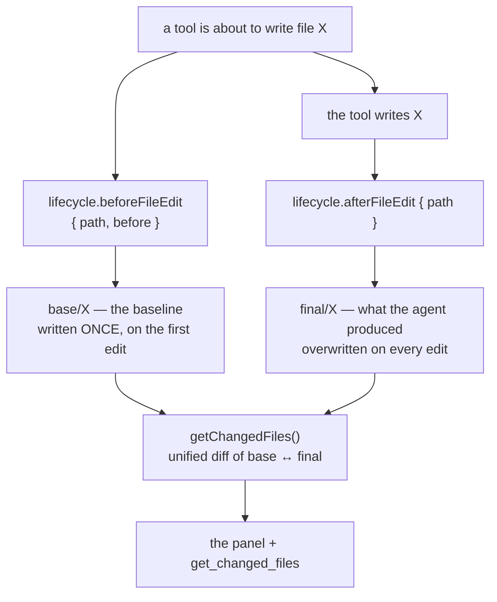

# File Changes — design

## The question this answers

_What did this task do to my workspace, and can I undo it?_

Answering it needs two pieces of state that exist for only an instant: the file **before**
the agent wrote it, and the file **as the agent left it**. Everything else — counts,
diffs, revert, accept — is derived from that pair.

## Two copies per file, owned by the task

The pair is deliberately **not** "the file then vs the file now":

- **The baseline is captured once.** A later edit in the same task must not move it, or
  reverting would restore something the agent itself wrote.
- **The right-hand side is the agent's copy, not the live file.** Two tasks editing one
  file in one worktree would otherwise report each other's work — and a formatter running
  on save would show up as the agent's change.
- **The live file is read for exactly two things**: capturing `final` after an edit, and
  deciding that a file whose content is back at the baseline is no longer a change (which
  is how "the user reverted it by hand" leaves the panel).

## Why the hooks, and not `beforeToolCall`

The plugin could in principle watch `beforeToolCall` and read the paths out of the tool's
arguments. It must not, because only the tool knows what it is about to touch: a path can
be embedded in a patch body, resolved by the language server (a symbol rename hitting a
dozen files), or be the destination of a move. Reimplementing each tool's semantics in the
plugin would be wrong the day a tool changes — and wrong _silently_, as a file quietly
missing from the list.

So core publishes the fact instead, at the point where it already tracks file context:

| Core                                                | Plugin                                 |
| --------------------------------------------------- | -------------------------------------- |
| `FileContextTracker.captureOriginal(path, content)` | `beforeFileEdit` → write `base/<path>` |
| `trackFileContext(path, "shofer_edited")`           | `afterFileEdit` → write `final/<path>` |

`beforeFileEdit` is **awaited** (a baseline taken after the write is worthless);
`afterFileEdit` is fire-and-forget (the content is on disk either way). Neither can fail a
tool: the registry isolates errors and applies the plugin's hook budget.

## The candidate set

"Which files did this task touch?" is answered by the plugin's own storage — every path
with a snapshot in `originals/` or `finals/`, newest first (the real path is stored inside
each snapshot; the file name is a hash of it). Deriving it from the store rather than from
core's task metadata means the list and the data behind it cannot disagree, and it keeps
core free of any notion of "tracked file".

A path with only a `final` — a tool that produced content without a readable baseline, like
a generated image — still appears, with diffing disabled. That mirrors the built-in.

## Reading the list

`getChangedFiles` walks the candidates and, per file:

1. Reads the baseline and the produced state. No produced state yet (the hook is
   fire-and-forget) ⇒ falls back to the live file for that one entry.
2. Drops it when the net effect is nothing: absent → absent, or `base === final`.
3. Drops it when the live file currently equals the baseline (you reverted it).
4. Counts insertions/deletions from a real unified diff of `base` ↔ `final`.
5. Derives `added` / `deleted` / `modified` from which sides exist — never from the live
   file.

Entries that end at `+0/−0` are filtered out: no diff worth showing.

## Requests

The panel talks to the plugin through `PluginUIApi.request`, which the host routes to the
plugin instance **on the task's own host** — so a task running on a remote executor behaves
exactly like a local one, with no branch in the UI.

| Method            | Mutates | What it does                                                                                                             |
| ----------------- | ------- | ------------------------------------------------------------------------------------------------------------------------ |
| `get`             | no      | The change list for the focused task                                                                                     |
| `diff`            | no      | The before/after pair for one file                                                                                       |
| `local:show-diff` | no      | Opens that pair in **this** host's editor (an executor has none)                                                         |
| `revert`          | yes     | One file back to its baseline (asks first if you edited it since)                                                        |
| `revert-all`      | yes     | Every file, behind one confirmation                                                                                      |
| `accept`          | yes     | Promote this file's current disk state to the new baseline                                                               |
| `accept-all`      | yes     | The same for every file                                                                                                  |
| `task-stats`      | no      | `{ insertions, deletions }` — the broadcast question core asks every plugin when a task completes, for the history badge |

`accept` reads the **disk**, not the produced copy: after the agent's write the file may
have been reformatted on save or edited by you, and promoting a stale copy leaves a hash
mismatch that brings the entry straight back on the next refresh.

The active-task guard lives here too: a mutating request throws when `ctx.taskStreaming`
is set. The host adds that flag when it builds the request context, because a plugin cannot
see the agent loop.

## Keeping the panel current

- **Local task:** `afterFileEdit` schedules a debounced push (500 ms) over the plugin's UI
  channel, serialized so a burst of accepts cannot deliver a stale list last.
- **Remote task:** the executor's push reaches its own webview, not this one, so the panel
  re-reads when the task's `messageCount` changes (throttled to once a second) and after
  every action.

## What lives where

| File                    | Role                                                                    |
| ----------------------- | ----------------------------------------------------------------------- |
| `src/snapshot-store.ts` | The two copies + their metadata, per task. Knows nothing about diffs.   |
| `src/changed-files.ts`  | The list, the diff counts, revert/accept. Knows nothing about the host. |
| `src/main.ts`           | Hooks, requests, the tool, the UI push — the only file that sees `ctx`. |
| `ui/panel.tsx`          | The `chat-footer` bundle.                                               |
| `src/vendor/diff.mjs`   | Pre-bundled `diff` (see `build-ui.mjs` for why it is vendored).         |
