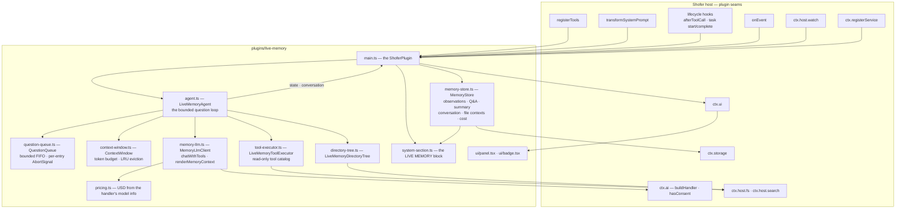
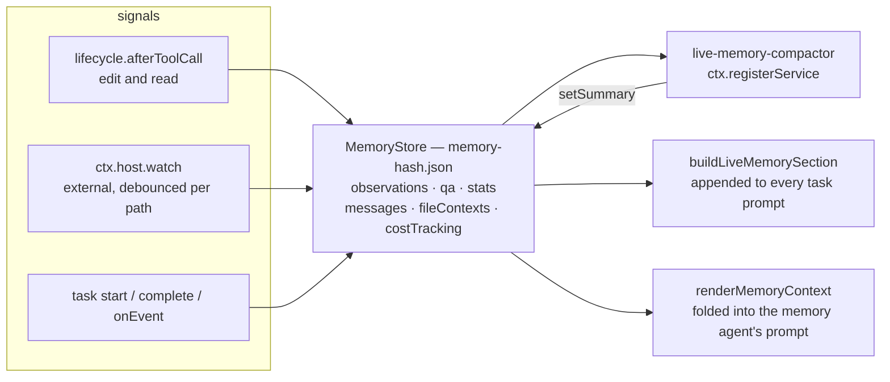
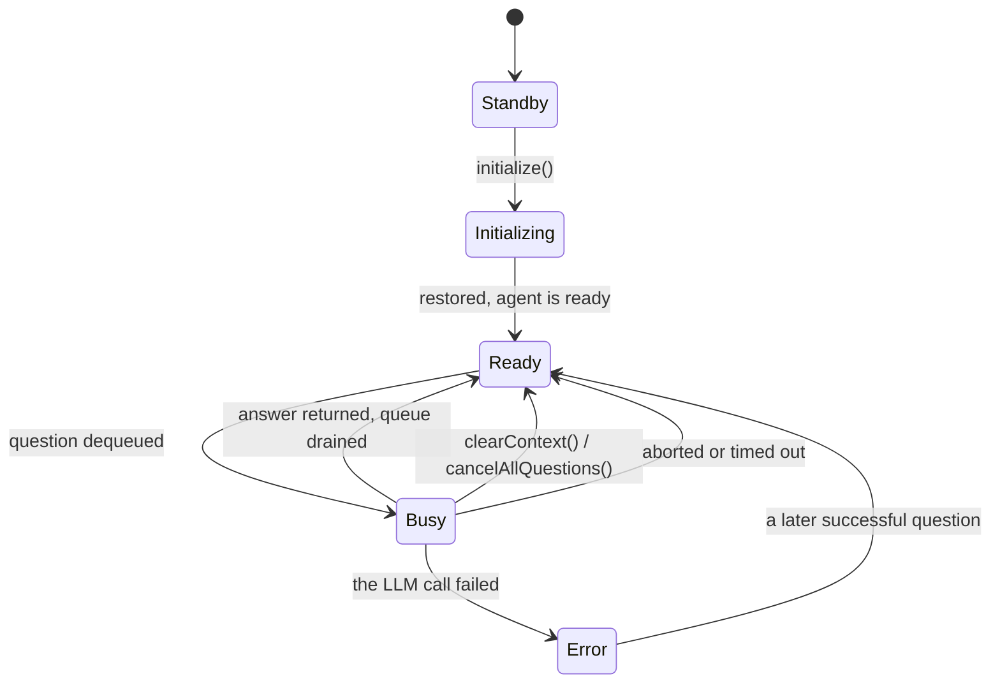
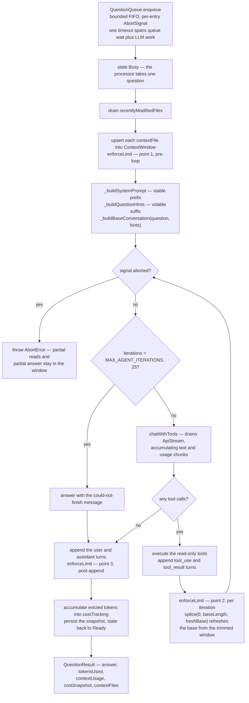
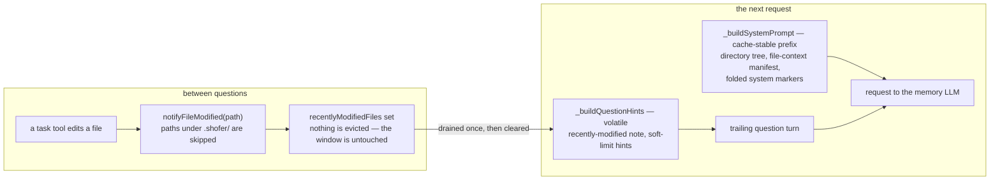

# Live Memory — design

## Purpose

The Live Memory is a **persistent, long-context LLM companion** for one workspace. Where a
task's agent is ephemeral — created for a task, destroyed with it — the Live Memory
survives task termination and editor restarts. It runs on a **cheap model with a very
large context window**, accumulates knowledge of the codebase over time, and answers
questions for other agents so they do not have to re-read the repository themselves. It
is reached through the `ask_live_memory` tool the plugin contributes.

It knows two things, kept separately and used together:

- a **knowledge log** — a durable, workspace-scoped record of what Shofer edited and read,
  what changed on disk outside Shofer, and every question/answer pair, with a running
  summary compacted in the background;
- a **conversation window** — the memory agent's own token-budgeted context, holding the
  transcript and the file contents it has pulled in, persisted so a session resumes after
  a restart.

The design principles behind it:

- **Persistent context** — the conversation survives task termination and editor restarts.
- **Cheap + large context** — the user points it at a low-cost, large-window provider
  profile; it never shares the task agent's model by necessity.
- **File-aware** — it observes both Shofer's own tool activity and external edits, so it
  knows which of the files it has read went stale.
- **Serialized access** — questions are queued; exactly one is processed at a time.
- **KV-cache preserving** — the context window is append-only during normal operation. A
  file modified by a task is never evicted; instead a "recently modified" note rides on the
  next question. That keeps the provider's attention cache warm, which is what makes the
  large window affordable.
- **Cold start** — the window starts empty and fills organically as tasks ask questions.
- **Truncation, not summarization** — when the budget is exceeded, the oldest content is
  dropped. Nothing is lossily compressed, so what remains is verbatim.
- **Strictly read-only** — the memory agent has no write tools, no shell, no MCP. Its tool
  catalog is a fixed allow-list.
- **Fixed system prompt** — internally defined, not user-configurable. It instructs the
  agent to be a concise, read-only codebase Q&A assistant and carries a snapshot of the
  workspace file hierarchy, capped at ~10% of the context window.

## Why a plugin

Everything the Live Memory does costs the user money and needs a provider profile of its
own. As a plugin it can be absent entirely — no tool in any task's catalog, no prompt
section, no watcher, no background service, no stored observations — rather than being a
core subsystem that is merely switched off. It owns its domain types, its persistence
format and its prompt (`types.ts` — zero footprint in `@shofer/types` / `@shofer/core`),
and it reaches into no core internals: every signal it consumes comes through the public
plugin surface.

It ships **enabled** (manifest `defaultEnabled: true`) but **inert**. `isReady(ctx)` is
`ctx.ai.hasConsent()`, and every hook returns early until the user grants the separate
**billed-AI consent** in Settings → Plugins. An unconsented install contributes no tool, no
prompt section, no watcher, no service and stores no observations. It is not silent about
that: the chat-input badge and the panel render a **"needs your approval"** state
(`NEEDS_APPROVAL_STATE`) whose button posts `openSettings`, which calls
`ctx.ui.openSettings()` and takes the user to the consent control. Granting it reloads the
plugin and it comes alive through the same code path a manual enable takes.

## The seams this plugin uses

Core knows nothing about knowledge logs, memory agents or context windows. It provides the
generic plugin seams the feature is built from, all documented in
[`plugin_system.md`](../../docs/plugin_system.md):

| Seam                                                 | What Live Memory uses it for                                                                                   |
| ---------------------------------------------------- | -------------------------------------------------------------------------------------------------------------- |
| `registerTools` (`permissions.tools`)                | Contributes `ask_live_memory` via `defineCustomTool` — returns `[]` while unconsented                          |
| `transformSystemPrompt` (`permissions.systemPrompt`) | Appends the live "LIVE MEMORY" section, rebuilt from the store on every prompt build                           |
| `ctx.ai.buildHandler()` (`permissions.ai`)           | The memory LLM. The plugin never sees provider keys; the handler is the host's                                 |
| `ctx.ai.hasConsent()`                                | The billed-AI consent gate — readable without making a billed call                                             |
| `ctx.storage`                                        | The traversal-blocked per-plugin directory holding `memory-<hash>.json`                                        |
| `ctx.host.watch(glob, cb)`                           | External edits, with the changed path and change kind carried through to the callback                          |
| `ctx.host.fs` (`permissions.filesystem: ["."]`)      | Sandboxed reads: `contextFiles`, the directory-tree glob, on-load file-context validation                      |
| `ctx.host.search` (`permissions.search`)             | The memory agent's search-backed read tools (`rag_search`, `git_search`, `list_code_usages`, `get_errors`)     |
| `ctx.registerService` (`permissions.lifecycle`)      | The supervised `live-memory-compactor` maintenance service                                                     |
| `lifecycle.afterToolCall`                            | Observing Shofer's own file activity — tool name, args **and** result                                          |
| `lifecycle.beforeTaskStart` / `afterTaskComplete`    | Task markers in the knowledge log (the start marker carries a truncated prompt)                                |
| `onEvent`                                            | Coarse markers for anything else in the telemetry catalog                                                      |
| `ctx.ui` (`permissions.ui`)                          | The `sidebar-panel` chat view and the `chat-input-toolbar` badge, plus `openSettings` / `showPanel`            |
| `onUiMessage`                                        | The panel/badge command vocabulary: `ready`, `getState`, `openSettings`, `showChat`, `clear`, `reset`, `empty` |
| `ctx.config` + manifest `config`                     | All settings, rendered in Settings → Plugins — the plugin touches no `ContextProxy` key                        |
| `contributes.skills` / `contributes.commands`        | The three human-facing skills and four slash commands — no host command registry involved                      |
| `ctx.host.telemetry`                                 | `capture("agent_error", { kind })` on a failed question, tagged `plugin: "live-memory"`                        |

Every one of those is feature-agnostic. In particular, `afterToolCall` gives **strictly
more** signal than a bespoke core coupling would: it fires for every tool with the tool
name, its arguments (carrying the path) and the result string, so the plugin can observe
edits _and_ reads and attach a result excerpt — with no core change.

## Architecture

`main.ts` is a thin orchestrator: it declares the `ShoferPlugin` (hooks, the
`ask_live_memory` tool, the prompt transform, the UI channel) and owns the process-lived
state the hooks share — one `MemoryStore` and one `LiveMemoryAgent` per workspace, keyed by
`ctx.workspacePath ?? ctx.cwd`. All the work lives in focused collaborators it composes.



Settings come from the manifest `config` schema via `ctx.config`; the slash commands come
from `contributes.commands`. The plugin touches neither `ContextProxy` nor the host command
registry.

### Key source files

| File                           | Role                                                                                                                                                                                                     |
| ------------------------------ | -------------------------------------------------------------------------------------------------------------------------------------------------------------------------------------------------------- |
| `main.ts`                      | The `ShoferPlugin`: `initialize`, `registerTools` (`ask_live_memory`), `transformSystemPrompt`, `onUiMessage`, `onEvent`, the lifecycle hooks, the `ctx.host.watch` subscription, the compactor service. |
| `memory-store.ts`              | Per-workspace persistence over `ctx.storage`: observations, Q&A pairs, stats/summary, and the conversation slice (messages, file contexts, cost ledger).                                                 |
| `agent.ts`                     | `LiveMemoryAgent` — the question-answering loop, bounded by `MAX_AGENT_ITERATIONS`, plus the agent state machine and the `recentlyModifiedFiles` hint.                                                   |
| `question-queue.ts`            | `QuestionQueue` — bounded FIFO with a per-entry `AbortSignal`, reentrant-safe drain loop, per-entry timeouts, bulk `cancelAll()`.                                                                        |
| `context-window.ts`            | `ContextWindow` — messages + file contexts with token estimates, LRU eviction, `ContextUsage` reporting, evicted-token accounting.                                                                       |
| `memory-llm.ts`                | `MemoryLlmClient` over `ctx.ai.buildHandler()` (streaming, abort-aware, tool-call chunk accumulation), plus `renderMemoryContext`, `answerFromMemory` and `summarizeMemory`.                             |
| `tool-executor.ts`             | `LiveMemoryToolExecutor` — dispatches the read-only catalog over `ctx.host.search` and the scoped `ctx.host.fs`.                                                                                         |
| `directory-tree.ts`            | `LiveMemoryDirectoryTree` — workspace scan rendered as a `find .`-style tree, capped at `DIRECTORY_TREE_MAX_CONTEXT_FRACTION` of the window.                                                             |
| `system-section.ts`            | `buildLiveMemorySection` — the "LIVE MEMORY" block appended by `transformSystemPrompt`.                                                                                                                  |
| `pricing.ts`                   | `estimateUsdCost` — per-model USD from the handler's `getModel().info.{inputPrice,outputPrice}`, with fallback rates.                                                                                    |
| `types.ts`                     | The plugin's own domain types, constants and the fixed `LIVE_MEMORY_SYSTEM_PROMPT`.                                                                                                                      |
| `ui/panel.tsx`, `ui/badge.tsx` | The `sidebar-panel` chat view and the `chat-input-toolbar` status badge, built to `ui/*.js` by `build-ui.mjs`.                                                                                           |
| `plugin.json`                  | Manifest: permissions, contributed UI/skills/commands, and the `config` schema behind Settings → Plugins.                                                                                                |
| `__tests__/`                   | Vitest specs for the store, queue, context window, agent, tool executor, pricing, directory tree, system section, config and consent gating.                                                             |

### Module contracts

The collaborators are **concrete classes**, not interfaces (there is no `interfaces/`
directory). `main.ts` depends directly on each; substitution for testing is constructor
injection at the spec level.

- **`MemoryStore`** — `load()`, `snapshot()`, `recordObservation(obs)`, `recordQa(q, a)`,
  `setSummary(s)`, `saveConversation(snapshot)`, `empty()`, `relativePath` getter.
  Constructed with `(storage, workspacePath, { maxObservations, maxQuestions, hostFs })`.
  Loads are backward-tolerant up to `MEMORY_STORE_VERSION`; an unknown/future version
  starts fresh (no migrations). Corrupt or unreadable ⇒ empty defaults, never a throw into
  a hook.
- **`LiveMemoryAgent`** — `initialize(restore?)`, `restore(snapshot)`, `askQuestion(question,
contextFiles?, opts)`, `notifyFileModified(path)`, `cancelAllQuestions()`,
  `clearContext()`, `getModelLabel()`, `getContextUsage()`, `getCostSnapshot()`,
  `getMessages()`, plus `state`, `stateMessage`, `isLiveMemoryAvailable`,
  `conversationTurnCount`, `contextFiles`, `pendingQuestionCount` getters. Emits
  `onStateChange` / `onConversationUpdate`, which `main.ts` forwards to the UI.
- **`QuestionQueue`** — `setProcessor(fn)`, `enqueue(question, contextFiles?, timeoutMs?,
softLimits?): Promise<QuestionResult>`, `cancelAll()`, `pendingCount`, `isProcessing`.
  `softLimits` carries `{ softTimeoutSec?, softResultLength? }` — prompt-embedded
  recommendations, not enforced. Processor signature: `(question, contextFiles, signal,
softLimits) => Promise<QuestionResult>`.
- **`ContextWindow`** — `configure(opts)`, `restore(messages, fileContexts)`, `clear()`,
  `appendMessage`, `upsertFileContext`, `removeFileContext`, `invalidateFileContext`,
  `enforceLimit()`, `getUsage()`, `consumeEvictedTokens()`, plus the `messages`,
  `fileContexts`, `fileContextPaths`, `estimatedTokenCount`, `maxContextTokens`,
  `contextFillThreshold`, `isNearlyFull` getters.
- **`MemoryLlmClient`** — constructed with `(ctx.ai, profileRef)`; builds the host handler
  **lazily and once** via `ctx.ai.buildHandler(profileRef)`. `chatWithTools(opts)` drains the
  stream, accumulating text, reasoning, usage and tool calls (it handles both the
  single-chunk and the streamed `tool_call_start`/`_delta`/`_partial`/`_end` shapes), and
  aborts cooperatively between chunks. `getModelInfo()` is best-effort and cached.
- **`LiveMemoryDirectoryTree`** — constructed with `(workspacePath, maxContextTokens,
hostFs)`; `generate()` returns the formatted tree capped at
  `DIRECTORY_TREE_MAX_CONTEXT_FRACTION * maxContextTokens`. `SKIP_PARTS` (`node_modules`,
  `.git`, `.shofer`, `__pycache__`, `.cache`, `dist`, `out`, `build`, `target`, `.next`,
  `.turbo`) prunes the scan; `FIND_FILES_CAP` bounds the glob.
- **`LiveMemoryToolExecutor`** — `fromContext(ctx)` builds it from `ctx.host`; it dispatches
  exactly the names in `LIVE_MEMORY_PLUGIN_READ_TOOLS` and caps any single result at
  `MAX_TOOL_OUTPUT_BYTES`.

## The knowledge log

The log is what makes the memory persistent independently of any conversation window: it
accumulates whether or not anyone is asking questions, and it is what the system-prompt
section reports on.

`MemoryStore` keeps one JSON document per workspace, named `memory-<hash>.json` where
`<hash>` is an FNV-1a hash of the workspace path (dependency-free, so the module bundles
cleanly). It is written through the traversal-blocked `PluginStorage` surface — the plugin
never touches a host path. Every mutation is write-through, so the tool, the prompt
transform, the lifecycle observers and the maintenance service all share one coherent,
persisted view.

An **`Observation`** is `{ at, kind, subject, via?, note? }`. The four kinds map onto four
distinct seams:

| `kind`     | Source                                                       | `subject`                          | Notes                                                                          |
| ---------- | ------------------------------------------------------------ | ---------------------------------- | ------------------------------------------------------------------------------ |
| `edit`     | `lifecycle.afterToolCall`, tool in `EDIT_TOOLS`              | the path from the tool's arguments | Carries a 160-char excerpt of the tool result; also feeds `notifyFileModified` |
| `read`     | `lifecycle.afterToolCall`, tool in `READ_TOOLS`              | the path from the tool's arguments | No excerpt                                                                     |
| `external` | `ctx.host.watch`, debounced 250 ms per path                  | the changed path                   | `note` records `external create` / `change` / `delete`                         |
| `task`     | `lifecycle.beforeTaskStart` / `afterTaskComplete`, `onEvent` | a marker label                     | The start marker carries the task prompt, truncated to 200 chars               |

`EDIT_TOOLS` is `write_to_file`, `apply_diff`, `insert_content`, `search_and_replace`,
`edit_file`; `READ_TOOLS` is `read_file`. Anything else is ignored by `classify()`.

Observations and Q&A pairs are capped (`maxObservations`, `maxQuestions`) and evicted FIFO,
but the `totalObservations` / `totalQuestions` counters in `stats` survive eviction, so the
prompt section can report lifetime activity honestly. `renderMemoryContext(data)` folds the
log — running summary first, then the last 120 observations oldest-to-newest, then the Q&A
history — into the block the memory agent reasons over on every question.

The **compactor** is a supervised `ctx.registerService` entry named `live-memory-compactor`.
Every `compactIntervalMs` (default 300000; `0` disables it) it calls `summarizeMemory` over
the current snapshot and stores the result via `setSummary`. It is best-effort: a failure
is swallowed rather than surfaced to the host, and its timer is `unref`'d so it never holds
the process open.



## The memory agent

### State machine

`LiveMemoryAgentState` is `Standby | Initializing | Ready | Busy | Error`. The agent is
created lazily on the first question (`getAgent()`), which needs `ctx.ai` and `ctx.host.fs`;
`initialize()` restores the persisted conversation slice and promotes it to `Ready`.



| From           | Event                  | To             | Notes                                                      |
| -------------- | ---------------------- | -------------- | ---------------------------------------------------------- |
| `Standby`      | `initialize()`         | `Initializing` | Restores messages, file contexts and the cost ledger       |
| `Initializing` | restore complete       | `Ready`        | Idle, waiting for questions                                |
| `Ready`        | question dequeued      | `Busy`         | `QuestionQueue` invokes the processor                      |
| `Busy`         | answer returned        | `Ready`        | Stays `Busy` while the queue is non-empty                  |
| `Busy`         | abort / timeout        | `Ready`        | Partial work already in the window is retained             |
| `Busy`         | LLM error              | `Error`        | `stateMessage` carries the reason                          |
| `Busy`         | `cancelAllQuestions()` | `Ready`        | Queued entries are rejected                                |
| any            | `clearContext()`       | `Ready`        | Window cleared, directory tree rebuilt, snapshot persisted |

`types.ts` also declares a wider `liveMemoryStates` enum (adding `Stopping`) for the
persisted/UI vocabulary; the agent itself uses the five above.

### Question pipeline

`ask_live_memory` is **synchronous** for the caller: the task blocks until the answer
returns or the hard timeout expires. One timer covers the **entire** duration — queue wait
plus processing — so a question that waits behind three others cannot silently exceed its
budget.

```
External task calls ask_live_memory (blocking)
  → agent.askQuestion(question, contextFiles?, { timeoutMs, softTimeoutSec, softResultLength })
  → QuestionQueue.enqueue(...) — one timeout spans queue wait + LLM work
  → if the timeout fires at any point:
      abort the in-flight LLM call via the entry's AbortController
      retain partial reads and any partial answer already in the window (KV-cache preserving)
      transition to Ready (or process the next queued question)
      reject with a timeout error

When dequeued (the processor runs with an AbortSignal):
  → state → Busy
  → drain recentlyModifiedFiles
  → read each contextFile → ContextWindow.upsertFileContext(entry)
  → ContextWindow.enforceLimit()                        ← (1) pre-loop enforcement
  → _buildSystemPrompt()      — stable across iterations:
        LIVE_MEMORY_SYSTEM_PROMPT + directory tree (~10% cap)
        + the file-context manifest
        + the accumulated memory context (renderMemoryContext)
        + folded system-role messages from the window
  → _buildQuestionHints(recentlyModified, softLimits)   — the volatile suffix
  → _buildBaseConversation(question, questionHints)
  → agent loop, at most MAX_AGENT_ITERATIONS (25):
        → MemoryLlmClient.chatWithTools({ systemPrompt, messages, tools, signal })
        → no tool calls → this is the final answer, break
        → append the assistant turn (text + tool_use blocks)
        → execute the tool calls, append tool_result blocks
        → ContextWindow.enforceLimit()                  ← (2) per-iteration enforcement
        → freshBase = _buildBaseConversation(question, questionHints)
          conversation.splice(0, baseLength, ...freshBase)   // refresh base, keep in-flight
  → append the user turn and the assistant turn to the window
  → ContextWindow.enforceLimit()                        ← (3) post-append enforcement
  → accumulate evicted tokens into costTracking
  → persist the conversation snapshot
  → state → Ready (or stay Busy if the queue is non-empty)
  → resolve QuestionResult
```

The same pipeline as a graph — note the three `enforceLimit()` points and that an
abort/timeout unwinds without discarding what the window already holds:



Hitting the iteration cap is not an error: the agent answers with an explicit
"unable to finish within `MAX_AGENT_ITERATIONS` tool iterations" message and asks the
caller to narrow the scope, so the turn still ends with something usable.

### Staying aware of file changes

Two complementary mechanisms keep the memory aware of modifications. Both are scoped
by the **`fileGlobs`** config when set: a path matching none of the patterns is dropped
at the hook boundary — no observation, no recently-modified hint — keeping the memory
(and its delta stream) focused on the files that matter (e.g. a docs-only memory with
`preloadGlobs=docs/*.md fileGlobs=docs/*.md`).

**External edits — `ctx.host.watch`.** Changes originating outside Shofer (an edit in
another editor, a `git checkout`, a script) arrive through the host watcher on the
configured `watchGlob`, scoped to the plugin's granted filesystem roots. The callback
carries the concrete path and the change kind; `main.ts` debounces 250 ms per path so a
burst of saves to one file is a single observation.

**Shofer's own edits — `lifecycle.afterToolCall`.** When a task's tool modifies a file,
the file is **not evicted** from the memory's context. Evicting and re-adding it would
invalidate the provider's KV cache, forcing a recomputation of the whole window on the next
request. Instead the path is added to `recentlyModifiedFiles` (paths under `.shofer/` are
ignored), and on the next question that set is drained into a note:

```
[Note: the following files have been modified since you last read them: src/foo.ts,
 src/bar.ts. Consider re-reading them if relevant to this question.]
```

> **Placement matters for the KV cache.** The recently-modified note and the per-question
> soft-limit hints are appended to the **trailing question turn**, never to the
> system-prompt prefix. Providers cache on the longest stable prefix; injecting
> per-question-varying content into the system prefix would invalidate the cache on every
> question — defeating the very eviction-avoidance this mechanism exists to protect.
> `_buildQuestionHints()` produces the volatile suffix that rides on the question.

### The frozen volatile block + observation deltas

The system prompt is two zones. The **stable prefix** (`_buildStablePrompt`) is the fixed
instructions + directory tree. The **volatile block** — accumulated memory context,
preloaded reference docs, the file-context manifest, folded system markers — would
naturally mutate whenever anything is observed, and an in-place mutation truncates the
provider's prefix cache at the first changed byte. So `_prepareSystemPrompt()` **freezes**
it: the block is rendered once (`_renderVolatileBlock`), stored on the agent
(`_frozenVolatile`) with a watermark (`_freezeAt`), and re-sent **byte-identical** on every
subsequent question. Changes after the freeze reach the model as **appended
memory-update delta messages** instead: observations recorded since the watermark are
rendered (`memoryDeltaProvider`) into a history message flagged
`metadata.observation: true` — append-only, so the prefix cache _extends_ rather than
truncates. Newly-loaded `contextFiles` are announced on the volatile question turn (their
manifest entry lands in the block at the next re-freeze).

The block re-freezes only at moments the prompt legitimately changes wholesale — the
compactor rewriting the running summary (`invalidateFrozenPrefix`), `clearContext` /
`resetContext`, or a snapshot restore — amortizing the one-time cache re-write.

### Preloaded reference documents (`preloadGlobs`)

`loadPreloadedDocs` (main.ts) expands the configured globs through `ctx.host.fs.findFiles`,
reads each match (sorted, deduplicated; binary files skipped; per-file cap
`PRELOAD_MAX_FILE_BYTES`), and clamps the total to
min(`preloadMaxTotalBytes`, `PRELOAD_BUDGET_FRACTION` of the window budget in chars) —
preloading past that would leave no room to converse. The docs render **verbatim** in the
frozen volatile block under a "PRE-LOADED REFERENCE DOCUMENTS" heading; they live outside
the evictable `ContextWindow` (a fixed prompt overhead), and their token estimate is
subtracted from the window budget passed to the agent so eviction math stays honest. The
`reset` command re-reads them fresh from disk.

### Keep-warm heartbeat (`keepWarm`, opt-in)

A second supervised service (`live-memory-keepwarm`) periodically calls
`agent.keepWarmPing()`, which re-sends the **same** stable-plus-frozen prompt a real
question would use with a minimal trailing turn — refreshing the provider cache's TTL
across idle gaps. It only fires for an idle agent whose last real question is within
`KEEP_WARM_MAX_IDLE_MS`, and every ping is a billed call, hence off by default.



This approach:

- **Preserves the KV cache** — the existing window is never mutated, so the provider can
  reuse cached attention computations, keeping requests fast and cheap.
- **Informs without forcing** — the model knows which files are stale and decides for itself
  whether re-reading them is relevant to the current question.
- **Aligns with worktree practice** — tasks normally operate in worktrees under
  `.worktrees/`, so main-workspace files change mostly after a merge back. The
  memory does not consult git; it only ever sees "file X was modified".
- **Clears on use** — the set is drained after each question, so stale notifications do not
  accumulate.

### Context-window management

The memory uses **truncation, not summarization**. The window is a budgeted structure whose
oldest content is dropped when the limit is reached; nothing is compressed, so what remains
is verbatim. `enforceLimit()` runs at three points during a question (pre-loop, per
iteration, post-append), and at the per-iteration call site the base portion of the
in-flight conversation is **refreshed from the possibly-trimmed window** via
`_buildBaseConversation()`, so the next iteration benefits from the eviction immediately.
The in-flight `tool_use`/`tool_result` turns survive because only the base zone is spliced.

Eviction order inside `enforceLimit()`, repeated until the estimate is under budget or
nothing more can be dropped:

1. the **least-recently-referenced file context** (`lastReferencedAt` ascending);
2. once no file contexts remain, the **two oldest messages** (a user/assistant pair), while
   more than two messages remain.

Everything evicted is accounted into `_evictedTokens`, which the agent consumes into the
cost ledger's `totalTokensTruncated`. Token counts are a cheap character-length heuristic
(`estimateTokens`), not a provider tokenizer.

`isNearlyFull` is `estimatedTokenCount > maxContextTokens * contextFillThreshold`. It is a
signal, not a limit: it rides on every `QuestionResult` as `contextUsage.isNearlyFull`,
shows in the badge, and appears with a ⚠️ in the task-facing prompt section, so a caller can
choose to clear the context rather than let truncation happen.

The system prompt is rebuilt per question and is never part of the evictable window, so the
directory tree can never be truncated away.

### Directory-tree injection

On agent creation, and again on Clear Context, the workspace is scanned and rendered as a
`find .`-style hierarchy inside the system prompt, giving the memory immediate orientation
without spending a tool call on `list_files`. `SKIP_PARTS` prunes the obvious noise
directories and hidden entries, `FIND_FILES_CAP` bounds the glob, and the render is capped
at `DIRECTORY_TREE_MAX_CONTEXT_FRACTION` (10%) of the window — e.g. 12,800 tokens for a
128K window — truncating the deepest and last lines first. A failure degrades to
`[Workspace directory tree unavailable]` rather than failing the question.

## Data types

**`AgentMessage`** — one conversation turn. `parts` preserves the stream order of an
assistant turn (interleaved reasoning, text and tool calls) so the panel can replay it as it
happened; `content` stays the canonical flat-text summary. A `tool_call` part mutates in
place: appended with `inProgress: true` when the model emits the call, then filled in with
`result` / `isError` when the tool returns.

```typescript
{
	id: string                    // UUID
	role: "user" | "assistant" | "system"
	content: string
	timestamp: number             // Unix ms
	parts?: AgentMessagePart[]    // text | reasoning | tool_call
	metadata?: {
		sourceTaskId?: string     // which task asked
		fileReferences?: string[]
	}
}
```

**`FileContextEntry`** — a file loaded into the memory's context:

```typescript
{
	filePath: string
	contentHash: string // SHA-256 of the content at load time
	tokenEstimate: number
	loadedAt: number // Unix ms
	lastReferencedAt: number // Unix ms — eviction priority
}
```

**`QuestionResult`** — what a question resolves to:

```typescript
{
	answer: string
	tokensUsed: { prompt: number; completion: number; total: number }
	contextUsage: {
		currentTokens: number
		maxTokens: number
		fillFraction: number  // 0.0–1.0, current / max
		isNearlyFull: boolean // fillFraction past contextFillThreshold
	}
	costSnapshot: {
		sessionInputTokens: number
		sessionOutputTokens: number
		sessionEstimatedCostUSD: number
	}
	contextFiles: string[]   // files in context when the answer was produced
	durationMs: number
}
```

**`LiveMemoryCostTracking`** — the running ledger, persisted with the conversation:

```typescript
{
	totalInputTokens: number
	totalOutputTokens: number
	totalTokensTruncated: number // tokens dropped by eviction
	estimatedCostUSD: number
	lastUpdated: number // Unix ms
}
```

Cost comes from `estimateUsdCost`, which reads the live handler's
`getModel().info.{inputPrice,outputPrice}` (USD per 1M tokens) and falls back to
conservative constants when the handler reports no price — a local Ollama model or a custom
OpenAI-compatible deployment. The aggregate accumulates across sessions and is restored from
the snapshot on reboot; it surfaces in the badge popover and the chat panel.

## Tools

### The contributed tool: `ask_live_memory`

Registered through `registerTools`, so an unconsented plugin contributes nothing rather than
a tool that would only fail.

| Parameter          | Type       | Required | Meaning                                                                                   |
| ------------------ | ---------- | -------- | ----------------------------------------------------------------------------------------- |
| `question`         | `string`   | yes      | The investigative question to answer from accumulated memory                              |
| `contextFiles`     | `string[]` | no       | Workspace-relative paths to load into the memory's context window first                   |
| `softTimeoutSec`   | `number`   | no       | Advisory wall-time recommendation, embedded in the prompt. Default 60                     |
| `softResultLength` | `number`   | no       | Advisory answer-length recommendation in characters, embedded in the prompt. Default 2000 |

The **hard timeout is not a tool argument**: it is the `questionTimeoutMs` config
option (default `QUESTION_TIMEOUT_MS`), covering queue wait + processing — callers
just ask, and the configured budget applies.

The soft limits are prompt guidance only — nothing cancels on `softTimeoutSec` and nothing
truncates on `softResultLength`. The tool returns a text block carrying the answer followed
by the context fill, duration, token split and session cost, and it records the Q&A pair in
the store so the stats the prompt section reports stay current. Errors are returned as text
(`Live Memory error: …`) rather than thrown, and a failure additionally reports
`ctx.host.telemetry.capture("agent_error", { kind })` — the error's `name` only, never its
message, which can quote the workspace.

### The memory's own tool catalog

The memory agent is strictly read-only, and that is enforced by construction: the catalog is
the fixed `LIVE_MEMORY_PLUGIN_READ_TOOLS` allow-list in `tool-executor.ts`, and a call to
anything outside it is rejected by the dispatcher. There is no path by which a write tool, a
shell command or an MCP tool can reach it.

| Tool                     | Backed by                                   |
| ------------------------ | ------------------------------------------- |
| `read_file`              | `ctx.host.fs`                               |
| `grep_search`            | `ctx.host.fs` (bounded by `GREP_MAX_FILES`) |
| `list_files`             | `ctx.host.fs`                               |
| `find_files`             | `ctx.host.fs`                               |
| `get_changed_files`      | git, via the executor's `runGit` seam       |
| `get_project_setup_info` | `ctx.host.fs`                               |
| `fetch_web_page`         | `ctx.host.fetch` (`permissions.network`)    |
| `rag_search`             | `ctx.host.search`                           |
| `git_search`             | `ctx.host.search`                           |
| `list_code_usages`       | `ctx.host.search`                           |
| `get_errors`             | `ctx.host.search` (diagnostics)             |

Any single tool result is capped at `MAX_TOOL_OUTPUT_BYTES` (200,000) before it reaches the
model. A tool whose backing seam was not granted returns an explicit unavailable result the
model can recover from, rather than throwing — which is what `fetch_web_page` does today,
since the manifest requests no `network` permission.

This buys three things: **safety** (no accidental modification from a companion the user
never approves per-call), **cost control** (the cheap model is never used for expensive
operations), and **predictability** (a caller knows the answer is purely informational).

## Storage topology

| Data                                       | Location                                                      | Survives restart |
| ------------------------------------------ | ------------------------------------------------------------- | ---------------- |
| Observations, Q&A, stats/summary           | `ctx.storage`: `memory-<workspace-hash>.json`                 | Yes              |
| Conversation messages, file contexts, cost | The same document (v2 fields)                                 | Yes              |
| Plugin settings                            | The manifest `config` schema, read via `ctx.config`           | Yes              |
| Provider credentials                       | Never seen by the plugin — the host owns them behind `ctx.ai` | n/a              |

### Persistence format

```json
{
	"version": 2,
	"workspacePath": "/home/user/projects/my-app",
	"updatedAt": 1715680000000,
	"observations": [
		{
			"at": 1715678900000,
			"kind": "edit",
			"subject": "src/services/user-service.ts",
			"via": "apply_diff",
			"note": "…"
		}
	],
	"qa": [{ "at": 1715678901000, "question": "What does UserService do?", "answer": "…" }],
	"stats": { "totalObservations": 812, "totalQuestions": 63, "summary": "…", "summaryUpdatedAt": 1715679900000 },
	"messages": [
		{
			"id": "uuid-1",
			"role": "user",
			"content": "What does the UserService class do?",
			"timestamp": 1715678900000,
			"metadata": { "sourceTaskId": "task-123" }
		},
		{ "id": "uuid-2", "role": "assistant", "content": "The UserService class handles…", "timestamp": 1715678901000 }
	],
	"fileContexts": [
		{
			"filePath": "src/services/user-service.ts",
			"contentHash": "abc123…",
			"tokenEstimate": 2500,
			"loadedAt": 1715678900500,
			"lastReferencedAt": 1715678900500
		}
	],
	"costTracking": {
		"totalInputTokens": 125000,
		"totalOutputTokens": 8500,
		"totalTokensTruncated": 30000,
		"estimatedCostUSD": 0.042,
		"lastUpdated": 1715680000000
	}
}
```

### Restart behaviour

- Observations, Q&A, stats and the cost ledger are restored as they were.
- File contexts are **validated on load**: each file is re-read through `ctx.host.fs` and
  kept only if its SHA-256 still matches. A file modified while the editor was closed is
  evicted; a deleted or unreadable file is evicted.
- The conversation window is restored, and the agent resumes in `Ready` on the first
  question — there is nothing to restart by hand.

## Configuration

Everything is declared in the manifest `config` schema and rendered in Settings → Plugins.
The plugin owns no `ContextProxy` key and no global setting.

| Key                    | Default   | Meaning                                                                                                                                                                                                                                                         |
| ---------------------- | --------- | --------------------------------------------------------------------------------------------------------------------------------------------------------------------------------------------------------------------------------------------------------------- |
| `profileRef`           | `""`      | Provider-profile name/id the memory LLM uses (`ctx.ai.buildHandler`). Empty ⇒ the host default                                                                                                                                                                  |
| `maxObservations`      | `400`     | Retained activity observations per workspace (FIFO eviction)                                                                                                                                                                                                    |
| `maxQuestions`         | `50`      | Retained question/answer pairs per workspace (FIFO eviction)                                                                                                                                                                                                    |
| `watchGlob`            | `**/*`    | Glob (under the granted filesystem roots) watched for external edits                                                                                                                                                                                            |
| `compactIntervalMs`    | `300000`  | Maintenance-service interval for compacting the log into a running summary; `0` disables it                                                                                                                                                                     |
| `maxContextTokens`     | `128000`  | The memory agent's context-window budget                                                                                                                                                                                                                        |
| `contextFillThreshold` | `0.8`     | Fraction of the budget past which the window is flagged "nearly full"                                                                                                                                                                                           |
| `preloadGlobs`         | `""`      | Comma-separated globs (e.g. `docs/*.md`) loaded **verbatim** into the system prompt on agent creation and on the `reset` command. Clamped to `preloadMaxTotalBytes` and 60% of the window budget; the docs' token estimate is subtracted from the window budget |
| `preloadMaxTotalBytes` | `2097152` | Total byte cap across all preloaded reference documents                                                                                                                                                                                                         |
| `fileGlobs`            | `""`      | Monitoring scope: when set, the file-change feed (edit/read observations, external watch, recently-modified hints) applies only to matching workspace-relative paths (fnmatch; `*` crosses `/`). Empty = everything                                             |
| `questionTimeoutMs`    | `300000`  | HARD per-question timeout — the only timeout source; `ask_live_memory` takes no timeout arg                                                                                                                                                                     |
| `keepWarm`             | `false`   | KV/prompt-cache heartbeat: re-send the frozen prompt prefix periodically so the provider cache stays hot. Billed per ping — opt-in                                                                                                                              |
| `keepWarmIntervalMs`   | `240000`  | Heartbeat period (4 minutes — just under typical provider cache TTLs)                                                                                                                                                                                           |

The system prompt is deliberately **not** configurable — it is fixed in `types.ts`. The
user-facing controls are the provider profile, the tuning values above, and the Clear
Context / Empty actions.

Three human-facing skills (`live-memory-stats`, `live-memory-config`, `live-memory-empty`)
and four slash commands (`show-chat`, `clear-context`, `reset`, `empty`) come from the
manifest's `contributes` block. `reset` drops the in-flight window like `clear-context`
AND re-reads the `preloadGlobs` fresh from disk (the observation/Q&A log is kept).

## Key constants

Declared in `types.ts` unless noted:

| Constant                                     | Value     | Purpose                                                         |
| -------------------------------------------- | --------- | --------------------------------------------------------------- |
| `DEFAULT_MAX_CONTEXT_TOKENS`                 | `128000`  | Fallback context-window budget when the config supplies none    |
| `DEFAULT_CONTEXT_FILL_THRESHOLD`             | `0.8`     | Fallback "nearly full" fraction                                 |
| `MAX_QUESTION_QUEUE_SIZE`                    | `50`      | Maximum pending questions (`question-queue.ts` default)         |
| `QUESTION_TIMEOUT_MS`                        | `300000`  | Default hard timeout for one question (5 min)                   |
| `DEFAULT_LIVE_MEMORY_SOFT_TIMEOUT_SEC`       | `60`      | Default advisory wall-time hint embedded in the prompt          |
| `DEFAULT_LIVE_MEMORY_SOFT_RESULT_LENGTH`     | `2000`    | Default advisory answer-length hint embedded in the prompt      |
| `DIRECTORY_TREE_MAX_CONTEXT_FRACTION`        | `0.1`     | Share of the window the directory tree may occupy               |
| `MAX_AGENT_ITERATIONS` (`agent.ts`)          | `25`      | Tool-call iterations before the loop answers "could not finish" |
| `MEMORY_STORE_VERSION` (`memory-store.ts`)   | `2`       | Persisted document version                                      |
| `MAX_TOOL_OUTPUT_BYTES` (`tool-executor.ts`) | `200000`  | Cap on a single tool result fed back to the model               |
| `SKIP_PARTS` (`directory-tree.ts`)           | 11 dirs   | Directories pruned from the workspace scan                      |
| `DEFAULT_PRELOAD_MAX_TOTAL_BYTES`            | `2097152` | Default total byte cap for preloaded reference docs             |
| `PRELOAD_MAX_FILE_BYTES`                     | `262144`  | Per-file byte cap on a preloaded doc                            |
| `PRELOAD_BUDGET_FRACTION`                    | `0.6`     | Window-budget fraction preload may occupy                       |
| `DEFAULT_KEEP_WARM_INTERVAL_MS`              | `240000`  | Keep-warm heartbeat period (4 min)                              |
| `KEEP_WARM_MAX_IDLE_MS`                      | `1800000` | Stop warming after this long without a real question            |

## UI: badge and chat panel

The plugin contributes two UI bundles, both talking to the extension half over the scoped
plugin-UI channel — there are no webview IPC message types for it.

**`chat-input-toolbar` badge** (`ui/badge.tsx`). Shows the agent state, pulses while `Busy`,
and reports context fill. Its popover carries the model label, the token-usage bar, the
files currently in context, the conversation turn count, the session cost, and the actions:
View Chat (`showChat`), Clear Context (`clear`), and Configure / Approve (`openSettings`).
While the plugin is enabled but unconsented the badge renders the "needs approval" state
with a single action that opens the consent control — reporting `Standby` there would be the
plugin pretending to run while every hook returns early.

**`sidebar-panel` chat view** (`ui/panel.tsx`). Renders the full conversation — questions,
answers, interleaved reasoning and tool calls with their results — streaming live while the
agent works, plus the context-usage and cost header. `showPanel({ title: "Live Memory Chat" })`
opens it as a standalone editor panel.

Both are fed by one `pushPanelState()` message carrying the state header, `contextUsage`,
the typed conversation, the observation/Q&A/pending counters, the model label,
`contextFiles`, the turn count and the cost snapshot. It is fired on every state change and
every conversation mutation, and it is best-effort: a detached webview can never break a
hook. The panel drives the plugin with a small command vocabulary (`ready`, `getState`,
`openSettings`, `showChat`, `clear`, `empty`); an unknown command is ignored, so the channel
stays forward-compatible.

The chat view is **read-only** — the user cannot type at the memory. Every question comes
from a task through `ask_live_memory`, which keeps the interaction model simple and prevents
a human from polluting the accumulated window by hand.

## Error handling and recovery

- **Nothing thrown into a hook.** Store loads tolerate a missing or corrupt document by
  starting empty; observation writes, telemetry, model-label reads and UI pushes are all
  best-effort and swallow their failures.
- **Queue resilience.** A failed LLM call rejects that question and moves the agent to
  `Error` with the reason in `stateMessage`; an abort or timeout returns it to `Ready`
  instead, because nothing is broken. `cancelAllQuestions()` rejects everything pending.
- **Partial work is kept.** On abort or timeout, file reads and any partial answer already
  in the window stay there — discarding them would throw away the KV cache the whole design
  is built to preserve.
- **Conversation preservation.** The snapshot is persisted after each completed question, so
  a crash mid-question loses that question, not the session.
- **Clear vs. empty.** `clear` resets the agent's context window and rebuilds the directory
  tree, keeping the knowledge log. `empty` deletes the persisted document through
  `ctx.storage.delete` and drops the live agent, so the next question starts from a blank
  slate. Only the current workspace's file is affected.
- **Truncation is permanent.** Evicted content is gone; it is accounted in
  `totalTokensTruncated` and never summarized back in.

## Multi-workspace

State is a `Map` keyed by `ctx.workspacePath ?? ctx.cwd ?? "default-workspace"`, so each
workspace gets its own store file, agent, conversation window, question queue and cost
ledger. `profileRef` is per-plugin configuration, so all workspaces share the provider
profile.

## Worktree interaction

Shofer runs tasks in per-task git worktrees under `.worktrees/`. The memory treats
them as invisible:

- `SKIP_PARTS` includes `.worktrees` (and `.shofer`), so worktree files never enter the
  directory tree.
- `notifyFileModified` ignores any path under `.worktrees/` or `.shofer/`
  (`IGNORED_MODIFICATION_PREFIXES`), so a worktree edit never produces a
  recently-modified hint. The legacy `.shofer/worktrees/` location is covered by the
  `.shofer/` prefix.
- One memory serves all tasks in the workspace regardless of which worktree they run in; its
  knowledge represents the **main workspace**, not a task branch. Worktree creation and
  deletion are simply not interesting to it.

## Comparison with the RAG indexer

| Aspect              | RAG indexing (`rag_search`)                | Live Memory (`ask_live_memory`)                         |
| ------------------- | ------------------------------------------ | ------------------------------------------------------- |
| **Purpose**         | Semantic code search via vector embeddings | Conversational Q&A over accumulated, persistent context |
| **Storage**         | Qdrant collection + a local hash cache     | One JSON document per workspace in `ctx.storage`        |
| **Context**         | Stateless — each query is independent      | Stateful — a knowledge log plus a conversation window   |
| **Model**           | An embedding model                         | A cheap, large-window chat model                        |
| **Startup**         | Full or incremental scan of all files      | Cold start with an empty window                         |
| **File awareness**  | Re-indexes changed files (re-embeds)       | Notes stale files; the model re-reads them if relevant  |
| **Concurrency**     | Read-only search, no queueing needed       | Questions serialized through a FIFO queue               |
| **Survival**        | Survives restarts (Qdrant + hash cache)    | Survives restarts (the persisted document)              |
| **Overflow**        | n/a (stateless)                            | LRU eviction, no summarization                          |
| **Cost visibility** | Not tracked per query                      | Cumulative token counts + a USD estimate                |

They are complementary: `rag_search` is one of the tools the memory agent itself calls.

## Deliberate limits

- **`.shoferignore` is approximated, not applied.** `HostFileSystem` exposes no directory
  read and there is no ignore-controller plugin seam, so the directory tree is reconstructed
  from a single `findFiles("**/*")` glob and filtered by `SKIP_PARTS` plus the glob's own
  excludes (on a VS Code host that honours `.gitignore`). Genuine `.shoferignore` patterns
  are **not** enforced, even though the fixed system prompt tells the model they are.
- **Token counts are a heuristic.** `estimateTokens` divides by a fixed characters-per-token
  ratio; the budget is therefore approximate, and `tokensUsed` in a `QuestionResult` (which
  comes from the provider's usage chunks) will not match it.
- **No truncation marker is inserted.** Eviction is silent to the model; it sees a shorter
  history with no note saying so.
- **A question is answered by one agent at a time.** The queue is a deliberate serializer —
  parallel questions would multiply cost and thrash the cache the design exists to protect.
- **Cost is an estimate.** It is derived from published per-million-token rates, or from
  conservative fallbacks when the handler reports no pricing; it is not a provider invoice.
- **Declared but unused constants.** `DEFAULT_MAX_RESPONSE_TOKENS`, `FILE_CHANGE_DEBOUNCE_MS`,
  `MIN_CONVERSATION_TURNS_TO_KEEP`, `FILE_CONTEXT_SYSTEM_MESSAGE_PREFIX`,
  `TRUNCATION_MARKER_MESSAGE` and `CONVERSATION_STORE_VERSION` are exported from `types.ts`
  but nothing reads them — the external-edit watch debounces at a literal 250 ms and the
  persisted version is `MEMORY_STORE_VERSION`. They are carried over from the shape the
  types describe, not behaviour to rely on.

## Related

- [`DOGFOOD.md`](./DOGFOOD.md) — the extension-point gap report this plugin was built to
  produce: which seams were sufficient, where fidelity was reduced, what a genuine gap was.
- [`docs/plugin_system.md`](../../docs/plugin_system.md) — the seams themselves.
- [`plugins/rag-indexing/DESIGN.md`](../rag-indexing/DESIGN.md) — the semantic-search
  companion whose `rag_search` the memory agent calls.
