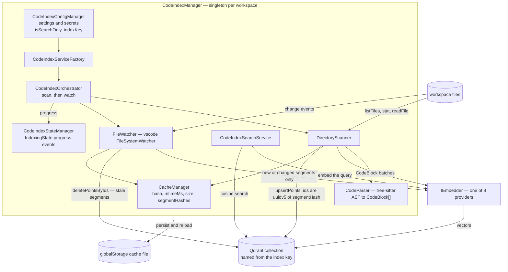
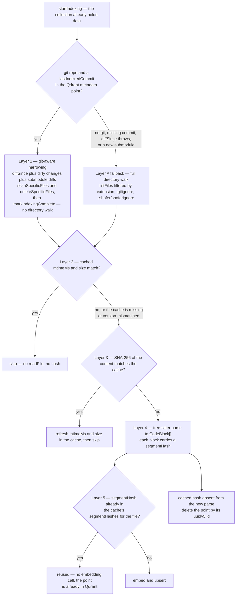
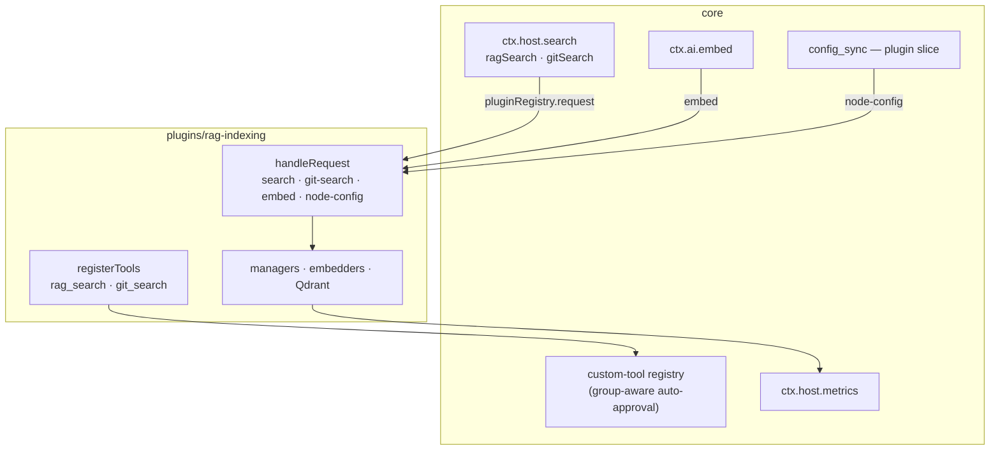
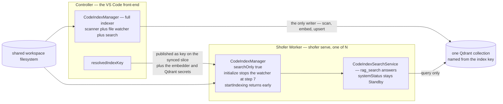
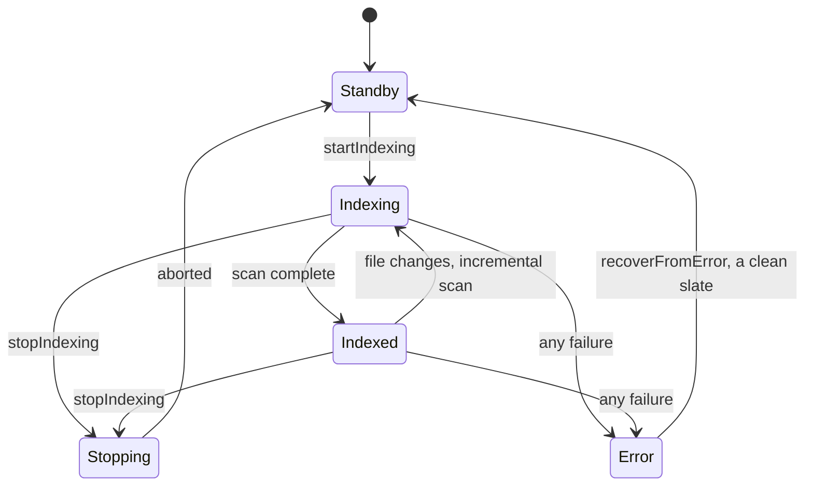

# RAG Indexing — design

## Purpose

Semantic code search (RAG — Retrieval-Augmented Generation): **vector embeddings** in a
**Qdrant** collection let the agent search a codebase by meaning rather than by keyword.
It is a bundled plugin (`plugins/rag-indexing/`), enabled by default (inert until an
embedding provider and Qdrant are configured), and it contributes the
`rag_search` tool — and, with the git-history half, `git_search`. Core's `lsp_search` is
the lighter companion that needs no infrastructure at all.

Two indexes ship in one plugin because they are one feature wearing two hats — the **code
index** (`rag_search`: find code by meaning) and the **git-history index** (`git_search`:
find when and why something changed). They share the embedder, the vector store, the
credentials and the settings panel.

## Why a plugin

The indexer is a _deployment_ choice: it needs an embedding provider, a credential and a
running vector store, and plenty of workspaces want none of that. As a plugin it can be
absent entirely — no settings, no tools in the prompt, no background scan — instead of
being a core subsystem that is merely switched off. What core keeps is listed under
[What core keeps](#what-core-keeps); the short version is the tree-sitter grammars (shared
with the other consumers of the parse path) and the file-type policy lists.

Everything the plugin needs from core it **bundles at build time** (`src/core-shared.ts`);
nothing resolves `@shofer/core` at runtime.

Indexing is **incremental** — startup reconciliation uses a cascade of increasingly selective layers to avoid re-embedding anything that hasn't changed. At the top, git-aware narrowing diffs from the last indexed commit so only changed files are even considered. For the files that remain, a `stat()`-only mtime+size fast-path skips unchanged files without reading them. Files that fail mtime/size fall through to a SHA-256 content-hash check. Files whose content hash changed are parsed, but even then per-segment deduplication checks each block's `segmentHash` against the cache and skips embedding for blocks that already exist in Qdrant with identical content — the embedding API is called only for genuinely new or modified code blocks. On a large repo with no changes, startup reconciliation completes with zero `readFile` calls. After a branch switch with a populated shared-worktree index, 99%+ of blocks survive the cascade and zero embedding calls are made.

See [Startup Reconciliation Cascade](#startup-reconciliation-cascade) for the full layer-by-layer breakdown.

---

## Architecture

`CodeIndexManager` is the singleton per workspace; it composes the config manager
(settings and secrets, plus the `isSearchOnly` / `indexKey` getters), the state
manager (`IndexingState` progress events), the cache manager (the v3 per-file
cache, in VS Code globalStorage — **not** on the Qdrant PVC), the service factory,
the orchestrator that drives scan-then-watch, and the search service.



### Key Source Files

| File                                                       | Role                                                                                                                                                                                                                                                                                                          |
| ---------------------------------------------------------- | ------------------------------------------------------------------------------------------------------------------------------------------------------------------------------------------------------------------------------------------------------------------------------------------------------------- |
| `src/manager.ts`                                           | Singleton per workspace. Orchestrates lifecycle: `initialize()` → `startIndexing()` → `searchIndex()`. Handles error recovery and settings changes.                                                                                                                                                           |
| `src/orchestrator.ts`                                      | Runs full or incremental scan, starts file watcher. Manages abort/cancel via `AbortSignal`. Wraps `vectorStore.initialize()` with exponential-backoff retry.                                                                                                                                                  |
| `src/service-factory.ts`                                   | Creates `IEmbedder`, `IVectorStore`, `DirectoryScanner`, `FileWatcher` based on config. Wraps `validateEmbedder()` with exponential-backoff retry.                                                                                                                                                            |
| `src/engine/shared/retry.ts`                               | `retryWithBackoff()` — reusable exponential-backoff helper used by orchestrator and service factory for service-level recovery.                                                                                                                                                                               |
| `src/git/git-source.ts`                                    | `git` CLI queries (works headless; no editor extension involved). Provides `diffSince()`, `discoverSubmodules()`, `diffSubmoduleSince()`.                                                                                                                                                                     |
| `src/indexing/scanner.ts`                                  | Parallel file traversal with concurrency control (`p-limit`). Batches code blocks, applies per-segment dedup (skips embedding for blocks whose `segmentHash` already exists in the cache), creates embeddings only for new/changed blocks, upserts to Qdrant, deletes stale segments. Handles file deletions. |
| `src/engine/processors/parser.ts`                          | Uses **web-tree-sitter** for AST-aware parsing. Filters out `@name.definition.*` captures (bare identifiers) to avoid indexing noise; re-extracts the identifier from the full definition node. Falls back to line-based chunking for unsupported languages. Also handles Markdown via custom parser.         |
| `src/search-service.ts`                                    | Embeds query text → searches Qdrant with configurable min score & max results.                                                                                                                                                                                                                                |
| `src/config-manager.ts`                                    | Reads the plugin's own settings (`ctx.config`, secrets included). Detects config changes requiring restart.                                                                                                                                                                                                   |
| `src/engine/state-manager.ts`                              | `TypedEmitter` (`@shofer/types`)-based progress reporting to UI — no `vscode` dependency.                                                                                                                                                                                                                     |
| `src/cache-manager.ts`                                     | Persists per-file cache (v3: hash + mtimeMs + size + `segmentHashes[]`) to skip unchanged files during scans and to drive per-segment dedup in the file watcher.                                                                                                                                              |
| `src/engine/vector-store/qdrant-client.ts`                 | Implements `IVectorStore` using `@qdrant/js-client-rest`. One collection per index key. Stores metadata with commit info.                                                                                                                                                                                     |
| `plugin.json` (`config`)                                   | The settings schema — including the seven credentials, declared `secret: true`.                                                                                                                                                                                                                               |
| `packages/core/src/services/tree-sitter/languageParser.ts` | Maps file extensions to tree-sitter WASM parsers and language-specific AST queries. Fallthrough to `default:` throws for unsupported extensions.                                                                                                                                                              |
| `packages/core/src/services/tree-sitter/queries/`          | Per-language tree-sitter query files (e.g., `scala.ts`, `css.ts`, `python.ts`) that define AST capture patterns for definitions.                                                                                                                                                                              |
| `src/engine/shared/supported-extensions.ts`                | `fallbackExtensions` — extensions routed to line-based chunking instead of tree-sitter parsing.                                                                                                                                                                                                               |

### Language Coverage

Files are ingested only if their extension appears in [`CODEBASE_INDEX_FILE_EXTENSIONS`](../../packages/types/src/codebase-index.ts), defined in `@shofer/types`. The indexing pipeline then routes each file through either tree-sitter AST parsing or length-based fallback chunking. All 28 languages (31 extensions) are supported; 25 use tree-sitter WASM parsers, 3 use fallback chunking, and Markdown uses a custom heading/anchor parser.

| Extension(s)         | Parser            | Query file                                                                                          | Capture convention                                                | Mechanism                                              |
| -------------------- | ----------------- | --------------------------------------------------------------------------------------------------- | ----------------------------------------------------------------- | ------------------------------------------------------ |
| `.js` `.jsx` `.json` | JavaScript        | [`javascript.ts`](../../packages/core/src/services/tree-sitter/queries/javascript.ts)               | `@name` / `@definition.xxx` (no `.definition` on name)            | Tree-sitter WASM                                       |
| `.ts`                | TypeScript        | [`typescript.ts`](../../packages/core/src/services/tree-sitter/queries/typescript.ts)               | `@name.definition.xxx` / `@definition.xxx`                        | Tree-sitter WASM                                       |
| `.tsx`               | TSX               | [`tsx.ts`](../../packages/core/src/services/tree-sitter/queries/tsx.ts)                             | `@name` / `@definition.xxx` (no `.definition` on name)            | Tree-sitter WASM                                       |
| `.py`                | Python            | [`python.ts`](../../packages/core/src/services/tree-sitter/queries/python.ts)                       | `@name.definition.xxx` / `@definition.xxx`                        | Tree-sitter WASM                                       |
| `.rs`                | Rust              | [`rust.ts`](../../packages/core/src/services/tree-sitter/queries/rust.ts)                           | `@name.definition.xxx` / `@definition.xxx`                        | Tree-sitter WASM                                       |
| `.go`                | Go                | [`go.ts`](../../packages/core/src/services/tree-sitter/queries/go.ts)                               | `@definition.xxx` only (no name captures)                         | Tree-sitter WASM                                       |
| `.c` `.h`            | C                 | [`c.ts`](../../packages/core/src/services/tree-sitter/queries/c.ts)                                 | `@name.definition.xxx` / `@definition.xxx`                        | Tree-sitter WASM                                       |
| `.cpp` `.hpp`        | C++               | [`cpp.ts`](../../packages/core/src/services/tree-sitter/queries/cpp.ts)                             | `@name.definition.xxx` / `@definition.xxx`                        | Tree-sitter WASM                                       |
| `.cs`                | C#                | [`c-sharp.ts`](../../packages/core/src/services/tree-sitter/queries/c-sharp.ts)                     | `@name` / `@definition.xxx` (no `.definition` on name)            | Tree-sitter WASM                                       |
| `.rb`                | Ruby              | [`ruby.ts`](../../packages/core/src/services/tree-sitter/queries/ruby.ts)                           | `@name.definition.xxx` / `@definition.xxx`                        | Tree-sitter WASM                                       |
| `.java`              | Java              | [`java.ts`](../../packages/core/src/services/tree-sitter/queries/java.ts)                           | `@name.definition.xxx` / `@definition.xxx`                        | Tree-sitter WASM                                       |
| `.php`               | PHP               | [`php.ts`](../../packages/core/src/services/tree-sitter/queries/php.ts)                             | `@name.definition.xxx` / `@definition.xxx`                        | Tree-sitter WASM                                       |
| `.swift`             | Swift             | [`swift.ts`](../../packages/core/src/services/tree-sitter/queries/swift.ts)                         | `@name` / `@definition.xxx` (no `.definition` on name)            | Fallback chunking (parser instability)                 |
| `.kt` `.kts`         | Kotlin            | [`kotlin.ts`](../../packages/core/src/services/tree-sitter/queries/kotlin.ts)                       | `@name.definition.xxx` / `@definition.xxx`                        | Tree-sitter WASM                                       |
| `.css`               | CSS               | [`css.ts`](../../packages/core/src/services/tree-sitter/queries/css.ts)                             | `@name.definition.xxx` / `@_xxx`                                  | Tree-sitter WASM                                       |
| `.html` `.htm`       | HTML              | [`html.ts`](../../packages/core/src/services/tree-sitter/queries/html.ts)                           | `@name.definition` / `@definition.xxx`                            | Tree-sitter WASM (shared parser, `parserKey = "html"`) |
| `.ml` `.mli`         | OCaml             | [`ocaml.ts`](../../packages/core/src/services/tree-sitter/queries/ocaml.ts)                         | `@name.definition` / `@definition.xxx`                            | Tree-sitter WASM                                       |
| `.scala`             | Scala             | [`scala.ts`](../../packages/core/src/services/tree-sitter/queries/scala.ts)                         | `@name.definition` / `@definition.xxx`                            | Tree-sitter WASM                                       |
| `.sol`               | Solidity          | [`solidity.ts`](../../packages/core/src/services/tree-sitter/queries/solidity.ts)                   | `@name.definition.xxx` / `@definition.xxx`                        | Tree-sitter WASM                                       |
| `.toml`              | TOML              | [`toml.ts`](../../packages/core/src/services/tree-sitter/queries/toml.ts)                           | `@definition` only (no name captures)                             | Tree-sitter WASM                                       |
| `.vue`               | Vue               | [`vue.ts`](../../packages/core/src/services/tree-sitter/queries/vue.ts)                             | `@xxx.name.definition` / `@xxx.definition` (reversed)             | Tree-sitter WASM                                       |
| `.lua`               | Lua               | [`lua.ts`](../../packages/core/src/services/tree-sitter/queries/lua.ts)                             | `@name.definition.xxx` / `@definition.xxx`                        | Tree-sitter WASM                                       |
| `.rdl`               | SystemRDL         | [`systemrdl.ts`](../../packages/core/src/services/tree-sitter/queries/systemrdl.ts)                 | `@name.definition.xxx` / `@definition.xxx`                        | Tree-sitter WASM                                       |
| `.tla`               | TLA⁺              | [`tlaplus.ts`](../../packages/core/src/services/tree-sitter/queries/tlaplus.ts)                     | `@name.definition.xxx` / `@definition.xxx`                        | Tree-sitter WASM                                       |
| `.zig`               | Zig               | [`zig.ts`](../../packages/core/src/services/tree-sitter/queries/zig.ts)                             | `@name` / `@xxx.definition` (no `.definition` on name)            | Tree-sitter WASM                                       |
| `.ejs` `.erb`        | Embedded Template | [`embedded_template.ts`](../../packages/core/src/services/tree-sitter/queries/embedded_template.ts) | `@name.definition.xxx` / `@definition.xxx`                        | Tree-sitter WASM (`parserKey = "embedded_template"`)   |
| `.el`                | Emacs Lisp        | [`elisp.ts`](../../packages/core/src/services/tree-sitter/queries/elisp.ts)                         | `@name.definition.xxx` / `@_xxx`                                  | Tree-sitter WASM                                       |
| `.ex` `.exs`         | Elixir            | [`elixir.ts`](../../packages/core/src/services/tree-sitter/queries/elixir.ts)                       | Raw captures (`@function`, `@definition.xxx` — no `name.` prefix) | Tree-sitter WASM                                       |
| `.vb`                | Visual Basic .NET | —                                                                                                   | —                                                                 | Fallback chunking (no WASM parser)                     |
| `.elm`               | Elm               | —                                                                                                   | —                                                                 | Fallback chunking (no WASM parser)                     |
| `.md` `.markdown`    | —                 | —                                                                                                   | —                                                                 | Custom markdown parser (heading/anchor extraction)     |

#### Capture Filtering

Tree-sitter queries produce two captures per definition worker — a bare `@name.definition.xxx` capture (the identifier substring, e.g. `"setupQuietMode"` at 14 chars) and a `@definition.xxx` capture (the full worker). The parser in [`parser.ts`](src/engine/processors/parser.ts:179) filters out any capture whose name starts with `"name."` before queueing workers for embedding. The identifier string is re-extracted from the full definition worker via `childForFieldName("name")` — no metadata is lost.

This filter is **language-agnostic** and works across all 28 languages because every query file uses one of these naming patterns:

| Pattern                                                    | Languages                                                                                                    | Filter behavior                                                 |
| ---------------------------------------------------------- | ------------------------------------------------------------------------------------------------------------ | --------------------------------------------------------------- |
| `@name.definition.xxx` / `@definition.xxx`                 | TypeScript, Python, Rust, C, C++, Java, PHP, Ruby, Kotlin, Lua, Solidity, SystemRDL, TLA⁺, Embedded Template | `name.definition.*` filtered; `definition.*` enters queue ✓     |
| `@name` / `@definition.xxx` (no `.definition` on name)     | JavaScript, C#, Swift, TSX, Zig                                                                              | `"name"` doesn't start with `"name."` → unaffected ✓            |
| `@name.definition` / `@definition.xxx` (no subtype)        | Scala, OCaml, HTML                                                                                           | `name.definition` filtered; `definition.xxx` enters queue ✓     |
| `@name.definition.xxx` / `@_xxx` (underscore-prefixed def) | CSS, Emacs Lisp                                                                                              | `name.definition.*` filtered; `_xxx` enters queue ✓             |
| `@xxx.name.definition` / `@xxx.definition` (reversed)      | Vue                                                                                                          | Starts with element name (e.g. `"element.name"`) → unaffected ✓ |
| `@definition.xxx` only (no name captures at all)           | Go, TOML                                                                                                     | Nothing to filter; all captures enter queue ✓                   |
| Raw captures (no `name.` prefix)                           | Elixir                                                                                                       | No `name.` prefix anywhere → unaffected ✓                       |

Without this filter, roughly 30–50% of indexed points would be bare identifiers carrying zero semantic value, inflating embedding costs and polluting search results.

Extensions in `fallbackExtensions` ([`supported-extensions.ts`](src/engine/shared/supported-extensions.ts:21)) are detected before tree-sitter dispatch by [`shouldUseFallbackChunking()`](src/engine/shared/supported-extensions.ts:32). They never reach [`loadRequiredLanguageParsers()`](../../packages/core/src/services/tree-sitter/languageParser.ts:80) on the indexing path. Note that `loadRequiredLanguageParsers()` throws `Unsupported language: <ext>` at its `default:` case for any extension with no `case` (e.g. `.vb`, `.elm`; `.swift` actually has a live `case`). The other caller of the tree-sitter path, [`parseSourceCodeDefinitionsForFile`](../../packages/core/src/services/tree-sitter/index.ts) (used by [`foldedFileContext.ts`](../../packages/core/src/condense/foldedFileContext.ts) for context condensing — there is no `list_code_definition_names` tool in this codebase), **wraps the parse in try/catch and counts the file as skipped**, so a fallback/unsupported extension is silently skipped rather than crashing.

### Interfaces

All interfaces are defined under `src/interfaces/`:

- **`IEmbedder`** (`embedder.ts`) — `createEmbeddings(texts, model?)`, `validateConfiguration()`
- **`IVectorStore`** (`vector-store.ts`) — `initialize()`, `upsertPoints()`, `search()`, `deletePointsByFilePath()`, `deletePointsByMultipleFilePaths()`, `deletePointsByIds()` (targeted deletion of stale segment points during per-segment dedup), `hasIndexedData()`, `markIndexingComplete/Incomplete()`, `clearCollection()`, `deleteCollection()`, `collectionExists()`
- **`ICodeParser`** (`file-processor.ts`) — `parseFile(filePath, options?)` → `CodeBlock[]`
- **`IFileWatcher`** (`file-processor.ts`) — `initialize()`, `processFile()`, events: `onDidStartBatchProcessing`, `onBatchProgressUpdate`, `onDidFinishBatchProcessing`
- **`ICacheManager`** (`cache.ts`) — `deleteHash(filePath)`, `flush()`, `getEntry(filePath)` (returns `CodebaseIndexCacheEntry`), `updateEntry(filePath, entry)`, `getAllPaths()`, `getSegmentHashes(filePath)` (returns `Set<string>` of previously-indexed segment hashes for the file, used by the per-segment dedup path)
- **`ICodeIndexManager`** (`manager.ts`) — public API contract

### Data Types

**`CodeBlock`** — a parsed code segment:

```typescript
{
	file_path: string
	identifier: string | null // function/class name
	type: string // AST worker type
	start_line: number
	end_line: number
	content: string
	fileHash: string
	segmentHash: string // SHA-256(path + identifier + content length + content preview); drives per-segment dedup and Qdrant point IDs (uuidv5)
}
```

**`VectorStoreSearchResult`** — a search hit:

```typescript
{
	id: string | number
	score: number
	payload?: Payload | null
	// Payload: { filePath: string, codeChunk: string, startLine: number, endLine: number, ... }
}
```

---

## Supported Embedding Providers

8 providers, each implementing `IEmbedder`:

| Provider          | Source File                      | Auth                      |
| ----------------- | -------------------------------- | ------------------------- |
| OpenAI            | `embedders/openai.ts`            | API key                   |
| Ollama            | `embedders/ollama.ts`            | Base URL (local)          |
| OpenAI-Compatible | `embedders/openai-compatible.ts` | Base URL + API key        |
| Gemini            | `embedders/gemini.ts`            | API key                   |
| Mistral           | `embedders/mistral.ts`           | API key                   |
| Vercel AI Gateway | `embedders/vercel-ai-gateway.ts` | API key                   |
| AWS Bedrock       | `embedders/bedrock.ts`           | Region + optional profile |
| OpenRouter        | `embedders/openrouter.ts`        | API key                   |

Provider selection is stored in `embedderProvider` setting. Model ID and dimension are resolved via `shared/embeddingModels.ts` profiles.

**Ollama default: `embeddinggemma`.** Code search is an _asymmetric_ retrieval problem — the indexed document is raw code (`block.content`) but the query is a human-readable question — so the embedder must map an NL description and the code it describes into the same region of vector space. General text models (e.g. the previous `nomic-embed-text` default) aren't trained for that and fall back on lexical token overlap (see [Search Ranking Quality](#search-ranking-quality)). The Ollama default is therefore `embeddinggemma` (best MTEB-Code score among small local models, 768-dim, no prefix required), set in three places: the `ollama` profile order in `embeddingModels.ts` (first entry → `getDefaultModelId`), the `CodeIndexOllamaEmbedder` constructor fallback, and the webview `CodeIndexConfigForm` default.

**Prefix gap (asymmetric Ollama models).** `getModelQueryPrefix` is applied only in `openai.ts` and `openrouter.ts`, **not** in `ollama.ts`. So a code embedder with a `queryPrefix` in its profile (e.g. `nomic-embed-code`'s `"Represent this query for searching relevant code: "`) runs _without_ its query-side prefix under Ollama, losing part of the NL↔code asymmetry. `embeddinggemma` needs no prefix, so the default sidesteps this — but switching the Ollama provider to `nomic-embed-code`/`qwen3` requires wiring the prefix into `ollama.ts` first.

---

## Data Flow: Indexing Pipeline

### 1. Activation

The plugin's `initialize` binds the runtime, reads its enablement, and starts both
managers in the background — a failing embedder must never take plugin activation with it:

```
CodeIndexManager.getInstance(ctx.storage.dir, ctx.workspacePath)
  → void manager.initialize()   // non-blocking
```

### 2. Initialization

```
ConfigManager.loadConfiguration()   // from ctx.config
  → check: enabled? configured? workspace enabled?
  → CacheManager.initialize()
  → _recreateServices():
      ServiceFactory.createServices() → {embedder, vectorStore, scanner, fileWatcher}
      validateEmbedder() → probe embedding API
  → orchestrator.startIndexing()
```

### 3. Indexing (`orchestrator.ts:98-358`)

```
vectorStore.initialize() → create Qdrant collection if needed
  → if existing data:
      Phase 2 (Git-aware narrowing): getMetadata() → getRepository()
        → if repo && lastIndexedCommit:
            diffSince(lastIndexedCommit) → changed + deleted
            + dirtyChanges (unstaged/staged/untracked)
            + submodule: diffSubmoduleSince(storedCommit) → changed + deleted
            → scanner.scanSpecificFiles(changed) + deleteSpecificFiles(deleted)
            → markIndexingComplete(HEAD, submoduleCommits)
            → skip directory walk
        → else: fall through to Phase 1 incremental scan
  → if no data: full scan
  → scanner.scanDirectory():   (Layer A fallback)
      listFiles() → filter by extensions, .gitignore, .shofer/shoferignore
      → for each file (parallel, concurrency=10):
          stat() → get mtimeMs + size
          Phase 1 fast-path: if cache entry has matching mtimeMs+size → skip
          (avoids readFile + SHA-256 for unchanged files)
          readFile() + SHA-256 hash → if hash matches cache → update mtimeMs+size, skip
          → CodeParser.parseFile():
              tree-sitter AST → extract functions/classes etc. as CodeBlock[]
              fallback: line-based chunking for unsupported exts
          → accumulate blocks into batches (threshold=60)
          → when batch full:
              embedder.createEmbeddings(batchTexts)
              → QdrantVectorStore.upsertPoints(points with UUID-v5 IDs)
              → CacheManager.updateEntry() (stores hash + mtimeMs + size)
      → handle deleted files (remove from Qdrant + cache)
  → start FileWatcher for incremental updates
  → markIndexingComplete()
```

### Storage Topology

The system uses **two separate storage locations** for different kinds of data:

| Data                                                                               | Storage Location                                                                                                                            | Survives Reboot?                                |
| ---------------------------------------------------------------------------------- | ------------------------------------------------------------------------------------------------------------------------------------------- | ----------------------------------------------- |
| **Vector embeddings** (in Qdrant)                                                  | Qdrant PVC (`qdrant-storage`, `local-path`) — stored at `/var/lib/rancher/k3s/storage/pvc-<uuid>_shofer_qdrant-storage/`                    | ✓ Yes — persisted on Kubernetes PVC             |
| **File cache** (v3: hash + mtimeMs + size + segmentHashes per file)                | Local filesystem — VS Code globalStorage directory: `~/.config/Code/User/globalStorage/shofer.dev/shofer-index-cache-<workspace-hash>.json` | ✗ No — stored on laptop filesystem, outside PVC |
| **Metadata marker** (`indexing_complete`, `lastIndexedCommit`, `submoduleCommits`) | Qdrant collection — a special point with `type: "metadata"` and indexing status + git commit info                                           | ✓ Yes — persisted in Qdrant                     |

#### Cache Location & Format

The `CacheManager` persists a version 3 JSON cache to VS Code's extension global storage directory:

```
~/.config/Code/User/globalStorage/shofer.dev/shofer-index-cache-<sha256-of-index-key>.json
```

(the index key, not the raw workspace path — see [Index Identity](#index-identity-_resolveindexkeypath))

**v3 format** (Phase 1 stat() fast-path + per-segment dedup):

```json
{
	"version": 3,
	"entries": {
		"src/utils/helpers.ts": {
			"hash": "a1b2c3d4...",
			"mtimeMs": 1715952000000,
			"size": 4096,
			"segmentHashes": ["e3f1a2...", "9c7d4b..."]
		}
	}
}
```

Each entry stores the file's SHA-256 hash, last-modified time (ms), size (bytes), and the list of `segmentHash` values produced by the tree-sitter parser for the file's previously-indexed blocks. On startup reconciliation, the scanner calls `stat()` and compares `mtimeMs` and `size` against the cache. If both match, the file is skipped without reading or hashing it. If only the hash matches (mtime changed but content identical — rare cases like `touch`, rebase, rsync -t), the cache entry is updated with the new mtimeMs/size and the file is still skipped. The `segmentHashes` list drives the **per-segment deduplication** path in the file watcher (see below). Per the **Versioned Snapshot Rule**, a `version` mismatch discards the entire cache and starts fresh — v2 cache files are dropped on load.

This cache file is **NOT** on the Qdrant PVC. It lives on the local filesystem with VS Code's settings.

#### Incremental Scan Logic

After a reboot, when `CodeIndexManager.initialize()` runs:

```
1. vectorStore.initialize() → connects to Qdrant, collection already exists with N points
2. hasIndexedData() → checks if collection has points AND metadata marker exists
   → if points_count > 0 → collection has indexed data ✓
3. if hasIndexedData():
       → runs incremental scan: per-file stat() → compare mtimeMs+size with cache
         → if mtime+size match: skip (Phase 1 fast-path — no read, no hash)
         → if not: readFile + SHA-256 → if hash matches: update cache entry, skip
         → else: parse, embed, upsert
   else:
       → runs full scan: embed all files
```

The critical dependency: **incremental scans require the cache file to be present**. Without it, the system cannot determine which files are unchanged → treats all files as new/changed → re-embeds everything, even though Qdrant already contains the vectors. The Phase 1 mtime+size fast-path makes startup reconciliation O(changed files) instead of O(workspace files) — on a workspace where nothing changed, zero `readFile` calls are made.

#### Phase 2: Git-Aware Narrowing

When a git repository is detected, the orchestrator bypasses the directory walk entirely:

```
4. getMetadata() → read lastIndexedCommit, submoduleCommits from Qdrant
5. if repo && lastIndexedCommit:
     git diffSince(lastIndexedCommit) → main-repo changed + deleted
     + dirtyChanges (unstaged/staged/untracked files)
     + for each submodule:
         if storedCommit != currentCommit:
             diffSubmoduleSince(storedCommit) → changed + deleted
     → scanner.scanSpecificFiles(changed) + scanner.deleteSpecificFiles(deleted)
     → markIndexingComplete(HEAD, submoduleCommits)
     → return (skip full directory walk)
   else:
     fall through to Layer A (Phase 1 fast-path full directory walk)
```

**Submodule support**: `GitSource.discoverSubmodules()` finds child repositories tracked by VS Code. For each submodule, the orchestrator compares the stored commit against the current HEAD. If they differ, it diffs the submodule from the stored commit. New submodules (no stored commit) are included in the directory walk via the Layer A fallback.

**Fallbacks**: If `diffSince` throws ("bad object", missing commit), or the git extension is unavailable, or `lastIndexedCommit` is absent from metadata — the orchestrator falls through to the existing Phase 1 incremental scan.

On a 50k-file repo with 3 dirty files, startup reconciliation now issues one `git diff` + one status query and processes 3 files — no directory walk at all.

#### Per-Segment Deduplication (File Watcher)

The full-file SHA-256 is the right signal for **skipping** an unchanged file, but it is far too coarse for **re-indexing** a changed file: if a 2,000-line file gains a single line, the old pipeline re-embedded every block in the file and re-upserted every point, and the historical points for any removed lines were never cleaned up at all.

Per-segment dedup uses the parser's per-block `segmentHash` (`SHA-256(filePath + "-" + (identifier ?? "anon") + "-" + content.length + "-" + contentPreview[0:100])`, computed in `parser.ts`) as a stable identity for each indexed segment. **The hash deliberately excludes `start_line`/`end_line`** — this is what makes dedup survive line shifts: inserting a line at the top of a file changes every block's line numbers but leaves `identifier`, `content.length`, and the content preview unchanged, so blocks below the edit keep their `segmentHash` and skip re-embedding. (An earlier version of this doc incorrectly listed line numbers in the formula.) The cache's `segmentHashes[]` records which segments the file watcher last persisted to Qdrant for a given file.

When [`FileWatcher.processFile()`](src/indexing/file-watcher.ts) handles a changed file:

1. Read the previous segment-hash set from the cache: `prev = cacheManager.getSegmentHashes(filePath)`.
2. Parse the file and compute `newSegmentHashes = blocks.map(b => b.segmentHash)`.
3. Diff:
    - **Reused**: `b.segmentHash ∈ prev` → skip embedding, the point is already in Qdrant.
    - **New / changed**: `b.segmentHash ∉ prev` → embed and upsert.
    - **Stale**: `h ∈ prev ∧ h ∉ new` → delete the corresponding point from Qdrant. Point IDs are derived from segment hashes via `uuidv5(segmentHash, QDRANT_CODE_BLOCK_NAMESPACE)`, so no extra lookup is needed.
4. After [`processBatch`](src/indexing/file-watcher.ts) completes Phase 2 (per-file processing), it:
    - Issues a single `vectorStore.deletePointsByIds(allStaleSegmentIds)` for the whole batch (Phase 3a). `deletePointsByIds` throws on failure so the error is surfaced via `overallBatchError` and an `indexing_error` telemetry event tagged `subsystem: "deletePointsByIds"`.
    - If every file in the batch turned out to be all-reused (no points to upsert), an early-return path in `_executeBatchUpsertOperations` still updates the cache (so the new full-file hash + segment hashes are persisted) without contacting the embedder or issuing an upsert.
    - Fires a single aggregated `segment_dedup` telemetry event with `{ reused, embedded, deleted }` per batch (not per file, to keep cardinality bounded and avoid leaking file paths).
5. If the parser produces 0 blocks (file shrunk below `MIN_BLOCK_CHARS`, became empty, etc.) the file is still processed: the cache entry is refreshed and any previously-indexed segments are queued for deletion via the same `staleSegmentIds` path — no special "skip on empty" short-circuit.

The scanner ([`scanner.ts`](src/indexing/scanner.ts)) writes `segmentHashes` at all three cache-update sites: the unchanged-file skip path preserves the existing list, the no-blocks path writes `[]`, and the successful batch-upsert path groups `batchBlocks` by `file_path` into a `Map<string, string[]>` so each file's full segment-hash list is recorded with one cache entry.

**Trade-off**: edits to a small "hot" file no longer cascade into N redundant embedding calls and upserts, and removed code is actively cleaned out of Qdrant on the next save rather than lingering until a full re-index. The cache file is slightly larger (one extra string array per entry), but still well within an order of magnitude of the v2 layout for typical workspaces.

The same per-segment dedup logic applies in the scanner's [`processBatch()`](src/indexing/scanner.ts:447) during startup reconciliation: before creating embeddings, the scanner checks each block's `segmentHash` against the cache's `segmentHashes[]` for that file. Reused blocks skip both the embedding API call and the Qdrant upsert. If every block in a batch is reused, the embedder is bypassed entirely — cache entries are updated in-place. Stale segments (cached hashes no longer in the current parse) are deleted from Qdrant by their deterministic point ID.

#### Index Identity (`_resolveIndexKeyPath`)

Both storage names are hashed from **one** value, the **index key**, resolved by `CodeIndexManager._resolveIndexKeyPath()`:

- The Qdrant collection — `${collectionPrefix}${sha256(keyPath)[:16]}`, prefix `"ws-"` by default ([`qdrant-client.ts`](src/engine/vector-store/qdrant-client.ts)).
- The local cache file — `shofer-index-cache-<sha256(keyPath)>.json` ([`cache-manager.ts`](src/cache-manager.ts)).

`_resolveIndexKeyPath()` resolves in two steps:

1. **A controller-assigned `key` wins** when present (surfaced by `CodeIndexConfigManager.indexKey`). This is the logical identity of the index, not a path — see [Multi-node — search-only workers](#multi-node--search-only-nodes) for why index identity must not be host-derived.
2. **Otherwise fall back to the local derivation.** Git worktrees are separate directories and would normally get separate collections and cache files, so [`GitSource.resolveWorktreeMainRepoPath()`](src/git/git-source.ts) reads the `.git` file in a worktree directory, parses the `gitdir:` line (`gitdir: /path/to/main/.git/worktrees/name`), and derives the main repository root. For regular repos this returns the workspace path unchanged.

So all worktrees of the same repository share one collection (`ws-<sha256(main-repo-path)[:16]>`) and one cache file (`shofer-index-cache-<sha256(main-repo-path)>.json`), and switching between them re-indexes nothing.

Whichever branch is taken, the resolved value is recorded and exposed as `CodeIndexManager.resolvedIndexKey` — that getter is what a controller publishes to its workers.

#### Reboot Behavior

After a system reboot, **no restart of indexing is needed** because:

- ✓ Qdrant PVC retains all vectors
- ✓ Metadata marker (`indexing_complete`) stored in Qdrant, survives reboot
- ✓ If hash cache is intact → incremental scan skips unchanged files, and the file watcher uses `segmentHashes` to embed only changed blocks on the next edit
- ✓ If hash cache was lost/deleted but Qdrant has data → the scanner reads and parses changed files but per-segment dedup skips embedding for blocks whose `segmentHash` is already in the cache

The hash cache is the only component that may not survive a reboot depending on system configuration. The Qdrant PVC is the durable store of record.

#### Startup Reconciliation Cascade

The startup reconciliation pipeline is organised as five layers, each more selective than the last. A layer falls through to the next when its inputs are missing or its assumptions fail. The cascade is designed so that the most expensive operation — calling the embedding API — only happens for genuinely new or modified code blocks.

| Layer                       | Operates on                                 | Mechanism                                                                                                                                                                                                                                                                                                  | Cost per file                                                                                 | Fallback trigger                                                                                         |
| --------------------------- | ------------------------------------------- | ---------------------------------------------------------------------------------------------------------------------------------------------------------------------------------------------------------------------------------------------------------------------------------------------------------- | --------------------------------------------------------------------------------------------- | -------------------------------------------------------------------------------------------------------- |
| **1. Git-aware narrowing**  | Git diff → candidate files                  | `git diff <lastIndexedCommit> HEAD` ∪ dirty changes ∪ submodule diffs. Most files are eliminated here.                                                                                                                                                                                                     | 1 git command                                                                                 | git extension unavailable, `lastIndexedCommit` missing, `diffSince` throws ("bad object"), new submodule |
| **2. mtime+size fast-path** | Candidate files from layer 1 (or all files) | `stat()` only — skip when `cached.mtimeMs === stats.mtimeMs && cached.size === stats.size`. Zero I/O beyond the stat syscall.                                                                                                                                                                              | 1 `stat()` syscall                                                                            | cache file missing or version mismatch                                                                   |
| **3. Content-hash check**   | Files that failed layer 2                   | `readFile()` + SHA-256 — skip when hash matches cache (mtime changed but content didn't — `touch`, rebase, rsync -t).                                                                                                                                                                                      | 1 `readFile()` + 1 SHA-256                                                                    | none (always available)                                                                                  |
| **4. Tree-sitter parse**    | Files that failed layer 3                   | AST parsing → `CodeBlock[]`, each with a deterministic `segmentHash`.                                                                                                                                                                                                                                      | CPU: tree-sitter parse                                                                        | none (always available)                                                                                  |
| **5. Per-segment dedup**    | CodeBlock[] from layer 4                    | Compare each block's `segmentHash` against the cache's `segmentHashes[]` for that file. Matching blocks skip the embedding API call entirely — the point already exists in Qdrant (deterministic `uuidv5` from `segmentHash`). Stale segments (in cache but not in current parse) are deleted from Qdrant. | Only for blocks with new/changed content: embed + upsert. Everything else: cache update only. | none (always available)                                                                                  |



**Runtime layer** (file watcher, not startup): When a file is saved, the file watcher applies layers 3–5 per-file: SHA-256 → if changed, parse → per-segment dedup against cache → embed only new/changed blocks.

**Example: branch switch with shared worktree index (50k-file repo, 10 files changed)**

```
Layer 1: git diff → 10 files changed, 2 deleted  ← 49,990 files eliminated
Layer 2: 10 files → 10 fail mtime (checkout resets mtimes)  ← 0 saved
Layer 3: 10 files → 10 fail hash (different branch content)  ← 0 saved
Layer 4: 10 files parsed → ~500 CodeBlocks
Layer 5: ~485 blocks match segmentHash in cache (reused from previous index)
         ~15 blocks are genuinely new/changed → embedded
         ~2 stale blocks deleted from Qdrant
━━━━━━━━━━━━━━━━━━━━━━━━━━━━━━━━━━━━━━━━━━━━━━━━
Total: 10 readFile + 10 SHA-256 + 10 parse + 15 embedding API calls
```

Without layers 1 and 5 this would be 50,000 readFile + 50,000 SHA-256 + 50,000 embedding API calls.

Per the **Versioned Snapshot Rule** and **No Backward Compatibility Unless Asked** rule, schema bumps (cache `version`, Qdrant metadata fields) discard old state rather than migrate. Each layer was shipped as its own minor-version bump.

Phase 3 (an "optimistic `Indexed` state" that flips the badge green immediately and reconciles in the background) is tracked in [`todos/code-indexer-optimistic-indexed.md`](../../todos/code-indexer-optimistic-indexed.md).

### 4. Search (the plugin's `rag_search` tool → `search-service.ts`)

```
User query string
  → embedder.createEmbeddings([query]) → query vector
  → vectorStore.search(vector, directoryPrefix, minScore, maxResults)
  → return results [{filePath, score, startLine, endLine, codeChunk}]
```

---

## Two Search Tools

### `rag_search` — Semantic (embedding-based)

- Requires Qdrant + embedding provider configuration.
- Uses vector cosine similarity search.
- Tool definition: the plugin's `registerTools()` in [`src/main.ts`](src/main.ts), declared `group: "read"` so "auto-approve reads" covers it.
- Contributed only when `CodeIndexManager` reports `isFeatureEnabled && isInitialized` — see [Tools are registered, not gated](#tools-are-registered-not-gated).

### `lsp_search` — Symbol-based (LSP)

- Uses `vscode.executeWorkspaceSymbolProvider` with word-level text fallback.
- No external infrastructure required — works out of the box.
- Tool implementation: `packages/core/src/tools/LspSearchTool.ts`.
- Tool schema: `packages/core/src/prompts/tools/native-tools/lsp_search.ts`.
- Always available to the agent.

---

## Integration Points

### What core keeps

Almost nothing. There is no `CodeIndexManager`, no embedder, no vector store, no
`rag_search`/`git_search` native tool, and no `codebaseIndex*` global setting in core. What
remains is what the rest of the product shares:

| Kept in core                                                                | Because                                                                                                                                |
| --------------------------------------------------------------------------- | -------------------------------------------------------------------------------------------------------------------------------------- |
| tree-sitter grammars + loader (`packages/core/src/services/tree-sitter/`)   | `parseSourceCodeDefinitionsForFile` (context condensing, via `condense/foldedFileContext.ts`) uses them; the grammars ship once        |
| `CODEBASE_INDEX_FILE_EXTENSIONS` / `CODEBASE_INDEX_IGNORED_DIRS`            | the glob service (`services/glob/constants.ts`) and tree-sitter (`services/tree-sitter/index.ts`) re-export them (Indexer Policy rule) |
| `codebaseIndexCacheSchema` (`packages/types/src/codebase-index.ts`)         | the plugin's on-disk cache format, versioned like every other snapshot                                                                 |
| the embedding-model catalog (`packages/core/src/shared/embeddingModels.ts`) | the provider settings UI reads it too                                                                                                  |

The plugin **bundles** those pure modules at build time (`src/core-shared.ts`); it has no
runtime dependency on `@shofer/core`.



**`ctx.host.search` still exists.** Core no longer has an index, but the seam does not
mention one: `ShoferProvider.buildPluginSearchProvider()` forwards `ragSearch`/`gitSearch`
to this plugin over `pluginRegistry.request` and returns empty when the plugin is absent or
its index is off. That is what keeps Live Memory ([`plugins/live-memory/`](../live-memory/),
which searches through `ctx.host.search`) working whether or not the indexer is installed.

#### Tools are registered, not gated

Core does not consult a manager to decide whether the search tools are usable: the plugin
simply does not contribute a tool until its index is enabled **and** initialised, so the
model never sees a tool that cannot answer. Accordingly `FEATURE_GATED_TOOLS`
([`filter-tools-for-mode.ts`](../../packages/core/src/prompts/tools/filter-tools-for-mode.ts))
carries no `rag_search`/`git_search` entry — the gates it lists are for native tools only.

The full seam catalogue these paragraphs draw on is
[`docs/plugin_system.md`](../../docs/plugin_system.md).

### Host seams

Nothing in core reaches into the indexer any more; the plugin reaches OUT through seams:

| Seam                                      | Used for                                                                                     |
| ----------------------------------------- | -------------------------------------------------------------------------------------------- |
| `initialize(ctx)`                         | Binds the runtime, starts both managers in the background                                    |
| `registerTools()`                         | Contributes `rag_search` / `git_search` — only when the index can answer                     |
| `CustomToolDefinition.group`              | Declares both tools `read`, so "auto-approve reads" covers them                              |
| `handleRequest("search" \| "git-search")` | Answers `ctx.host.search` for other plugins (Live Memory)                                    |
| `handleRequest("embed")`                  | Answers `ctx.ai.embed` — the host has no embedder of its own                                 |
| `handleRequest("node-config")`            | Shapes what a Shofer Worker receives (search-only + the resolved index key)                  |
| `handleRequest(status/start/stop/clear)`  | The settings panel's actions                                                                 |
| `ctx.host.watch`                          | The file watcher and the `**/.gitignore` watcher                                             |
| `ctx.storage`                             | The scan cache, and per-workspace enablement                                                 |
| `ctx.host.metrics`                        | `shofer_code_index_*` — the plugin publishes its own instruments                             |
| `ctx.host.telemetry`                      | `indexing_error` / `segment_dedup`, namespaced under `Plugin Event` and scrubbed by the host |
| `ctx.config` (+ `secret: true`)           | Every setting and all seven credentials                                                      |

The UI is two small bundles (`ui/settings.tsx`, `ui/status.tsx`) on the host component kit;
the credential form is the generic one the Plugins panel renders from the manifest schema.

### Configuration Schema

Declared in `plugin.json` (`config`) — the settings names lost their `codebaseIndex`
prefix when they stopped being global settings, and the seven credentials are
`secret: true` (kept in the OS keychain, never echoed to the webview):

```typescript
enabled: boolean
searchOnly: boolean // query the store; never scan or watch (see Multi-node)
indexKey: string // controller-assigned logical index identity (see Multi-node)
qdrantUrl: string
embedderProvider: "openai" |
	"ollama" |
	"openai-compatible" |
	"gemini" |
	"mistral" |
	"vercel-ai-gateway" |
	"bedrock" |
	"openrouter"
embedderBaseUrl: string // base URL override (OpenAI-compatible)
embedderModelId: string
embedderModelDimension: number
searchMinScore: number // 0–1, default 0.4
searchMaxResults: number // 10–200, default 50
// OpenAI Compatible specific
openAiCompatibleBaseUrl: string
openAiCompatibleModelDimension: number
// Bedrock specific
bedrockRegion: string
bedrockProfile: string
// OpenRouter specific
openRouterSpecificProvider: string
```

Secrets are stored via VS Code's `SecretStorage` (keyed as `codeIndexOpenAiKey`, `codeIndexQdrantApiKey`, `openAiCompatibleApiKey`, `geminiApiKey`, `mistralApiKey`, `vercelAiGatewayApiKey`, `openRouterApiKey`).

---

## Key Constants

Defined in `src/constants/index.ts`:

| Constant                          | Value  | Purpose                                                                      |
| --------------------------------- | ------ | ---------------------------------------------------------------------------- |
| `MAX_BLOCK_CHARS`                 | 1000   | Max characters per code block                                                |
| `MIN_BLOCK_CHARS`                 | 30     | Min characters per code block                                                |
| `MIN_CHUNK_REMAINDER_CHARS`       | 200    | Min size for the remainder when splitting a chunk                            |
| `MAX_CHARS_TOLERANCE_FACTOR`      | 1.15   | 15% tolerance on max block size                                              |
| `MAX_FILE_SIZE_BYTES`             | 1 MB   | Skip files larger than this                                                  |
| `BATCH_SEGMENT_THRESHOLD`         | 60     | Code segments per embedding API call                                         |
| `MAX_LIST_FILES_LIMIT_CODE_INDEX` | 50,000 | Max files to scan                                                            |
| `PARSING_CONCURRENCY`             | 10     | Parallel file parsing limit                                                  |
| `BATCH_PROCESSING_CONCURRENCY`    | 10     | Parallel embedding batch processing                                          |
| `MAX_PENDING_BATCHES`             | 20     | Backpressure limit on pending embedding batches                              |
| `MAX_BATCH_RETRIES`               | 3      | Retry count for failed embedding batches                                     |
| `INITIAL_RETRY_DELAY_MS`          | 500    | Initial delay before first batch retry (ms)                                  |
| `MAX_SERVICE_ATTEMPTS`            | 5      | Total attempts for service-level (Qdrant/Ollama) ops (4 retries + 1 initial) |
| `SERVICE_INITIAL_RETRY_DELAY_MS`  | 2000   | Initial delay for service-level retry (ms)                                   |
| `SERVICE_MAX_BACKOFF_MS`          | 60,000 | Max delay cap for service-level retry (ms)                                   |
| `DEFAULT_SEARCH_MIN_SCORE`        | 0.4    | Cosine similarity threshold for search results                               |
| `DEFAULT_MAX_SEARCH_RESULTS`      | 50     | Default max number of search results                                         |

---

## Multi-Workspace Support

`CodeIndexManager` uses a **singleton-per-workspace** pattern via `Map<string, CodeIndexManager>` keyed by `workspacePath`. Per-workspace enablement is stored in `workspaceState` under key `codeIndexWorkspaceEnabled:<folder-uri>`. Each workspace gets its own Qdrant collection, named from a hash of its resolved **index key** — see [Index Identity](#index-identity-_resolveindexkeypath).

---

## Multi-node — search-only workers

In the [Shofer Workers](../../docs/v3_architecture.md#distributed-execution-horizontal-scaling) model several hosts share one workspace filesystem: the **controller** (the VS Code front-end) and N remote executors running `shofer serve`. The code index is a workspace-scoped shared resource, so it needs exactly one writer.

**The model: the controller is the sole indexer; workers are search-only readers.**



### Why it is race-free

The controller shares the workspace filesystem, so its scanner and file-watcher already observe **every** change — including edits a remote worker's task makes. A second indexer would therefore add nothing: it would re-embed content the controller is already embedding (duplicated API cost) while racing it as a concurrent writer into the same collection. Making the controller the only writer removes the race by construction rather than by locking.

### `searchOnly` — where the constraint is enforced

The controller asks THIS plugin what a worker should receive — the `"node-config"` request
in `src/main.ts` ([`config_sync.md` §4b-2](../../docs/config_sync.md)) — and the plugin
answers with `searchOnly: true` and the index key it resolved. The rewrite is outbound-only:
the controller never applies its own answer, so it stays a full indexer while every worker it
feeds is pinned to search-only. The flag then holds the worker in two places, so neither entry
point can sneak past it:

| Entry point                        | Behavior when `isSearchOnly`                                                                                                                                                                          |
| ---------------------------------- | ----------------------------------------------------------------------------------------------------------------------------------------------------------------------------------------------------- |
| `CodeIndexManager.initialize()`    | Step 7 calls `this._orchestrator?.stopWatcher()` and returns early. Steps 5–6 already ran, so the cache manager, embedder, vector store and **search service** exist — `rag_search` answers normally. |
| `CodeIndexManager.startIndexing()` | Returns early. This is the path a settings change or a manual re-index command reaches, so a worker cannot be talked into scanning after the fact.                                                    |

Because service creation completes, `isInitialized` is true on a worker, so `registerTools()` still contributes `rag_search` there. Nothing drives the orchestrator's state machine, though, so a search-only host's reported `systemStatus` stays `Standby`.

`CodeIndexConfigManager` exposes the flag as the `isSearchOnly` getter (and the key below as `indexKey`).

> **Not a headless-vs-VS-Code distinction.** `shofer serve` loads the same extension bundle through `ExtensionHost.activate()` ([`serve.ts`](../../apps/cli/src/commands/cli/serve.ts), [`extension-host.ts`](../../apps/cli/src/agent/extension-host.ts)), so a served worker **does** register the code-index factory and construct a real `CodeIndexManager`. What holds a worker to querying is `searchOnly`, not a missing factory.

### `key` — why index identity cannot be host-derived

A search-only worker has to open **the controller's collection**. Since both the collection name and the cache filename are hashed from the index key ([Index Identity](#index-identity-_resolveindexkeypath)), deriving that key from the local workspace path is wrong in both directions:

- **False miss** — a worker that mounts the shared workspace at a different path than the controller hashes a different name and finds an empty collection, so `rag_search` returns nothing on a fully-indexed repo.
- **False collision** — unrelated hosts that merely happen to share a container path land in the _same_ collection holding entirely different content. This is structural rather than hypothetical for a deployed executor image, which runs every pod with the same `--workspace /home/node/workspace`.

So the controller publishes its own `CodeIndexManager.resolvedIndexKey` on the synced slice as `key`, and `_resolveIndexKeyPath()` prefers it over any local derivation. Both sides then name the same collection no matter where each mounted the workspace. Absent a controller key (the standalone case) the local git-worktree fallback applies unchanged.

### How the config and credentials reach a worker

The plugin declares `syncConfig` in its manifest, so the controller replicates its config
**and** its `secret: true` values to every worker (`AgentApi.applyConfig`'s `plugins`
argument). The worker merges them per plugin and reloads it, so `ctx.config` is current
without a restart. Credentials never ride the settings channel — `SYNCED_SECRET_KEYS` is
empty now, precisely because these keys became the plugin's.

## Error Handling & Recovery

### Service-Level Retry (Ollama / Qdrant connectivity)

Two entry points wrap their operations with **exponential backoff retry** so that a brief outage of either Ollama or Qdrant does not permanently block indexing:

| Location                                  | Wrapped operation                  | Attempts | Initial delay | Max delay |
| ----------------------------------------- | ---------------------------------- | -------- | ------------- | --------- |
| `orchestrator.ts` (`startIndexing`)       | `vectorStore.initialize()`         | 5        | 2 s           | 60 s      |
| `service-factory.ts` (`validateEmbedder`) | `embedder.validateConfiguration()` | 5        | 2 s           | 60 s      |

`MAX_SERVICE_ATTEMPTS = 5` counts _total_ invocations — the helper sleeps 4 times between them: 2 s → 4 s → 8 s → 16 s (capped at 60 s), so worst-case sleep time before giving up is ≈ 30 s plus the cost of the 5 failed calls themselves. If the signal is aborted mid-backoff the retry loop exits immediately with an `AbortError`.

The orchestrator also updates the UI status on each retry attempt: `"Qdrant connection failed (attempt N/5), retrying in Xs..."` so the user can see that indexing is not stuck — it is waiting for the infrastructure to come back. `validateEmbedder` emits the analogous `"Embedder connection failed (attempt N/5), …"` message via a `notifyRetryStatus` callback injected by `CodeIndexManager`. Per-attempt telemetry is intentionally **not** emitted — only a single `indexing_error` event at the end of a fully-exhausted retry loop, so transient blips do not amplify telemetry volume 5×.

### Batch-Level Retry

Failed embedding batches inside the scanner retry up to 3 times with a 500 ms initial delay (`MAX_BATCH_RETRIES`, `INITIAL_RETRY_DELAY_MS` in `constants/index.ts`). This is unchanged.

### Other Recovery

- **`recoverFromError()`** clears all service instances, forcing a clean re-initialization on next use. Protected against race conditions with `_isRecoveringFromError` flag.
- **Cache preservation**: If Qdrant connection fails before any data is written, the cache is preserved for future incremental scans. If indexing fails mid-way (after connecting), the cache is cleared to avoid inconsistency.
- **Telemetry**: errors go through `ctx.host.telemetry.capture("indexing_error", { subsystem })` (`incCodeIndexError` in [`src/plugin-runtime.ts`](./src/plugin-runtime.ts), which increments the matching metric in the same call), and the file watcher fires `segment_dedup` once per batch with `{ reused, embedded, deleted }` — so dedup effectiveness is measurable in production without per-file cardinality or path leakage. `subsystem` is always a call-site literal; the host scrubs properties to primitives regardless, and drops everything unless the user has opted in.

---

## State Machine



---

## Gaps, Issues & Areas for Improvement

Discovered during the 2026-05-20 review that verified every file path, line number, entity name, constant value, and code example against the live source.

### Documentation Accuracy

- **`serialized-embedder.ts` not documented** — the embedders directory contains a 9th file (`serialized-embedder.ts`) that wraps an `IEmbedder` in a concurrency lane (`embedder-lane.ts`). Neither file is mentioned in the embedder provider table (§8) or architecture diagram.

- **`embeddingModels.ts` path is imprecise** — the doc says "resolved via `shared/embeddingModels.ts`" (§8). The file lives at [`packages/core/src/shared/embeddingModels.ts`](../../packages/core/src/shared/embeddingModels.ts), not under `src/shared/`. The doc should use an absolute or workspace-relative link.

### Interfaces

- **`interfaces/index.ts` barrel export is incomplete** — the barrel re-exports `embedder`, `vector-store`, `file-processor`, and `manager`, but omits `cache` and `config`. `ICacheManager` and `CodeIndexConfig` are therefore not available through a single `interfaces/` import, which the interface table implies.

- **`ICodeIndexManager` interface methods not listed** — the doc says "public API contract" but doesn't enumerate the actual methods: `dispose()`, `stopWatcher()`, `loadConfiguration()`, `getCurrentStatus()`, `clearIndexData()`, etc. The `ICacheManager` entry lists methods explicitly; the `ICodeIndexManager` entry should too for consistency.

### Constants

- **The constants table (§Key Constants) presents a flattened list** — in the source, constants are grouped by consumer: `/**Parser */`, `/**Search */`, `/**File Watcher */`, `/**Directory Scanner */`, `/**OpenAI Embedder */`, `/**Gemini Embedder */`. The doc table loses this grouping, making it unclear which subsystem owns each constant.

### Search Ranking Quality

- **Semantic ranking is too lexical in practice** — Despite the tool description promising meaning-based search, the top results for queries like "home screen recent tasks" are dominated by i18n JSON entries (e.g., `"Show worktrees in home screen"`, score 0.65–0.71) that match on word-level substring overlap ("tasks", "home", "screen"). The actual architectural component ([`HistoryPreview.tsx`](../../webview-ui/src/components/history/HistoryPreview.tsx)) does not appear in the top 15. The embeddings (and the [default `cosine` similarity](src/engine/vector-store/qdrant-client.ts)) appear to heavily weight lexical token overlap rather than structural/semantic relationships, making the tool unreliable for codebase exploration. In practice, `grep_search` with literal strings like `"Recent Tasks"` or component names like `HistoryPreview` finds the right files instantly.

    **Root cause:** this is the visible symptom of the _asymmetric retrieval_ design noted in [Supported Embedding Providers](#supported-embedding-providers) — a raw-code index queried with natural-language questions. A general text embedder hasn't learned the NL↔code alignment, so it exploits the one always-available signal (shared surface tokens). It is not a separate bug from the model choice. Possible avenues to investigate:

    - **Embedding model quality** _(partially addressed)_ — The embedder must be trained on `(NL query, code)` pairs to bridge the gap. The Ollama default was moved from `nomic-embed-text` (general) to `embeddinggemma` (code-capable) for exactly this reason. Remaining headroom: code-specialised embedders like `nomic-embed-code`/`qwen3-embedding` (heavier; and `nomic-embed-code` needs the Ollama prefix wiring above), or on the cloud providers a code-tuned model (`codestral-embed`, `voyage-code`). Note the hard ceiling: embeddings capture what code _looks like_, not what it _does_ — changing `<` to `<=` barely moves the vector — so model choice narrows the NL↔code gap but never fully closes it.
    - **Chunking strategy** — Tree-sitter AST blocks may capture too much or too little context for meaningful semantic comparison. The current [`MAX_BLOCK_CHARS`](src/engine/constants/index.ts) of 1000 and `MIN_BLOCK_CHARS` of 30 produce blocks of varying granularity; i18n JSON files chunk differently than React components, potentially giving short, keyword-dense strings an unfair ranking advantage.
    - **Search query preprocessing** — The raw user/agent query is embedded as-is. Adding query expansion, synonym injection, or file-type boosting could improve results.
    - **Distance metric** — Qdrant's default `cosine` similarity may not be optimal for code search. `dot` product or a learned metric could be worth evaluating.

- **No feedback loop or relevance tuning** — There is no mechanism for the agent or user to signal that a search result was irrelevant or that a missed file should have ranked higher. A relevance-feedback loop (explicit or implicit from tool-call patterns) could progressively improve ranking.

### Concurrency

- **`embedder-lane.ts` not mentioned** — the Per-Provider Concurrency Lane Rule (from `AGENTS.md`) is implemented in [`embedder-lane.ts`](src/engine/embedders/embedder-lane.ts), which wraps every `IEmbedder` in a `PQueue`-based lane keyed by `(provider, endpoint)`. The doc describes the embedding flow but never mentions this wrapper or the concurrency guarantees it provides.

- **`serialized-embedder.ts` is the lane-wrapped embedder** — it calls `embedder-lane.ts`'s `getOrCreateLane()` and queues every `createEmbeddings()` call through `lane.add(() => inner.createEmbeddings(...))`. The doc should mention both files together.

### Auth

- **Qdrant API key support not detailed** — the config schema lists `qdrantApiKey?: string` but the doc never explains when authenticated Qdrant is needed or how the key is used.
