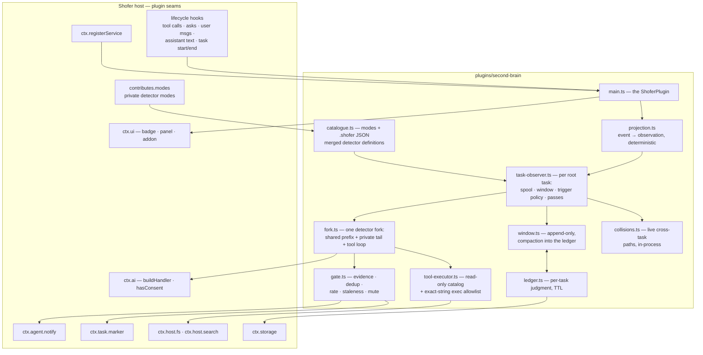
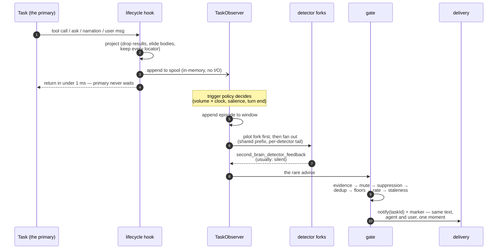
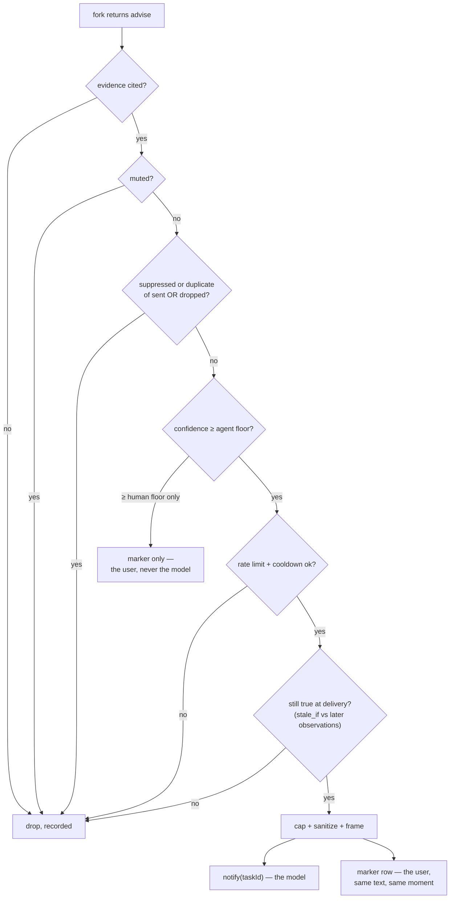

# Second Brain — design

## Purpose

The Second Brain is a **cheap background model that watches a task over its shoulder** and,
when — and only when — it sees something worth saying, drops one short advisory into the
task: asynchronously, without blocking, interrupting, or being asked. It is the Shofer port
of the standalone Claude Code plugin of the same name
([`claude-code/second-brain/DESIGN.md`](../../../../claude-code/second-brain/DESIGN.md) in
the parent workspace is the reference design; this document supersedes it for the Shofer
implementation and only re-argues decisions the port changes).

Its three defining properties survive the port unchanged:

1. **Asymmetric observation.** It sees the agent's _emissions_ — narration, tool-call
   arguments, asks, user prompts — never its _intake_ (successful tool results). Measured on
   the original corpus that is ~27 % of conversation volume, which is what makes it
   affordable to leave running on every task.
2. **A continuously running, fully decoupled loop.** Its own window, its own (cheap) model,
   its own tools. The primary never waits for it, never calls it, and does not know when it
   is thinking.
3. **Advisory only, and ignorable.** Advice arrives as one-way injected context framed as
   data. It cannot block, veto, pause, edit, or ask. Silence is the steady state, and the
   success metric.

## What it is not

|                                           | Direction                                | Timing                          | Holds                                                         |
| ----------------------------------------- | ---------------------------------------- | ------------------------------- | ------------------------------------------------------------- |
| **Live Memory** (`plugins/live-memory`)   | **pull** — a task asks `ask_live_memory` | synchronous; the task waits     | codebase facts, workspace-scoped, durable                     |
| **RAG indexing** (`plugins/rag-indexing`) | pull — `rag_search`                      | synchronous                     | an embedding index                                            |
| **Second Brain**                          | **push — nobody asks**                   | **async; the task never waits** | a judgment about how the task is going, task-scoped, expiring |

They are complementary, not overlapping: the Second Brain's detectors may _call_
`rag_search` (through `ctx.host.search`) the way any reader would; the Live Memory answers
questions and never volunteers. A failed Q&A tool gives a worse answer; a failed Second
Brain **falls silent**, which is its expected state anyway.

## Why a plugin

Same argument as Live Memory, and the Core Self-Sufficiency Rule makes it binding: this
feature costs the user money, needs a provider profile, and injects text into running
tasks — as a plugin it can be absent entirely. It ships `defaultEnabled: true`, and
**`defaultEnabled` implies the billed-AI consent** (§Required core changes): a bundled
plugin the product ships on is on, consent included — the user's control is the same
Settings → Plugins toggle either way, and revoking consent there still renders the
"needs your approval" badge state and makes every hook return early
(`ctx.ai.hasConsent()` stays the single gate the code checks). A default-on observer
that then sat inert behind a second approval would be default-off with extra steps.

---

## Detectors are private modes

The original design carried a bespoke detector catalogue (`detectors.json`) whose entries
each held a system prompt and a tool grant. Shofer already has that concept: a **mode**.
The port therefore ships **one private, plugin-contributed mode per built-in detector**,
and the detector contract splits cleanly in two:

- **The mode carries what a mode is for** — identity, the detector's system prompt
  (`roleDefinition` + `customInstructions`), its tool grant (`tools`, with scoped groups
  and `tools_denied`), and optionally its own provider profile (`provider`) so one
  detector can run on a different cheap model than the rest.
- **The catalogue carries what a mode has no field for** — enablement, cadence,
  confidence floor, per-fork deadline, pilot flag, exec-command allowlists, and
  detector-specific config (the `standard-questions` checklist). It lives in JSON under
  `.shofer/` (§Configuration), keyed by mode slug.

The modes are declared in `plugin.json` → `contributes.modes` with `private: true` and
**without** `unqualifiedContributions`, so their slugs are namespaced and can never shadow
a user mode:

| Mode slug                           | Watches for                                                                             | `tools` (mode grant)                       | Ships                   |
| ----------------------------------- | --------------------------------------------------------------------------------------- | ------------------------------------------ | ----------------------- |
| `second-brain:repeat-failure`       | the same command failing 3+ times with cosmetic variations                              | none                                       | **enabled** (the pilot) |
| `second-brain:standard-questions`   | checklist items the stream never answers (tests run? compiles? deployed? docs updated?) | none                                       | **enabled**             |
| `second-brain:default`              | anything a competent watcher would flag                                                 | scoped `read`                              | **enabled**             |
| `second-brain:goal-drift`           | the user asked for A, the work is now B                                                 | none                                       | defined, off            |
| `second-brain:git-log`              | editing an area someone changed recently                                                | scoped `read` + exec allowlist (catalogue) | defined, off            |
| `second-brain:prior-art`            | re-building something that exists in the repo                                           | scoped `read` + search                     | defined, off            |
| `second-brain:constraint-drift`     | contradicting `AGENTS.md` or an earlier user rule                                       | scoped `read`                              | defined, off            |
| `second-brain:static-analysis`      | does the edited tree still build / type-check                                           | exec allowlist (ships **empty**)           | defined, off            |
| `second-brain:cross-task-collision` | another live task touching the same files                                               | none (structural trigger)                  | defined, off            |

What being a _mode_ buys, concretely:

- **The grant vocabulary is Shofer's, not ours.** The plugin expands a detector's grant
  with `getToolsForMode()` from `@shofer/types` — groups, scoped `allowed`/`denied`
  entries, `tools_allowed`/`tools_denied` — instead of inventing a parallel schema. The
  plugin's own dispatcher enforces the result (§Fork fan-out), the same double-check the
  original had.
- **Detectors are spawnable as real tasks.** Because a private mode is registered and
  switchable by its qualified slug, `ctx.agent.spawn(prompt, { mode:
"second-brain:git-log" })` — or a user's explicit `new_task` — can run one detector as a
  full interactive task for deep, on-demand investigation (the `/second-brain-run
<detector>` skill uses exactly this). The routine passes do **not** spawn tasks
  (§Why not spawn-per-fork).
- **Per-detector model choice rides the existing per-mode provider link** (`provider` on
  the mode → `ctx.ai.buildHandler(profileName)`), instead of a bespoke model table.
- **`private: true` keeps them out of every user surface** — the mode picker, the Modes
  settings editor, the Plugins panel counts — and (after the core fixes below) out of the
  LLM-visible modes list, so nine detector modes cost the primary agent zero prompt bytes.

### Why not spawn-per-fork

Evaluated and rejected for the routine passes; recorded so it is not re-derived:

|                  | `ctx.agent.spawn` per fork                                                                                                                                                                       | plugin-owned fork loop (chosen)                                             |
| ---------------- | ------------------------------------------------------------------------------------------------------------------------------------------------------------------------------------------------ | --------------------------------------------------------------------------- |
| Mode fidelity    | full (core assembles the prompt, filters tools)                                                                                                                                                  | grant honored by the plugin's dispatcher; prompt taken from the mode config |
| Cost per pass    | a full `Task` per detector: the entire Shofer system prompt (tens of KB), task persistence to disk, history rows, worktree placement, every plugin's lifecycle hooks — ×N detectors, every ~90 s | N provider calls sharing one byte-identical prefix                          |
| Cache economics  | N divergent conversations — the fan-out's whole saving lost                                                                                                                                      | pilot writes the prefix once, the rest read it                              |
| Self-observation | each fork is itself observed by this plugin (needs a no-chaining rule)                                                                                                                           | forks are not tasks; nothing to exclude                                     |
| History/UI       | pass × detector task spam                                                                                                                                                                        | invisible, as an observer should be                                         |

This is the same verdict the original design reached against SDK sessions, for the same
reason: _we want the same conversation asked N questions, not N agents._ `spawn` remains
the right tool for the one case it fits — a human explicitly asking one detector to dig.

---

## The seams this plugin uses

Everything comes through the public plugin surface (`PLUGINS.md`,
`docs/plugin_system.md`); core knows nothing about detectors, windows, or advisories.

| Seam                                                                               | What Second Brain uses it for                                                                                                                                                                                                                |
| ---------------------------------------------------------------------------------- | -------------------------------------------------------------------------------------------------------------------------------------------------------------------------------------------------------------------------------------------- |
| `contributes.modes` (`permissions.modes`)                                          | The private detector modes                                                                                                                                                                                                                   |
| `lifecycle.beforeToolCall` / `afterToolCall`                                       | Observing tool intent (args, projected) and **error heads only** from results                                                                                                                                                                |
| `lifecycle.beforeAsk`                                                              | Observing proposals/questions the agent raises (a signal the original never had)                                                                                                                                                             |
| `lifecycle.onUserMessage` / `beforeTaskStart`                                      | The goal, and mid-task user prompts                                                                                                                                                                                                          |
| `lifecycle.afterTaskComplete`                                                      | The turn/task-end pass trigger; subtask conclusions                                                                                                                                                                                          |
| `lifecycle.onAssistantMessage`                                                     | **new core hook, §Required core changes** — the narration, the highest-value segment per byte                                                                                                                                                |
| `lifecycle.onTaskDeleted` / `onTimelineRewind`                                     | Ledger GC; rewinding the window past a restored point                                                                                                                                                                                        |
| `ctx.registerService` (`permissions.lifecycle`)                                    | The supervised observer service hosting the pass loop (the monitor's replacement)                                                                                                                                                            |
| `ctx.ai.buildHandler(profileRef)` / `hasConsent()` (`permissions.ai`)              | The detector forks' model; the consent gate                                                                                                                                                                                                  |
| `ctx.agent.notify(text, { mode: "notify", taskId, source })` (`permissions.agent`) | **The advisory channel**: one-way, system-prompt-injected beside the next request, delivered exactly once, dropped if no live task — the `additionalContext` analog, with the "no response is required or possible" frame already host-owned |
| `ctx.agent.notify(text, { mode: "queue", taskId })`                                | The finish gate's wake (§Delivery)                                                                                                                                                                                                           |
| `ctx.task.marker` (`permissions.task`)                                             | The user-visible half of every advisory, and the turn-end report row                                                                                                                                                                         |
| `ctx.storage`                                                                      | Ledgers, gate history, status, debug captures                                                                                                                                                                                                |
| `ctx.host.fs` (`permissions.filesystem: ["."]`) / `ctx.host.search`                | The detectors' read-only tools (`read_file`, `grep_search`, `list_files`, `rag_search`, `git_search`)                                                                                                                                        |
| `ctx.config` + manifest `config`                                                   | Tunables, rendered in Settings → Plugins (§Configuration)                                                                                                                                                                                    |
| `contributes.skills` / `contributes.commands`                                      | The human surfaces: stats / run / why / config / forget                                                                                                                                                                                      |
| `ctx.ui` (`chat-input-toolbar`, `sidebar-panel`, `chat-message-addon`)             | The statusline badge, the why/stats panel, advisory row rendering                                                                                                                                                                            |
| `handleRequest`                                                                    | Backs the skills/commands and the panel vocabulary                                                                                                                                                                                           |
| `ctx.host.telemetry` (`permissions.telemetry`)                                     | Error accounting, tagged `plugin: "second-brain"`                                                                                                                                                                                            |

`hookTimeoutMs` stays at the **default 500 ms**: every hook only appends a projected
observation to an in-memory spool and returns. All thinking happens in the service.

Allowlisted command execution (`git log`, a build) has **no host seam**; the plugin runs
exact-string, time-boxed commands via `child_process` in the workspace root, the same way
Live Memory's `get_changed_files` runs git. Proposing a governed `ctx.host.exec` is out of
scope here; the allowlist-of-exact-strings posture is the control.

---

## Required core changes

The port needed five small changes in `@shofer/types` / `@shofer/core` / host — **all
landed** (`feat(plugins): the four core seams the second-brain observer needs` and the
consent commit). Recorded here because they are the load-bearing seams; everything
else is plugin-local.

1. **Honor `private` on the three enumeration surfaces that miss it today.** The flag
   exists (`modeConfigObjectSchema.private`, `packages/types/src/mode.ts`) and the webview
   state push already filters it; three surfaces do not:

    - `getModesSection()` (`packages/core/src/prompts/sections/modes.ts`) — today every
      private mode is advertised to the model in **every system prompt**. Filter private
      modes out (or add `getAllModes(modes, { includePrivate })` and thread it).
    - The incremental `postConfigUpdate("customModes", …)` push
      (`src/core/webview/ShoferProvider.ts`) — bypasses the filtered snapshot, so private
      modes leak into the picker whenever a modes file changes.
    - `ShoferProvider.getModes()` — feeds the CLI `/mode` autocomplete and the
      `GetModes` API.

    `switch_mode` / `new_task` / `CreateTaskInput.mode` deliberately keep validating
    against the **unfiltered** list — a private mode must stay spawnable by slug; that is
    its documented contract.

2. **A new observer lifecycle hook: `onAssistantMessage({ taskId, text, turn })`.**
   Assistant prose has no hook today (`Task.say` is uninstrumented; only asks are), and
   narration is the single most valuable observed segment per byte. Fire-and-forget, not
   awaited, emitted when a completed (non-partial) assistant text block lands. Without it
   the observer sees what the agent _did_ but never what it _said it was doing_ — drift
   and intent are largely invisible.
3. **`parentTaskId` on the lifecycle contexts** (`TaskLifecycleContext`, and the tool-call
   context), if absent. The observer scopes a window per **root** task; a subtask's
   `new_task` spawn and its conclusion (`attempt_completion` args, seen via
   `beforeToolCall` on the child) must be attributable to the root it belongs to. This is
   how the port keeps the original's "conclusion, not the conversation" subagent contract:
   child activity is dropped, the child's final result (capped) is appended to the root's
   window.
4. **Advisory notifications must not be user-invisible.** `mode: "notify"` deliberately
   renders nothing in chat. The design's transparency invariant — _nothing is said to the
   agent that is not shown to the user, verbatim, at the same moment_ — is met plugin-side
   by pairing every `notify` with a `ctx.task.marker` advisory row rendered by the
   plugin's `chat-message-addon`. No core change needed **iff** marker rows render for
   this region reliably in both hosts; if the headless CLI surface cannot show markers, a
   core-side rendering of `kind: "notification"` queue entries becomes necessary. Verify
   in Phase 0.
5. **`defaultEnabled: true` implies billed-AI consent.** Today enablement and AI consent
   are two separate gates, and a bundled default-enabled plugin still waits for the
   consent click (`aiConsentedPlugins`). Change the consent resolution so a **bundled**
   plugin with `defaultEnabled: true` is AI-consented by default, with the user's explicit
   revocation (the Settings → Plugins consent toggle) still winning — the same
   explicit-OFF-beats-default shape `resolveEnabled` already has. Applies to Live Memory
   as much as to this plugin; `ctx.ai.hasConsent()` remains the only thing plugin code
   checks.

Each lands with its own tests (the partition/enumeration tests for 1, a `Task` spec for 2
and 3, a consent-resolution spec for 5) and a minor version bump.

---

## Architecture

`main.ts` declares the `ShoferPlugin`: the lifecycle hooks (feed), the service (think),
the UI channel and `handleRequest` (surfaces). One `TaskObserver` per **root task**, owned
by a per-workspace `Supervisor` the service starts.



The path an observation takes, and what each stage costs:



### Key source files

| File                                              | Role                                                                                                                                                  |
| ------------------------------------------------- | ----------------------------------------------------------------------------------------------------------------------------------------------------- |
| `src/main.ts`                                     | The `ShoferPlugin`: hooks (feed only), the supervised service tick, delivery seams, `handleRequest`, the status snapshot                              |
| `src/types.ts`                                    | Domain types (Observation, DetectorFeedback, Advisory, TaskLedger, …) and every named tunable/constant                                                |
| `src/projection.ts`                               | The observation contract as a pure function: event in, observation out — golden-tested                                                                |
| `src/task-observer.ts`                            | Per-root-task state: spool, window, trigger policy, single-flight passes, pilot-then-fan-out, demotion ladder, adjudication, budgets, the finish gate |
| `src/window.ts`                                   | Append-only window; hysteresis compaction into the ledger (deterministic distillation — see TODO.md for the model-backed variant)                     |
| `src/fork.ts`                                     | One detector fork: prefix + tail, the small tool loop, the feedback tool schema, deadlines                                                            |
| `src/detectors.ts`                                | Single in-code source for the detector modes + catalogue defaults; a spec asserts `plugin.json` `contributes.modes` equals it byte-for-byte           |
| `src/catalogue.ts`                                | Layers `.shofer/second-brain/catalogue.json` over the bundled defaults into effective detector definitions; fail-closed parse; pilot fallback chain   |
| `src/gate.ts`                                     | Evidence → mute → suppression → dedup → confidence floors → rate/cooldown → staleness; the two delivery-time expiry clocks                            |
| `src/ledger.ts`                                   | Per-task durable judgment; TTL sweep; dropped on `onTaskDeleted`                                                                                      |
| `src/collisions.ts`                               | Paths touched per live task, in-process; the structural `cross-task-collision` trigger                                                                |
| `src/llm.ts`                                      | The fork's provider adapter over `ctx.ai.buildHandler` (tool-call chunk accumulation, usage, cost); `ForkClient` is the scriptable interface          |
| `src/tool-executor.ts`                            | Dispatches exactly the granted tool names over `ctx.host.fs`/`search` + the exec allowlist; re-checks the calling detector's grant                    |
| `src/advice.ts`                                   | The advisory envelope, the fixed security frame, caps and sanitization, both renderings                                                               |
| `ui/badge.tsx`, `ui/panel.tsx`, `ui/advisory.tsx` | Statusline badge, why/stats panel, the advisory chat row (built by `build-ui.mjs`)                                                                    |
| `__tests__/`                                      | Projection goldens, gate simulations, fork behavior against a scripted client, catalogue/manifest sync, the observer end-to-end                       |

---

## The observation contract

The original read a transcript file because hooks could not carry the content; Shofer's
hooks carry it directly, in-process, so the spool/offset/transcript machinery disappears.
The **projection rules survive verbatim** — they are the economics:

| Original source                          | Shofer seam                                                     | Treatment (unchanged from the reference design)                                                                          |
| ---------------------------------------- | --------------------------------------------------------------- | ------------------------------------------------------------------------------------------------------------------------ |
| assistant narration                      | `onAssistantMessage` (new)                                      | whole, capped (`text_cap`)                                                                                               |
| `tool_use` arguments                     | `beforeToolCall`                                                | **projected**: structure-aware elision then per-tool caps; heredoc/edit/write bodies markered; **locators never elided** |
| user prompts                             | `onUserMessage`, `beforeTaskStart`                              | whole, capped                                                                                                            |
| tool errors                              | `afterToolCall` (result classified as error)                    | head, capped (`error_head`)                                                                                              |
| successful tool results                  | `afterToolCall`                                                 | **dropped** — observed, projected away                                                                                   |
| asks (proposals, questions, completions) | `beforeAsk`                                                     | headline projected — a new, high-signal segment the original could not see                                               |
| subtask final message                    | child's `beforeToolCall("attempt_completion")` + `parentTaskId` | capped, appended to the root's window; child activity otherwise dropped                                                  |
| the primary's reasoning                  | —                                                               | still unobservable; unchanged                                                                                            |

Two fidelity **gains** over the original, both structural:

- **Edit anchors are real.** `beforeFileEdit` delivers the pre-edit content, so the
  `@L88-L94` anchor is resolved against the file the edit actually applied to — fixing a
  known drift in the original (which resolved against the post-edit file).
- **Delivery-time staleness is enforceable.** Gate and delivery share one process, so an
  advisory is re-checked against the observations at the _moment of delivery_, and a mute
  takes effect instantly — both were pass-granular at best in the original.

Accumulation stays free: projection is deterministic string work in a hook, no model, no
I/O. Only judgment costs, and only passes spend.

---

## The observer loop

Ported intact; only the substrate changes. Per root task, single-flight:

- **Trigger policy** — the same two binding limits (`min_interval_s` clock floor,
  `trigger_chars` volume), `max_interval_s` liveness, a bounded salience allowance
  (errors, user prompts), coalescing while throttled, budget-aware backoff. **Turn end is
  its own unconditional trigger**: in Shofer that is the task going idle (an idle-class
  ask observed via `beforeAsk`) or completing (`afterTaskComplete`), and the pass's
  verdicts reach the _user only_ — badge + a claim-once turn report.
- **Window discipline** — append-only between compactions; compaction is the one
  sanctioned prefix rebuild, hysteresis-scheduled (`compaction_threshold` 0.85 →
  `compaction_floor` 0.60), distilling the evicted span into the ledger by neutral
  summarization. Nothing already in the window is ever rewritten.
- **The ledger is per task and expires** — and in Shofer a "task" is first-class:
  `taskId` replaces the original's session/task-identity heuristics outright (a real
  simplification; `/clear`-style epoch guessing is gone). Dormant ledgers TTL-sweep
  (`ttl_days` 7, size caps); `onTaskDeleted` deletes immediately;
  `/second-brain-forget` deletes on demand. Deleting a ledger is always safe — it is
  derived state.
- **Cross-task collisions** — the one thing that crosses tasks. The original needed a
  shared file with locks and TTLs; here **one plugin instance observes every task in the
  host**, so the live index is a `Map` in `collisions.ts`. The trigger stays structural
  (a projected edit whose path another live task touched → the model only writes the
  advisory). Scope limitation, stated: tasks running on _other_ hosts (remote Shofer
  Nodes) are invisible to this instance; cross-host collision awareness is out of scope.

### Fork fan-out — one window, N detector forks

A pass snapshots the window and runs one fork per enabled detector, all on the cheap
model, sharing one byte-identical prefix:

```
[ shared system prompt + workspace block ]   ← stable for the task's lifetime
[ task ledger ]                              ← changes only at compaction
[ observations + prior detector feedback ]   ← append-only
────────────────── prefix ends here ──────────────────
[ per-fork tail: the detector mode's roleDefinition + customInstructions,
  its grant, its open advisories, its stated time/length budget ]
```

- **Pilot-then-fan-out**: the pilot (declared: `repeat-failure`; fallback: first tool-less
  enabled detector; else any) runs first and warms the provider's prefix cache; the rest
  launch on its completion.
- **The plugin controls prefix bytes, not breakpoint placement.** `ctx.ai.buildHandler()`
  returns the host `ApiHandler`, whose provider implementation owns `cache_control` /
  implicit prefix caching. The plugin's obligation is byte-identical
  `(systemPrompt, messages-prefix)` across forks and passes — the handler does the rest.
  This is a fidelity note, not a loss: append-only discipline is what earns the hits.
- **Grants are enforced at dispatch.** The wire-level tool list is the pass union of the
  enabled detectors' expanded mode grants; `tool-executor.ts` re-checks every call
  against the _calling_ detector's own grant, and exec runs only exact allowlisted
  strings from the catalogue. Same defence-in-depth as the reference design.
- **Forks return through `second_brain_detector_feedback`** — verdict
  (`silent | advise | resolved | still_open`), headline, body, evidence, confidence,
  `dedup_key`, `stale_if[]`, `finish_gate`, `outcomes[]` (the self-adjudication of its
  own prior advisories). Only the compact feedback record merges back into the window, in
  detector-name order. A prose reply with no call coerces to `silent`; the final
  iteration forces the call.
- **Two-tier deadlines and the demotion ladder** port unchanged: soft deadline stated in
  the tail, hard cancel after a grace; 2 consecutive timeouts → every k-th pass, 4 →
  disabled for the task, retried once after `demote_retry_s`; every step logged and
  visible in stats. Same ladder for collapsed uptake.

---

## Advice: generation → gating → delivery

The gate ports with the **code's** stage order (which the original's review found saner
than its own diagram): evidence required → mute → suppression → dedup (spanning dropped
advice, so a repeated sub-floor hunch cannot spam anyone) → confidence floors
(agent floor / human floor split) → rate limit + cooldown → staleness re-check
(`stale_if` matched mechanically against everything observed since generation) → cap +
sanitize + frame. Both expiry clocks apply — validity TTL from generation, queue timeout
from enqueue — and an advisory dies on whichever fires first, recorded with the reason.



**Say it to both.** Every agent-addressed advisory is a pair: `ctx.agent.notify(...,
{ mode: "notify", source: "second-brain" })` for the model (the host already injects it
one-shot into the system prompt with a one-way frame) and a `ctx.task.marker` advisory
row for the human, identical text, emitted together — the marker names the detector and
the one-command mute. Sub-agent-floor advice is **marker-only**: a hunch too weak for the
model's attention is still worth a person's glance, free. The plugin's own security frame
(data-not-instructions, no user authority, hard length cap, tool-syntax stripping) wraps
the text before either copy leaves the gate.

**Self-adjudicated uptake** ports unchanged: every delivered advisory opens an outcome
record; the originating detector closes it in a later fork with cited post-delivery
evidence (`adopted | partially_adopted | rejected | already_handled | no_evidence |
contradicted`, defaulting to `no_evidence` on window lapse). Outcomes feed suppression
(`rejected`/`contradicted` bans the key for the task), per-detector calibration
(persistently-ignored detectors auto-mute for the task), and the ledger.

### The finish gate

Shofer has no `Stop`-hook analog and does not need the original's two-half split. The
task-end pass runs on `afterTaskComplete` / the idle ask; if it finds **evidenced,
specific unfinished work** clearing the higher `finish_gate.confidence_floor`, within the
per-task budget (once per `min_interval_s`, hard `per_task_cap`), it delivers via
`ctx.agent.notify(..., { mode: "queue", taskId })` — the message enters the task's queue
as a user-style message, and enqueueing onto a just-completed task re-triggers the loop
(the host's existing queue-after-abort behavior). A marker names what was unfinished and
which detector said so. This is the single riskiest seam of the port and is **Phase 0
verification, not an assumption**; if queue-wake proves unreliable on a completed task,
the finish gate degrades to marker + badge only (user-facing), never to interrupting.

---

## Configuration

Three layers, lowest first — and every user-editable JSON file lives under `.shofer/`,
like every other project-owned Shofer artifact:

| Layer            | Where                                                                 | Holds                                                                                                                                                                                                                                                         |
| ---------------- | --------------------------------------------------------------------- | ------------------------------------------------------------------------------------------------------------------------------------------------------------------------------------------------------------------------------------------------------------- |
| Bundled defaults | the plugin (`modes.ts`, `catalogue.json`, manifest `config` defaults) | detector modes, catalogue defaults, every tunable's default                                                                                                                                                                                                   |
| User settings    | manifest `config` schema via `ctx.config` — Settings → Plugins        | tunables: `profileRef`, loop cadence (`minIntervalS`, `triggerChars`, `maxIntervalS`), gate (`ratePerHour`, `cooldownS`, floors, caps, the two TTL clocks), budgets, finish gate, `mute`, `debug`                                                             |
| Workspace        | **`.shofer/second-brain/catalogue.json`**                             | per-detector overrides keyed by mode slug: `enabled`, `cadence`, `confidenceFloor`, `deadlineS`, exec allowlists (`static-analysis` ships empty **by design**), and detector config — the `standard-questions` checklist is the canonical project-owned entry |

Semantics: the catalogue file is validated with a Zod schema (fail-closed to the bundled
defaults, per the Schema-First Persistence Rule — a broken catalogue must degrade to the
shipped one, never to no observer), watched via `ctx.host.watch`, and re-read at pass
boundaries — except `mute`, honored immediately. A Settings edit reloads the plugin
(host behavior); state survives because ledgers and status live in `ctx.storage`, and
the window is rebuilt lazily (a reload costs the warm prefix, not judgment — same trade
as the original's worker restart). Detector _prompts and grants_ are overridden by
editing the catalogue's `system`/`tools` fields, which shadow the mode's — the modes UI
never sees private modes, so the catalogue is deliberately the only override surface.

`.shofer/` is covered by `PROTECTED_PATTERNS`, so an agent editing the catalogue trips
the protected-write gate — the checklist a team commits cannot be silently rewritten by
the very agent being watched.

Mode-level knobs stay on the modes themselves (`plugin.json`): prompt, grant, provider.
The two independent rate limits keep their roles and their names: the loop's
`minIntervalS` bounds what the Second Brain **costs**; the gate's `ratePerHour` bounds
what it costs **the primary**.

## Storage topology

| Data                             | Location                                                                                                | Survives                                                                                    |
| -------------------------------- | ------------------------------------------------------------------------------------------------------- | ------------------------------------------------------------------------------------------- |
| Task ledgers                     | `ctx.storage`: `ledgers/<taskId>.json`                                                                  | restart; TTL-swept; dropped on task delete                                                  |
| Gate history (for `/why`)        | `ctx.storage`: `history/<taskId>.jsonl`                                                                 | restart; swept with the ledger                                                              |
| Status snapshot (badge/skills)   | `ctx.storage`: `status.json`, written through every pass                                                | stale-but-readable, says so with a timestamp                                                |
| Debug captures (`debug: true`)   | `ctx.storage`: `debug/<taskId>/<pass>/` — the byte-exact shared prefix + one file per fork's whole loop | until manually cleared; never TTL-swept                                                     |
| Windows, spools, collision index | memory only                                                                                             | no — a restart costs the warm cache and the uncompacted tail (accepted, as in the original) |
| Tunables                         | `ctx.config` (ContextProxy)                                                                             | yes                                                                                         |
| Workspace catalogue              | `.shofer/second-brain/catalogue.json` (the repo)                                                        | committed                                                                                   |

## Human surfaces

| Surface                                 | Mechanism                                           | Shows                                                                                                                                                                                                                                       |
| --------------------------------------- | --------------------------------------------------- | ------------------------------------------------------------------------------------------------------------------------------------------------------------------------------------------------------------------------------------------- |
| **Badge** (`chat-input-toolbar`)        | plugin UI channel                                   | `🧠 watching · N passes · $cost · last turn: all silent` — and _nothing_ when unconsented/muted/idle beyond the honest state; the "needs approval" affordance                                                                               |
| **Advisory row** (`chat-message-addon`) | `ctx.task.marker`                                   | every advisory, verbatim, attributed, with its mute affordance — the user half of "say it to both"                                                                                                                                          |
| **Panel** (`sidebar-panel`)             | plugin UI channel                                   | why (advisories + evidence + verdicts + what the gate dropped and why), stats (volume per segment, pass latency, window fill, tokens + $, uptake per detector, demotions), turn-end reports                                                 |
| **Skills/commands**                     | `contributes.skills` / `commands` → `handleRequest` | `second-brain-stats`, `second-brain-run` (one pass now — bypasses the cost limits, not mute or budget; with a detector argument, spawns that private mode as a real task), `second-brain-why`, `second-brain-config`, `second-brain-forget` |

Costs the model nothing: badge and panel are model-free reads of `status.json`; skills
relay `handleRequest` output.

## Testing

The three harness layers port directly, all offline, under
`packages/core/vitest.plugins.config.ts`:

1. **Projection goldens** — recorded lifecycle-event streams in, projected observations
   out, byte-exact (caps, locator retention, elision markers, subtask finals).
2. **Detector fixtures** — observations in, per-detector verdicts out, against a scripted
   handler (`createInMemoryHost()` + a fake `ApiHandler` yielding canned chunks); asserts
   precision: `standard-questions` fires when tests never ran, stays silent when they did.
3. **Gate simulations** — scripted advisory streams in, delivery decisions out: rate
   limits, cross-detector dedup, both expiry clocks, suppression, mute — no model.

Host-side: specs for the core changes (private-mode enumeration, `onAssistantMessage`,
`parentTaskId`) in `packages/core/src/plugins/__tests__/` beside the existing
seam/registry specs. The suite refuses live providers, as the original's did.

## Failure modes and non-goals

Fail open, always: a throwing hook is skipped by the registry with a warning; an
unconsented or erroring plugin observes nothing and injects nothing; a dead service means
an unobserved task, never a stalled one. Budget exhaustion degrades to silence and says
so in stats. Headless is **in scope** (an improvement on the original, whose worker was
interactive-CLI-only): `shofer serve` runs the same bundle, the same seams, the same
service; only the UI surfaces are decorative there, and the truth lives in
`handleRequest` + storage.

Non-goals, restated so they are not re-litigated: no edits, no repo writes, no blocking
or vetoing, no permission decisions, no tool the _agent_ can call to ask the Second Brain
anything, and no attempt to be right often — only right cheaply, and quiet otherwise.

## Implementation status

| Piece                                                                                                       | State                                                                                                          |
| ----------------------------------------------------------------------------------------------------------- | -------------------------------------------------------------------------------------------------------------- |
| Core seams (`private` enumeration gaps, `onAssistantMessage`, `parentTaskId`, default consent)              | **landed**, with host-side specs                                                                               |
| Observation → projection → window → passes → forks → gate → delivery                                        | **built**, offline-tested (projection goldens, gate sims, fork against a scripted client, observer end-to-end) |
| The catalogue (bundled defaults + `.shofer/second-brain/catalogue.json` layering, manifest↔code sync spec) | **built**                                                                                                      |
| Adjudication → suppression/uptake, demotion ladder, budgets, cross-task collisions, ledger TTL sweep        | **built**                                                                                                      |
| Surfaces: badge, advisory row, panel, skills, commands, `handleRequest`                                     | **built**                                                                                                      |
| Finish gate (queue-wake on a completed task) and `notify` rendering in both hosts                           | built, **live verification pending** — see TODO.md; degrades to user-only surfaces on failure                  |
| Model-backed neutral compaction; per-detector cache accounting; spawn-based deep runs                       | **not built** — recorded in TODO.md                                                                            |
| Detector calibration against real sessions                                                                  | **not started** — the tool-less three ship enabled deliberately                                                |
