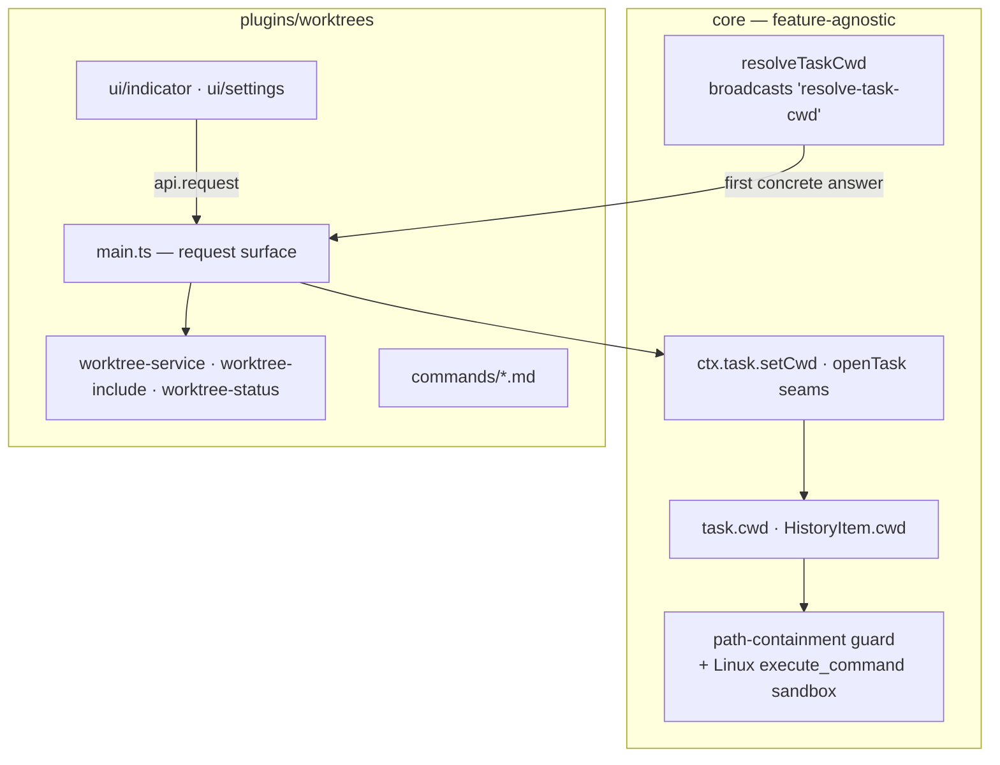
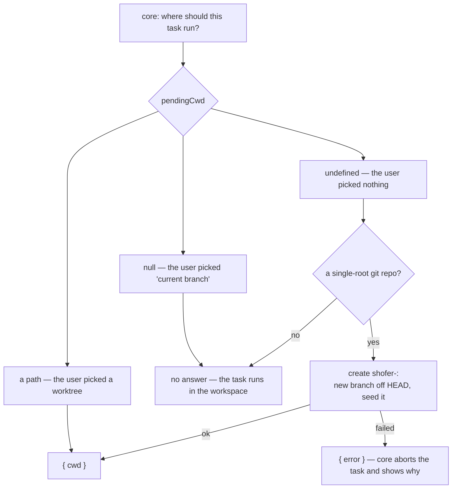

# Worktrees — design

## 1. Why a plugin

Worktrees are a _workflow_ choice, not part of what an agent is. Someone who wants every
task on the current branch, or who works in a non-git directory, should be able to switch
the whole idea off — and get an editor that behaves as if it had never existed, with
nothing left behind in core.

That is the test this design is written against: **disable the plugin and core still
runs tasks correctly**, because everything core knows is that a task has a working
directory.

## 2. The split, line by line

| Piece                                | Owner     | Why                                                                                          |
| ------------------------------------ | --------- | -------------------------------------------------------------------------------------------- |
| `git worktree` operations            | plugin    | The feature itself                                                                           |
| `.shofer/worktreeinclude` copy       | plugin    | Ditto                                                                                        |
| Which directory a new task runs in   | plugin    | Core asks, does not decide                                                                   |
| The chat chip and the Settings panel | plugin    | Rendered through the host's own kit, so they look built-in without being built-in            |
| Six merge/rebase slash commands      | plugin    | `contributes.commands`, unqualified (see §6)                                                 |
| `task.cwd` / `HistoryItem.cwd`       | core      | "A task runs in a directory" is the execution model; the plugin only _chooses_ the directory |
| Path containment in mutating tools   | core      | **Safety.** A confinement a user can remove by disabling a plugin is not a confinement       |
| The Linux `execute_command` sandbox  | core      | Same reason                                                                                  |
| Re-pointing an existing task         | core seam | Only the host knows whether the task has already written files somewhere                     |
| Opening a task in a new worktree     | core seam | Creating and focusing tasks is the host's; the plugin supplies the directory                 |

The safety line is the important one. `validateWorktreePath()` and the `shofer-sandbox`
wrapper stay in core and key off `task.cwd` alone: any task whose cwd is not the
workspace is confined to it, whoever put it there. Move them into the plugin and
"disable the plugin" would silently mean "let the agent write anywhere", which is not a
trade a user should be able to make by accident.

## 3. Placement: the one question core asks

At task creation core broadcasts `"resolve-task-cwd"` to every plugin and takes the
first concrete answer (`pluginRegistry.requestAll`, via `src/core/webview/resolveTaskCwd.ts`).
This plugin answers with the rule the user sees in the chip:

Two decisions inside that are easy to get wrong:

- **A failure is `{ error }`, never a throw.** `requestAll` treats a throw as "this
  plugin does not answer that question" — correct for a plugin that does not recognise
  it, and catastrophic here: the task would silently start on the user's current branch,
  the exact outcome per-task worktrees exist to prevent.
- **The pick is consumed.** `pendingCwd` resets on every answer, so one deliberate choice
  scopes one task; the next falls back to the auto-create default rather than quietly
  reusing someone else's checkout.

The selection lives in the **plugin**, not the webview. Core no longer has a
worktree-shaped field on `newTask` to thread it through, and the answer must be
available at the moment core asks — including when the question comes from a window that
did not make the choice.

## 4. Talking to the UI

Both bundles talk to `main.ts` over the plugin UI channel (`api.request`), which
replaces eleven webview IPC message types and the eight extension→webview replies they
were paired with.

Every request is prefixed **`local:`**. Without it, a request made while a remote
executor's task is focused would be answered by that executor — listing _its_ checkout
for a panel that manages the repository open here. Worktrees are directories on this
machine; the prefix pins them to the host with the workspace.

Progress goes the other way as pushes (`worktrees:step`, `worktrees:copy-progress`),
because a create can take minutes and a silent dialog reads as a hang.

Two requests need core rather than git. `open-task` calls `ctx.task.openTask({ cwd })`,
which is how creating a worktree from the chat input still _puts you in it_ — an idle
task in the new checkout, waiting for your first message, exactly as the built-in control
did. It is on task control rather than `ctx.agent.spawn` deliberately: spawn starts an
agent RUN (a prompt, an awaitable result, billed), while this only opens a task the user
then drives.

`set-task-cwd` is the other, and the one that can be refused: re-pointing a workflow that has not yet
started its agents goes through `ctx.task.setCwd`, which the host refuses once
`flowState.started` — by then agents have work on disk in the old directory. The refusal
surfaces in the picker rather than being swallowed.

## 5. Headless

`shofer serve` loads this plugin like any other host: the placement question is asked on
**every** task-creation path, not just the chat input — `ShoferAPI.startNewTask` (which
the AgentApi, the CLI and ACP all funnel through) resolves it too. So a controller
driving a headless executor gets the same isolation a user typing in the sidebar does:
each remote task in its own checkout of the executor's workspace, rather than every agent
on one branch.

What is genuinely webview-only is the _chrome_: the branch chip and the Settings panel
render where there is a webview, and `ctx.ui.postMessage` progress goes nowhere without
one. Neither is load-bearing — creation, placement, the slash commands and the
`worktreeinclude` seeding all run headless, and progress pushes are cosmetic. Nothing
here silently no-ops: the one seam whose absence would change behaviour, `ctx.task`,
throws when it is not granted or not wired.

## 6. Names that are a contract

`plugin.json` sets `unqualifiedContributions: true`, honoured only for **bundled** scope.
The six commands therefore register as `/merge-worktree` rather than
`/worktrees:merge-worktree`, at the built-in precedence tier — so a project's own
`.shofer/commands/merge-worktree.md` still wins, exactly as when the commands were
compiled into core. A third-party plugin cannot claim the exemption, because an
unqualified name from an unknown author could shadow a built-in.

## 7. Conventions the plugin enforces

- **Location.** A create request whose path is not under `<workspace>/.shofer/worktrees/`
  is rewritten so that it is; when a branch is being created, the directory basename is
  forced to match the branch. One name across branch, directory and label is what makes a
  worktree followable. The prefix itself is **core's**, not this plugin's — core's
  `isEmbeddedWorktreeTask()` tests for it literally, and confinement plus the shell
  sandbox are gated on the result, so the plugin cannot relocate worktrees on its own.
  A move out of `.shofer/` is proposed in
  [`todos/worktrees-path-move.md`](../../todos/worktrees-path-move.md).
- **Ignoring.** Creating the first worktree appends `.shofer/worktrees/` to `.gitignore`
  (never `.shofer/` itself — the rest of it is meant to be committed). Embedded worktrees
  are inside the repository, so without this they are untracked noise that can be
  committed by accident.
- **Detection.** Whether a subfolder workspace _is_ one of our worktrees is a containment
  check anchored at the git root (`path.relative`), never a substring match — an
  unrelated directory whose name contains `.shofer/worktrees` cannot pass.
- **Seeding is all-or-nothing for submodules.** A failed `git submodule update --init`
  tears the worktree down: empty submodule directories look like success and fail much
  later. A failed `worktreeinclude` copy only warns — an inconvenient checkout beats no
  checkout.

## 8. Interaction with checkpoints

The bundled `checkpoints` plugin scopes its shadow git to `task.cwd`, so a worktree task
snapshots only its own checkout, and a workspace-root task excludes `.shofer/worktrees/`
from its snapshots. Neither plugin knows about the other: both key off the task's
directory, which is core's.

## 9. Constraints

- **Single-root only.** With several folders open, "the repository" is ambiguous, and
  guessing would create a worktree somewhere the user did not ask for. The plugin says so
  instead.
- **Repository root (or an embedded worktree) only.** A subfolder checkout has a git root
  above the workspace; worktrees created from it would land outside the window.
- **`worktreeinclude` is intersection-only.** A path that is not also gitignored cannot be
  copied — see [`TODO.md`](./TODO.md).
