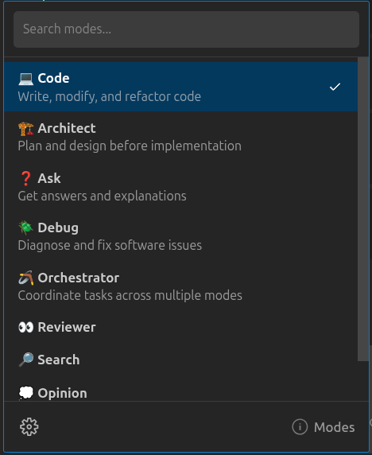

<!-- XXX: Screenshot of the Mode Selector dropdown in the chat input bar, showing all built-in modes (Code, Architect, Ask, Debug, Orchestrator) -->

# Choose a Mode

Shofer ships with **5 built-in modes** that control what tools the AI can use. Switch modes anytime via the dropdown in the chat input bar.

## Built-in Modes

| Mode                | Best For                                             | Tool Groups                                                                         |
| ------------------- | ---------------------------------------------------- | ----------------------------------------------------------------------------------- |
| 💻 **Code**         | Writing, modifying, and refactoring code             | `read`, `write`, `execute`, `mcp`, `mode`, `subtasks`, `questions`, `uncategorized` |
| 🏗️ **Architect**    | Planning and designing before writing code           | `read`, `write` (.md only), `mcp`, `questions`                                      |
| ❓ **Ask**          | Getting explanations, answers, or recommendations    | `read`, `mcp`                                                                       |
| 🪲 **Debug**        | Troubleshooting errors and diagnosing root causes    | `read`, `write`, `execute`, `mcp`, `subtasks`, `questions`, `uncategorized`         |
| 🪃 **Orchestrator** | Coordinating complex work by delegating to sub-tasks | (none — delegates via `new_task`)                                                   |

## Custom Modes

Create your own modes with a `.shofermodes` file — control exactly which tools are available per mode. Common custom modes include Reviewer, Search, Opinion, and Browser.

Select a mode from the dropdown in the chat input bar to continue.
