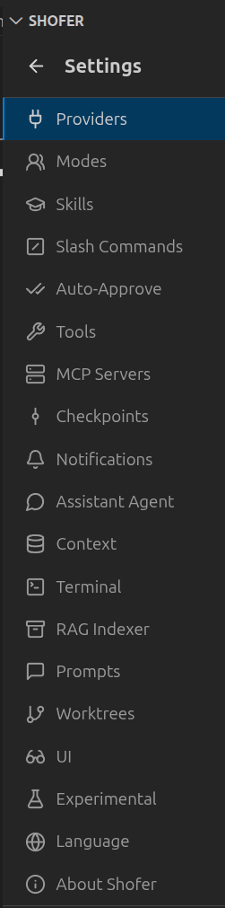

<!-- XXX: Screenshot of the Shofer Settings panel showing the Providers/Modes/Auto-Approval tabs -->

# Explore Settings

Shofer has dozens of settings to customize your experience. Access them via the ⚙️ gear icon in the Shofer panel, or open VS Code Settings and search for `shofer.`.

## Key Settings Areas

| Section                | What You Can Do                                            |
| ---------------------- | ---------------------------------------------------------- |
| **Providers**          | Add API profiles, switch models, configure endpoints       |
| **Modes**              | Create and edit custom modes with per-tool access control  |
| **Auto-Approval**      | Toggle which tool categories run without asking permission |
| **MCP Servers**        | Connect external tools (browser, databases, Kubernetes)    |
| **RAG Indexing**       | Build a semantic search index of your codebase             |
| **Context Management** | Control when conversations get condensed                   |
| **Limits**             | Set per-task USD cost caps and API request limits          |

## Must-Know Settings

- **Auto-Approval** — Start with toggles OFF and enable incrementally as you trust the agent
- **Cost Limits** — Set `shofer.defaultCostLimit` to cap spending per task
- **Command Allowlisting** — Configure which shell commands can run automatically

[Open the full User Manual](https://github.com/shofer-dev/shofer/blob/master/USER_MANUAL.md) for detailed documentation on every setting.
