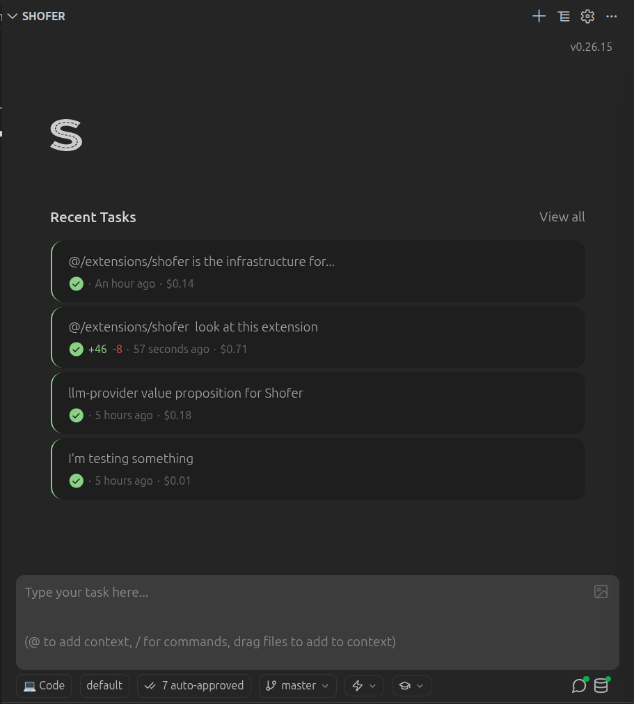

# Open the Shofer Sidebar

Shofer lives in one of VS Code's Side Bars. Click the **Open Shofer** button in the step description to open it.

## What You'll See

- **Chat view** — Type messages and interact with the AI
- **Task Selector** — Switch between multiple parallel tasks
- **Mode Selector** — Choose from Code, Architect, Ask, Debug, Orchestrator or any custom modes defined in your configuration
- **API Configuration Selector** — Select which API configuration to use for the current task or leave the default for the chosen mode
- **Auto-approval Selector** — Choose whether to automatically approve all changes, reject all changes, or ask for your approval on each change
- **Worktree Selector** — Create and select the worktree you would like your changes to land into
- **Slash Command Menu** — Access all of Shofer's commands and features from a single menu; includes build-in, global and local commands defined in your repository
- **Skill Library** — Browse the list of skills (global and local to your repository) that Shofer detected, along with the list of currently loaded ones
- **File Changes Panel** — Review, accept, or revert every file Shofer modifies
- **Assistant Agent Status** — Enable the assistant agent to share context between tasks, and across restarts
- **Codebase Indexing Status** — Enable Codebase & Git log indexing for lighting-fast context gathering
