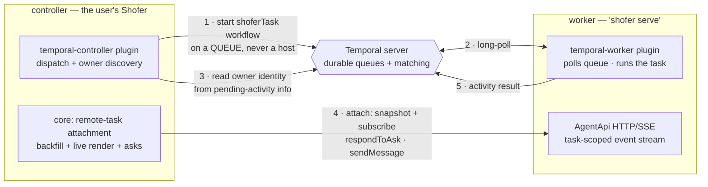

# Remote agents — Temporal dispatch, AgentApi observation

> **Status: decided direction, nothing built.** This doc captures the END STATE
> for horizontal scaling / remote agents and the ROADMAP from the current state.
> The current state it replaces is the shipped "Shofer Workers" fleet layer
> (`v3_architecture.md` §12), which the first roadmap phase REMOVES.

## 0. The decision

Shofer stops maintaining a bespoke fleet scheduler. Distributing tasks across
machines is a solved problem — Temporal is a mature, MIT-licensed workhorse
whose entire design is "workers pull tasks from durable queues; nothing ever
dials a worker" — and Shofer's comparative advantage is the _agent session_,
not the scheduler. So the two concerns split along that joint, each on the
protocol built for it:

- **Dispatch plane — Temporal.** A task travels to a worker as a Temporal
  activity: queued durably, matched to whoever polls, retried/observed/cancelled
  with Temporal's own semantics, against a **vanilla upstream Temporal server**
  (a standalone user runs `temporal server start-dev`, one binary).
- **Session plane — AgentApi.** Watching and steering a _running_ task —
  streamed transcript, interactive asks, `sendMessage`, `pluginRequest` — stays
  on AgentApi, exactly as today, attached **on demand** to the worker that owns
  the task. Temporal never carries transcript data; AgentApi never schedules.

Both ends are **plugins** (a public pair), not core features. Core keeps the
transport (`shofer serve`, the HTTP/SSE binding) and gains one generic
primitive: _attach to a remote task by address + task id_. Everything else the
current fleet layer does — worker registries, address books, load balancing,
config replication, version convergence — is either Temporal's job or nobody's.

## 1. Assumptions — what this design deliberately does NOT do

- **No code sync.** A worker is provisioned with the right build and the right
  workspace content _before_ it polls — shared filesystem, image, or git; the
  operator's problem, solved offline. The dispatch plane moves **tasks**, never
  code.
- **No config sync.** Same posture: a worker's configuration is the layered
  `.shofer/` files it was provisioned with (integrators have their own
  distribution mechanisms for these — e.g. arkware's config-bundle system).
  The only configuration that travels with work is **per-task** input
  (`CreateTaskInput.apiConfiguration` carried in the activity payload), gated by
  `allowClientConfig` as today. The entire controller-push settings channel
  (`config_sync.md`) is removed, not relocated.
- **Same-build fleet by provisioning, not by handshake.** Version alignment is
  the operator's provisioning discipline (one image / one install). The attach
  path still verifies (`whoami`) before observing; the dispatch payload carries
  the controller's version so a mismatched worker can fail the task fast
  instead of misbehaving.

## 2. End state

### 2a. The plugin pair (public)

**`temporal-worker`** — runs on each worker (`shofer serve` + plugin):

- Registers the **`runShoferTask` activity** (prompt/mode/per-task config in,
  final result out) and a **trivial `shoferTask` wrapper workflow** that only
  executes that activity and returns. The wrapper is what makes the pair
  self-contained against vanilla Temporal: no external orchestrator needs to
  exist, any worker can host the workflow leg.
- Polls its configured task queue(s) in its configured namespace.
- **Advertises ownership** by setting its Temporal worker _identity_ to its
  resolvable AgentApi address — Temporal surfaces it in pending-activity info
  (`DescribeWorkflowExecution`) and poller lists, so ownership discovery needs
  zero extra machinery. (Fallback if identity proves unreliable: signal the
  wrapper workflow with the address on pickup.)
- Runs the task like any served task: asks are left outstanding for a
  controller to answer over AgentApi; an unattached task **blocks durably** on
  its ask — nothing is lost, and Temporal's visibility shows it pending.
- **Fully parameterized — nothing about the Temporal deployment is hardwired.**
  Connection and pickup are plugin config: `temporalAddress`, `namespace`,
  task queue(s) to poll, `activityName` (default `runShoferTask`),
  `concurrency` (slot count = capacity + backpressure), `heartbeatMs`, worker
  `tags`, TLS, and a pluggable auth hook (none for a dev server / API key /
  mTLS / an integrator's own credential exchange). The pair must work
  unmodified against a laptop `start-dev`, a self-hosted cluster, or a hosted
  Temporal.
- **Configurable through the normal surfaces, not just provisioning.** The
  config rides the standard plugin-config mechanism — `pluginConfigs` in the
  layered `.shofer/settings.json` scopes (global/user/project, live-reloaded
  by the scope watcher), with `.shofer/plugins.json` handling
  source/version/enablement as for any plugin — and is **editable in the UI**:
  the pair's settings panel exposes every key above, so a desktop user can
  point Shofer at a Temporal server and pick a queue without touching a file.
  Env-var fallbacks remain for headless/provisioned workers, lowest
  precedence. Secrets (an API key) go through secret storage, never the
  config file.

**`temporal-controller`** — runs on the dispatching Shofer (the IDE):

- Dispatches: starts a `shoferTask` workflow on a named queue with
  `maximumAttempts: 1` by default (an agent task is not idempotent; a re-run
  against the same workspace is opt-in, never a silent retry).
- **Same connection config surface** as the worker (`temporalAddress`,
  `namespace`, TLS, auth hook), plus dispatch parameters — target task queue,
  workflow type (default `shoferTask`), retry policy, timeouts — settable as
  defaults and overridable per dispatch.
- Discovers the owner from Temporal, then hands the controller-side session to
  the core attachment primitive (below).
- Owns the UI (a plugin panel): dispatch surface, the fan-out task list, and
  queue health (pollers per queue — the "nothing is polling, this will hang"
  warning).
- **Durable fan-out index for free**: the list of dispatched tasks is
  `ListWorkflows` in the namespace, so a controller restart rebuilds its
  fan-out list from Temporal and re-attaches on demand. (The current fleet
  layer loses remote tasks on restart — shadows were never in task history.)

### 2b. What core keeps: the attachment primitive

One generic capability, usable by _any_ dispatcher (the temporal-controller
plugin is merely its first consumer): given `(address, taskId, token)`,

1. **Backfill** — fetch the task's state so far: messages, outstanding asks,
   status, token usage (new AgentApi snapshot route; the worker already
   persists all of it in its SQLite task store).
2. **Subscribe** — the existing task-scoped SSE
   (`GET /api/v1/task/:id/event`).
3. **Render + interact** — reduced-but-real conversation in the chat view,
   `respondToAsk`, `sendMessage`, `pluginRequest`, cancel; detach without
   affecting the task.

This is a _fresh, smaller_ implementation, not the old shadow machinery: no
pool feed to demux, no persistent connections to a fleet, no config-version
gating — a connection exists only while a view is attached. (Pieces of the
removed `RemoteTaskShadow` render logic may be resurrected from git history
where they fit.)

### 2c. What no longer exists anywhere

The bespoke fleet layer, wholesale — see the Phase 1 inventory below. After
Phase 1 there is **no** built-in multi-worker capability in core; horizontal
scaling is exclusively the plugin pair from Phase 3 on. Between those phases
Shofer is single-executor (Local + the 1:1 served/L2 paths, which are
untouched throughout).

## 3. Roadmap

Each phase is independently shippable; the tree stays green at every step.

### Phase 1 — REMOVE the bespoke fleet layer

Delete, in one coordinated change (with the doc updates in the same change):

- **Controller fleet machinery**: `src/core/workers/` (`WorkerRegistry`,
  `RemoteTaskShadow`), `WorkerPool` (`packages/types/src/worker-pool.ts`),
  `worker-connection.ts` (`packages/core/src/transport/`), the shadow
  render-override paths in `ShoferProvider`.
- **Worker declarations**: `.shofer/workers.json` support —
  `packages/core/src/config/worker-declaration.ts`,
  `src/core/config/workerDeclarationLoader.ts`, the `workers.json` half of the
  scope watcher (the settings half stays), `locked.json` `workers/<id>`
  entries — **and every cross-reference**: sweep `rg workers.json` at
  execution time; today that also hits the `ContextProxy` wiring, the
  workers-collection sections of `configuration.md` and `settings_overlay.md`,
  the drain-on-withdrawal item in `TODO.md`, and
  `todos/layered-config-single-sot.md`.
- **Config sync, entirely**: `AgentApi.applyConfig` + the `POST /api/v1/config`
  route, `SyncedSettings`/`SyncedSecrets`/`SyncedPluginState`,
  `SETTING_SYNC_SCOPE`/`SYNCED_SETTINGS_KEYS`/`SYNCED_SECRET_KEYS`,
  `computeConfigVersion`, the `configVersion` echo on `/health`, the
  `applySynced*` methods on `ShoferAPI`, and the rag-indexing plugin's
  `"node-config"` outbound shaping (search-only pinning becomes ordinary
  worker-side file config, provisioned offline like everything else).
- **Scheduling residue**: the load-balancer policies, the `loadavg`/`cpus`
  fields on `/health`, the `workersLoadBalancer` settings key.
- **UI**: the Shofer Workers settings panel, `WorkerSelector` (composer
  worker-picker), header worker status, the `shoferWorker`/`shoferWorkers`
  webview message types and `ShoferWorkerDef`/`View`/`Request`/`State` types.
- **Dead substrate**: the split-host RPC (`packages/types/src/host-rpc.ts`,
  `session-transport.ts` + tests) — kept for a model that will now never ship.

Keep: `shofer serve`, the HTTP/SSE server/client, `ShoferApiAgent`, the
task-scoped SSE route, `/health` (liveness + version) and `/whoami`,
`allowClientConfig` (per-task config gate), per-host storage separation, the
scope watcher's settings reload, task persistence.

**Docs consolidation, in the same change.** Three docs largely overlap once
the fleet layer is gone — the removal collapses them rather than patching each:

- **`config_sync.md` — deleted.** Its subject is the removed channel; nothing
  survives.
- **`v3_architecture.md` — deleted.** Half of it (distributed execution, §12,
  the delivery/status sections) describes what Phase 1 removes; the other half
  (the Category I/II host boundary, the seam families, the portable-core
  inventory, front-end adapters) duplicates `host-boundary.md`'s ground.
  Fold that still-true half into **`host-boundary.md`**, which becomes the
  single architecture doc — current-state only, no initiative/status tables
  (the strangler-migration narrative served its purpose and is history now).
  Its "Where the boundary is going" section is rewritten to point here.
- **`headless.md` — deleted.** It is a CLI usage reference wearing a stale
  v3-era architecture preamble ("as call sites migrate the shim shrinks" — the
  migration is done). The shim/adapter narrative that duplicates
  `v3_architecture.md` dies with it; the genuinely unique content — operating
  modes, flags, the stdin NDJSON protocol, `ShoferAPI` recipes, the shim file
  reference — moves to a trimmed **`cli.md`**.
- **`agentapi.md` — stays** the transport source of truth: drop
  `applyConfig`/the config route and the Workers framing (Phase 2 later adds
  the task-snapshot route).
- Repoint every reference to the deleted files — `docs/README.md`, `acp.md`,
  `configuration.md`, `plugin_system.md`, `public_api.md`, `multi_threaded.md`,
  `adding-new-tools.md`, `tool-categories.md`,
  `outside-workspace-path-allowlist.md`, the `rag-indexing` plugin docs, and
  this doc's own status header (enumerate the full set with `rg` at execution
  time).

Bump minor `Y` (settings keys and persisted/wire shapes removed).

**Done when:** `rg` over the repo finds none of the removed symbols; all
packages build and test green; the docs above are coherent with the code.

### Phase 2 — the attachment primitive

- New AgentApi **task snapshot** route (messages so far, outstanding asks,
  status, token usage) served from the worker's task store.
- Core **attach/detach** implementation per §2b, rendering into the chat view;
  per-view focus so an editor tab and the sidebar can watch different tasks.

**Done when:** against a plain `shofer serve` running a task, a controller can
attach mid-task by `(address, taskId, token)`, render the full transcript
including an ask raised _before_ attach, answer it, send a follow-up message,
detach and re-attach — with `workers.json` and every Phase-1 symbol gone.

### Phase 3 — the plugin pair

- `temporal-worker` (public): the existing private integration generalized —
  activity + wrapper workflow, identity-as-address, pluggable
  connection/credentials. (An integrator's private variant can then carry only
  its credential exchange and deployment specifics.)
- `temporal-controller` (public): dispatch, owner discovery, auto-attach via
  the Phase 2 primitive, the panel UI, queue health.

**Done when:** two `shofer serve` hosts + `temporal server start-dev`: a task
dispatched from the controller lands on a worker, its transcript renders live
in the controller, an interactive ask round-trips, the result returns as the
activity result, and killing the worker mid-task surfaces a failed task (no
silent retry).

### Phase 4 — durable fan-out

- The panel's task list is driven by `ListWorkflows` (status filters, re-attach
  action); controller restart rebuilds the list from Temporal.
- "Waiting on input" surfaced from workflow state for unattached blocked tasks.

**Done when:** restart the controller with two dispatched tasks in flight; both
reappear in the panel and re-attach with full history.

### Ordering rationale

Removal is first, deliberately: the current fleet layer is unusable for real
multi-user work anyway (its config-push echo corrupts shared settings — the
reason its own docs forbid enabling pools), so keeping it alive during the
build would mean maintaining two systems and their interference for zero
shipped value. Deleting first clears the wire surface (`AgentApi` shrinks
before the snapshot route grows it), and Phases 2–4 build on a clean floor.
The cost — no fan-out between Phase 1 and Phase 3 — is real but small: nothing
depends on the fleet layer today, and the Local + 1:1 served paths are
untouched.

## 4. Security notes

- The AgentApi bearer stays **machine trust**: a controller holding a worker's
  token can do anything on that worker. Fine for the single-operator case; a
  multi-tenant integrator either scopes network reachability (mesh/network
  policy) or extends the transport with per-user identity (the
  `--require-user-auth` direction in `agentapi.md`).
- Dispatch authorization is Temporal's: namespace-scoped credentials confine a
  controller and a worker to the namespaces they hold claims for. The pair
  inherits whatever authz the operator's Temporal server enforces, including
  none (dev server).
- The wrapper workflow runs on the same semi-trusted workers as the activity —
  dispatching never involves any privileged orchestration tier.

## 5. Non-goals

- **Config/code distribution** — offline provisioning, per §1. Permanently out
  of scope for the dispatch plane.
- **Streaming transcripts through Temporal** — history is not a data plane;
  the session plane exists precisely so Temporal carries only dispatch,
  liveness and results.
- **A bespoke scheduler, ever again** — capability routing, priorities,
  rate-limiting and the like are expressed as Temporal queues/features, not
  re-grown in Shofer.
- **Load-balancing in the controller** — matching is the server's job; a
  worker that shouldn't take work stops polling (concurrency/slot config on
  the worker plugin).
