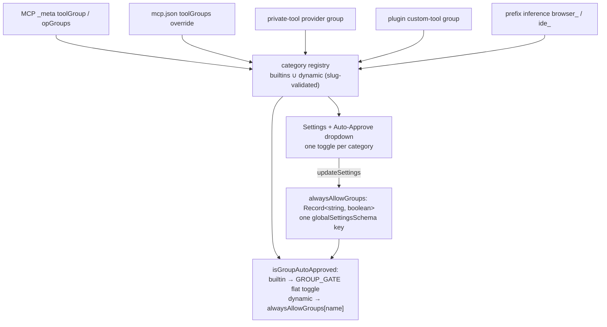

# TODO: User-defined (dynamic) tool categories

<!-- @review id=fuva3 by=human "categories": I'm thinking whether we should generalize and adopt the tagging mechanism that we already use in JustCEO for tool categories, meaning that a tool can have multiple tags (some reserved) and the UI hows them all docs/object_tags.md -->
<!-- @review id=k3nvp re=fuva3 by=agent "categories": Considered properly now (new first decision bullet). Recommendation: adopt the fabric's IDEAS, not multi-valued gating. (1) Approval over a tag SET needs a conjunction rule at every seam, which every server author must then understand; (2) the _meta shofer.dev/toolGroup key is a singular public wire contract (third-party MCP servers follow it, and the platform-side per-op derivation assumes one group per operation); (3) the two-dimension need it serves is already expressible per op via opGroups, e.g. list resolving read beside delete resolving salesforce, so read verbs ride the read toggle while the domain toggle gates mutations. Adopted from the fabric: builtins as the reserved vocabulary, meaning-lives-in-consumers, and a slug grammar that is a strict subset of the tag atom with colon excluded, so namespaced categories and a later widening to real tag sets stay open without renames. Revisit trigger: a tool needing a domain gate AND a danger gate on the same call. -->
<!-- @review id=x84fx re=fuva3 by=agent "categories": On the consistency motive specifically: the fabric's tags LABEL objects and meaning lives in the consumers, while a ToolGroup IS the gate, so matching the fabric's cardinality would change enforcement semantics rather than naming. The consistency worth having is grammar and vocabulary shape (slug as a strict subset of the tag atom, colon reserved for namespaces, builtins as the reserved set), and the design keeps exactly that. -->

Today the tool-category vocabulary is **closed**: `toolGroups` in
`packages/types/src/tool.ts` is a 9-member const enum, every schema that
mentions a group validates against it, and each group maps to a hand-wired
`alwaysAllow*` settings key with a hand-rendered UI toggle. The target state:

1. **The existing categories work as-is.** The 8 builtin groups that carry
   native tools or special semantics (`read`, `write`, `execute`, `mcp`,
   `mode`, `subtasks`, `questions`, `uncategorized`) keep their exact current
   behavior, their flat `alwaysAllow*` toggles, and their UI rows.
2. **A category is created on demand.** When a tool is registered under a
   group name that is not a builtin — an MCP server declaring
   `_meta["shofer.dev/toolGroup"]: "salesforce"`, a user `toolGroups` override
   in `mcp.json`, a private-tool provider's `group`, a plugin's custom-tool
   `group`, or a name typed into the MCP group dropdown — that name becomes a
   **dynamic category**: it is validated as a slug, registered in a runtime
   registry, and from then on behaves like a builtin for mode filtering and
   auto-approval. Previously an unknown group string was silently dropped to
   `uncategorized`; the new behavior is equally fail-closed (the new
   category's toggle defaults to absent = ask), it just stops lying about the
   category's name.
3. **UI and API support.** Every registered dynamic category appears in the
   Auto-Approve settings section and in the chat Auto-Approve dropdown with
   its own toggle. The toggle state lives in ONE new settings key,
   `alwaysAllowGroups: Record<string, boolean>`, which flows through the
   layered `.shofer/` scopes, `ContextProxy`, the `updateSettings` webview
   message, the headless posture seed, and `ExtensionState` like any other
   setting — so a controller driving the ShoferApi can read and set it.
4. **`browser` becomes the first dynamic category.** It has zero native tools
   (`TOOL_GROUPS.browser.tools` is `[]`); every browser tool arrives over MCP
   and is classified by the `browser_` prefix inference. Removing `browser`
   from the static enum and deleting the flat `alwaysAllowBrowser` key
   exercises the whole dynamic path end to end — registration, toggle
   storage, UI rendering, headless posture — using a category that already
   has real tools on real deployments.

<!-- @review id=gqgui by=human "uncategorized": but given that any unrecognized category becames a new category, then why do we need &quot;uncategorized&quot;? -->
<!-- @review id=w7dqa re=gqgui by=agent "uncategorized": It stays because it is the bucket for a tool that declares NOTHING: a dynamic category is minted from a declared NAME, and an absent _meta or config entry has no name to mint from (a non-slug string is malformed input, not a name). Its posture is also deliberately special, meaning danger-unknown: excluded from BOTH headless seeds and special-cased by the integrator's manifest review, which no ordinary category toggle should casually cover. What changes under this design is that it SHRINKS to exactly the undeclared plus the malformed, since a valid-but-unknown name no longer folds into it. Added a decision bullet stating this in the body. -->

Per the repo's no-backward-compatibility rule there is **no migration**: the
flat `alwaysAllowBrowser` key is deleted, not aliased. A stale
`alwaysAllowBrowser` in an old `settings.json` is stripped by
`globalSettingsSchema.partial()` like any unknown key. Bump the extension
**minor** version (persisted-state shape change).

## Target-state model

Design decisions, settled (do not re-litigate without a reason):

- **One group per tool, not a tag set.** The integrator platform carries a
  multi-valued object-tag fabric (one store, reserved namespaces, meaning
  lives in the consumers), and generalizing categories to tags for
  consistency with it was considered: a tool tagged `salesforce` AND `write`
  would express domain and danger at once. Rejected for now, on three
  grounds. (1) The fabric's tags LABEL objects; a ToolGroup IS a gate, so
  gating over a SET needs a conjunction rule at every seam (approval = every
  tag's gate passes; visibility = which?), and every server author must then
  understand it. (2) `_meta["shofer.dev/toolGroup"]` is a singular, public
  wire contract that third-party MCP servers already follow, and the
  integrator's per-op derivations assume one group per operation. (3) The
  two-dimension need is already expressible per operation: `opGroups` may map
  `list` → `read` beside `delete` → `salesforce`, so the read verbs ride the
  read toggle while the domain toggle gates the mutations. What IS adopted
  from the fabric: builtins as the reserved vocabulary,
  meaning-lives-in-consumers, and a slug grammar that is a strict subset of
  the fabric's tag atom with `:` excluded — so namespaced platform-stamped
  categories, and a later widening of `group` to a tag set, stay open
  without renaming anything. Revisit when a tool needs a domain gate and a
  danger gate on the SAME call.
- **`uncategorized` stays, and shrinks.** A dynamic category is minted from a
  declared NAME; a tool that declares nothing has no name to mint from, and
  a non-slug string is malformed input, not a name. Both land in
  `uncategorized`, whose posture is deliberately special — excluded from
  both headless seeds, special-cased by the integrator's manifest review —
  because it means "danger unknown", which no ordinary toggle should
  casually cover. What changes: a valid-but-unknown name no longer folds
  into it, so the bucket holds exactly the undeclared and the malformed.
- **Name validation** reuses the skill-name slug rule
  (`/^[a-z0-9]+(-[a-z0-9]+)*$/`, max 64) via a new `toolGroupNameSchema` in
  `packages/types/src/tool.ts`. A string that fails the slug rule is dropped
  to `uncategorized` exactly as unknown strings are dropped today — that path
  is the malformed-input guard and stays fail-closed.
- **`ToolGroup` widens to `string`.** Keep `BuiltinToolGroup` (the 8 literals)
  for the exhaustive records (`TOOL_GROUPS`, `GROUP_GATE`); export
  `ToolGroup = string` (optionally `BuiltinToolGroup | (string & {})` for
  editor hints). Everywhere currently typed `ToolGroup` that can carry a
  dynamic name (MCP tool metadata, mode group entries, private-tool meta)
  takes the wide type; the two exhaustive Records take `BuiltinToolGroup`.
- **Toggle shape: one record key, not synthesized flat keys.** A dynamic
  `alwaysAllow<Something>` key can never be routed — `ContextProxy` routes by
  `GLOBAL_STATE_KEYS`, `globalSettingsSchema` strips unknown keys, and
  `parseScopeSettings` silently drops them. The precedent for an open bucket
  in the schema is `pluginConfigs`. `alwaysAllowGroups` is consulted **only
  for non-builtin groups** — a builtin name inside the map is ignored, so
  each category has exactly one source of truth for its toggle.
- **Wildcard:** `alwaysAllowGroups["*"] === true` approves every dynamic
  category; an explicit per-category `false` beats the wildcard (same
  deny-by-exception shape as `allowedCommands`/`deniedCommands`). The
  wildcard exists for the unattended headless seed, whose rationale ("the
  person who typed the command is the author of that grant") covers
  categories nobody has met yet. `*` is not a valid slug, so it can never
  collide with a real category name; the UI's new-category entry refuses it
  by name rather than by accident (step 6).
- **Dynamic categories get no modifier toggles** (no outside-workspace /
  protected variants). Those modifiers are `read`/`write`-specific and
  `isPathAutoApproved` already refuses other groups.
- **No danger ordering.** The integrator-side "tool-level group is the max
  over op groups" rule is computed on the Go server side; in this repo group
  gates are independent booleans, and dynamic categories change nothing
  about that. Do not invent a `MostDangerousGroup` here.
- **Declaring a category NARROWS visibility, and that is accepted.** Today
  an unknown group string drops to `uncategorized`, so the tool is still
  visible in any mode listing `uncategorized` (`code`, `debug`). Under this
  design the tool keeps its dynamic group and is visible only in a mode that
  lists that name — declaring `salesforce` removes those tools from every
  builtin mode until a mode (or a bundle's mode) lists it. This is the same
  containment logic that keeps a `write`-level tool family out of read-only
  modes, and auto-inheriting `uncategorized` visibility would conflate
  "declared something new" with "declared nothing" — so the narrowing is
  kept, stated in `tool-categories.md` (step 7), and surfaced in the UI: a
  dynamic category's Settings row shows a hint when NO mode currently lists
  it (step 6). Side effect to note in the docs: a typo'd group name in a
  mode config used to fail schema validation loudly and now silently matches
  nothing — indistinguishable from a category whose server has not connected
  yet, which is why the surfacing is a UI hint rather than a load-time
  error. The matching itself is unchanged plain string-set matching
  (`filterMcpToolsForMode`, `filterPrivateToolsForMode`); builtin modes keep
  listing `"browser"`, now simply a dynamic name they happen to name.

## Steps

Order matters: each step builds and tests green on its own, and later steps
depend on the types the earlier ones open.

### 1. Open the vocabulary in `@shofer/types`

Files: `packages/types/src/tool.ts`, `packages/types/src/mode.ts`,
`packages/types/src/modes.ts`, `packages/types/src/shofermodes-schema.ts`,
`packages/types/src/mcp.ts`, `packages/types/src/custom-tool.ts`,
`packages/types/src/vscode-extension-host.ts`,
`packages/types/src/global-settings.ts`.

- `tool.ts`: add `toolGroupNameSchema` (slug regex above); remove `"browser"`
  from the `toolGroups` const (leaving 8 builtins); introduce
  `BuiltinToolGroup` (from the remaining enum) and widen `ToolGroup` to
  `string`; retype `TOOL_GROUPS` as `Record<BuiltinToolGroup, ToolGroupConfig>`
  and delete its empty `browser` entry. Fix the stale "8 categories" doc
  comment while there.
- `mode.ts` / `shofermodes-schema.ts`: replace every `toolGroupsSchema` arm of
  `groupEntrySchema` with `toolGroupNameSchema` (all three arms, including the
  `scopedGroupEntrySchema` refine). Plugin mode contributions
  (`plugin.ts` `pluginModeContributionSchema`) inherit this automatically —
  verify, don't duplicate.
- `modes.ts`: `getGroupName` returns `string`; `getToolsForMode` must treat a
  group with no `TOOL_GROUPS` entry as an empty native set
  (`TOOL_GROUPS[name]?.tools ?? []`) — today it throws a TypeError, protected
  only by the schema wall this step removes.
- `mcp.ts`: `McpTool.group` / `McpTool.opGroups` widen to `string`.
- `custom-tool.ts`: `CustomToolDefinition.group` widens to `string`.
- `vscode-extension-host.ts`: the `setMcpToolGroup` message's
  `toolGroup` field widens to `string | null`; remove `alwaysAllowBrowser`
  from the `ExtensionState` pick and the `GlobalSettings` key union; add
  `alwaysAllowGroups` and `dynamicToolGroups: string[]` (the registry
  snapshot, step 3) to `ExtensionState`.
- `global-settings.ts`: add
  `alwaysAllowGroups: z.record(z.string(), z.boolean()).optional()` to
  `globalSettingsSchema`; delete `alwaysAllowBrowser`; update
  `EVALS_SETTINGS` (drop `alwaysAllowBrowser`, add an explicit
  `alwaysAllowGroups` if evals need `browser`).

Unblocks everything below. Tests: type-level; update the schema tests that
assert rejection of unknown group names to assert acceptance of slugs and
rejection of non-slugs.

### 2. The settings key end to end (host)

Files: `src/core/webview/webviewMessageHandler.ts`,
`src/core/webview/ShoferProvider.ts`,
`packages/core/src/config/layered-config.ts` (per-entry merge + locks),
`packages/core/src/config/layered-settings-file.ts` (tests).

- **The write is a per-entry PATCH, never the whole effective map.** The
  record the webview displays is deep-merged across scopes (`deepMerge` in
  `layered-config.ts` recurses into plain-object values, so global, user and
  project each contribute entries); posting that whole record back through
  `updateSettings` would copy org-scope entries into the user write-scope
  file, where they would shadow the org's later changes forever. So the
  `alwaysAllowGroups` value in an `updateSettings` payload is DEFINED as a
  patch — entries to set, `null` deletes — and the handler merges it into
  the write scope's OWN map (read from that scope file), never into the
  effective view. Reads stay an ordinary `ContextProxy`-routed key.
- `ShoferProvider.getStateToPostToWebview()` / `getState()`: ship
  `alwaysAllowGroups ?? {}` (replacing the `?? false` for the deleted
  `alwaysAllowBrowser`).
- **Locking gets per-entry granularity.** `isPathLocked` today knows bare
  keys and `<namespace>/<id>` entries for the two array collections, so a
  record-valued key would be lockable only whole-map — and an org pinning
  `browser: false` would then freeze every user's unrelated category
  toggles. Extend the merge engine so `alwaysAllowGroups/<name>` locks one
  entry (the manifest grammar already has the `<namespace>/<id>` shape),
  with the bare key still locking the whole map. Note the asymmetry the
  per-entry deep merge leaves: scopes can only ADD or OVERRIDE entries, so
  an org revokes a user's grant by locking an explicit `false`, never by
  deleting the entry.
- Verify with a test that `parseScopeSettings` round-trips
  `alwaysAllowGroups` from a `.shofer/settings.json` scope (this is the path
  that silently strips unknown keys; the record is a known key so it
  survives, but pin it) and that the per-entry merge and per-entry lock
  behave as above.

Unblocks steps 4, 6, 7.

### 3. The dynamic-category registry

New module `packages/core/src/tool-groups/category-registry.ts` (singleton
re-export at the definition site, per the Singleton Re-export Rule):
`registerToolGroup(name: string)` (slug-validates, no-ops on builtins and
known names), `getDynamicToolGroups(): string[]`, and a change subscription.
Registration call sites — every place a group string enters the system:

- `packages/core/src/services/mcp/McpHub.ts`:
    - `resolveGroup` (currently `toolGroupsSchema.safeParse`, dropping unknown
      strings) → `toolGroupNameSchema.safeParse` + `registerToolGroup` on
      success. Same for `resolveOpGroups` per entry.
    - `BaseConfigSchema.toolGroups`: `z.record(toolGroupsSchema)` →
      `z.record(toolGroupNameSchema)`.
    - `setToolGroup`: `toolGroupsSchema.parse(group)` → `toolGroupNameSchema.parse(group)`
      (this is what makes a name typed into the MCP UI dropdown create a
      category).
- `packages/core/src/task/build-tools.ts`: `resolvePrivateToolGroup`'s two
  `toolGroupsSchema.options.includes(...)` guards → slug validation +
  registration. `restrictToolsToDeclaredGroups`'s fail-closed filter likewise
  accepts slugs (a task restricted to a not-yet-registered category is
  legitimate: the tools arrive when their server connects).
- `packages/core/src/custom-tools/custom-tool-registry.ts`: register
  `CustomToolDefinition.group` at registration time.
- `packages/core/src/auto-approval/tools.ts`: the `browser_` prefix inference
  keeps returning `"browser"` and registers it — but only as a LAST-RESORT
  fallback, because inference runs at approval time, and a toggle that
  appears only after the first call is attempted is a broken affordance. The
  normal birth of `browser` is DISCOVERY: the browser server's tools must
  carry the group at `tools/list`, which today they do NOT — the browser
  tools' MCP leg declares no `shofer.dev/toolGroup` `_meta` at all (verified
  2026-08-31) — so before implementing, pin down how a browser MCP call
  resolves `browser` on the `use_mcp_server` path in a real deployment (an
  `mcp.json` `toolGroups` map, or not at all). The fix is integrator-side
  (step 8): the browser tools' MCP leg declares `_meta` groups, so `browser`
  registers at connect. The `ide_` → `execute` inference is unchanged
  (`execute` stays builtin).
- **The registry also records the declared tool-name → group mapping** from
  the private-tool and custom-tool sites, and `getToolGroupForSayTool`
  consults it after `customToolRegistry` and before prefix inference. This
  closes a latent Dual-Resolution violation that dynamic categories would
  otherwise surface: `filterPrivateToolsForMode` reads a private tool's
  DECLARED group while the approval path infers by prefix only, so a
  `salesforce` private tool would be visible as salesforce yet approved as
  `uncategorized` — its toggle on, and the tool still asking.

Surface the snapshot on `ExtensionState.dynamicToolGroups` (set in step 1's
type change; populated by `ShoferProvider` from the registry, refreshed on
registry change and on MCP server connect/disconnect).

Unblocks steps 4 and 7. Tests: registration from each call site; slug
rejection; no duplicate/builtin registration; the say-path/filter-path
agreement for a declared private-tool group.

### 4. The gate: `GROUP_GATE` + `checkAutoApproval`

Files: `packages/core/src/auto-approval/group-gates.ts`,
`packages/core/src/auto-approval/index.ts`,
`packages/core/src/auto-approval/mcp.ts`,
`packages/core/src/tools/validateToolUse.ts`.

- `group-gates.ts`:
    - `AutoApprovalState` union: delete `alwaysAllowBrowser`.
    - `GROUP_GATE`: retype to `Record<BuiltinToolGroup, GroupGate>`; delete the
      `browser` entry.
    - `isGroupAutoApproved(group: string, ...)`: look up `GROUP_GATE[group]`; on
      a miss (dynamic category) the gate is
      `state.alwaysAllowGroups?.[group] === true ||
(state.alwaysAllowGroups?.[group] === undefined && state.alwaysAllowGroups?.["*"] === true)`.
      Absent = false, so an unconfigured dynamic category always asks —
      identical fail-closed posture to today's drop-to-`uncategorized`. Keep
      `applyModifiers` a no-op for dynamic groups (no modifier toggles exist
      for them).
    - The exhaustiveness test in `__tests__/group-gates.spec.ts`
      (`toolGroups.filter((g) => !(g in GROUP_GATE))`) keeps passing unchanged —
      it now also proves no dynamic name leaked into the static table.
- `index.ts` (`checkAutoApproval`): replace the closed whitelist
  `toolGroup === "browser" || toolGroup === "read" || toolGroup === "write"`
  with exactly this rule: `read`/`write` keep their modifier-bearing path
  (`applyModifiers: true`, plus the existing `batchFiles` outside-workspace
  refinement); a group with NO `GROUP_GATE` entry — a dynamic category,
  browser included — goes through the `alwaysAllowGroups` gate; and **every
  other builtin group keeps falling through to ask, unchanged**. The last
  clause is load-bearing, not an omission: the code comments that those
  groups "intentionally fall through to a user prompt", and widening them
  into the gate would change real semantics — an `execute`-resolved say tool
  (the `ide_` inference) would start auto-approving on `alwaysAllowExecute`
  ALONE, without the command-allowlist leg that toggle is documented to
  require, and an `uncategorized` say tool would start honoring
  `alwaysAllowUncategorized` on a path where it never has. Add
  `alwaysAllowGroups` to the `state` Pick surface. Delete the comment citing
  `browser` → `alwaysAllowBrowser`.
- `mcp.ts`: `getMcpToolGroup` return type widens to `string`; resolution
  order (user override → op group → tool group → `uncategorized`) unchanged.
- `validateToolUse.ts` (`isToolAllowedForMode`): `TOOL_GROUPS[groupName]` →
  tolerate unknown groups (empty native tool set), same rule as
  `getToolsForMode` in step 1.

Tests: `alwaysAllowGroups: { browser: true }` approves a `browser_navigate`
call and a `browser`-grouped MCP call; absent key asks; `"*"` approves,
explicit `false` overrides `"*"`; a builtin name in the map is ignored;
`browser` absent from `GROUP_GATE`; an `ide_`-inferred `execute` say tool
still asks under `alwaysAllowExecute: true` with an empty allowlist (the
builtin fall-through is preserved).

### 5. Headless posture (CLI)

File: `apps/cli/src/agent/approval-posture.ts` (+ its test).

- `APPROVAL_POSTURE_KEYS`: replace `alwaysAllowBrowser` with
  `alwaysAllowGroups` (the comment "This is the exact set config may take
  over" is the contract — keep it exact).
- `unattendedApprovalSeed()`: replace `alwaysAllowBrowser: true` with
  `alwaysAllowGroups: { "*": true }` — the seed's contract is "every declared
  capability", and a category first declared by a server connecting mid-run
  is exactly the case the wildcard exists for.
- `defaultApprovalSeed()` (serve): unchanged — seeds only
  `autoApprovalEnabled: false`; absent `alwaysAllowGroups` denies, which is
  the intended posture.
- `describeApprovalPosture` / `resolveApprovalPosture`: render the record
  readably in diagnostics.

### 6. Webview: toggles for categories nobody hardcoded

Files: `webview-ui/src/components/settings/AutoApproveToggle.tsx`,
`webview-ui/src/components/settings/AutoApproveSettings.tsx`,
`webview-ui/src/components/chat/AutoApproveDropdown.tsx`,
`webview-ui/src/components/settings/SettingsView.tsx`,
`webview-ui/src/context/ExtensionStateContext.tsx`,
`webview-ui/src/hooks/useAutoApprovalToggles.ts`,
`webview-ui/src/hooks/useAutoApprovalState.ts`,
`webview-ui/src/components/mcp/McpToolRow.tsx`,
`webview-ui/src/components/settings/ToolsSettings.tsx`,
`webview-ui/src/i18n/locales/en/settings.json` (+ `chat.json`; other locales
sync from en).

- `AutoApproveToggle.tsx`: keep `autoApproveSettingsConfig` for the 8 builtin
  toggles (minus browser). Export a second, data-driven renderer: for each
  name in `dynamicToolGroups` (from extension state), one toggle row reading
  `alwaysAllowGroups[name]`, writing a per-entry PATCH via `updateSettings`
  (step 2 — never the whole effective map). Labels for a dynamic category
  are NOT hand-keyed i18n entries — use a generic template
  (`settings:autoApprove.dynamic.label` / `.description` with `{{name}}`
  interpolation, e.g. "Always allow {{name}} tools"), satisfying the i18n
  String Rule without per-category keys. Fix the existing drift:
  `useAutoApprovalState`'s local interface omits `alwaysAllowUncategorized`
  — align while editing these hooks.
- `AutoApproveSettings.tsx`: render the dynamic rows as a "Custom categories"
  block after the builtin toggles; no per-category conditional sections
  (dynamics have no modifiers). A row whose category NO current mode lists
  carries the visibility hint from the design decisions ("no mode exposes
  these tools yet" — its own i18n key), computed against the mode configs
  already in extension state.
- `AutoApproveDropdown.tsx`: append dynamic categories to the list; the
  mode-group filter (`getModeAllowedGroups`) keeps working because it is
  string matching — a dynamic category shows in the dropdown exactly when the
  current mode lists it. Replace the hardcoded per-key setter switch with the
  generic record write.
- `ExtensionStateContext.tsx`: drop the `setAlwaysAllowBrowser` setter; add a
  generic `setDynamicToolGroupApproval(name, value)` that posts the
  per-entry `updateSettings` patch.
- `SettingsView.tsx`: remove `alwaysAllowBrowser` from the destructure /
  payload / props; add `alwaysAllowGroups` and `dynamicToolGroups`.
  Save-gating and change-detection specs need the new key.
- `McpToolRow.tsx`: the group dropdown offers builtin groups + registered
  dynamic categories + a free-text "new category…" entry (validated against
  the slug rule client-side, refusing `*` by name as the reserved wildcard;
  the host re-validates in `setToolGroup`). This is the UI path that CREATES
  a category.
- `ToolsSettings.tsx`: the `Record<ToolGroup, McpToolEntry[]>` reduce and the
  `for (const group of toolGroups)` section loop must iterate builtins ∪
  dynamic (from the registry snapshot) so a tool in a dynamic category gets a
  section.

Tests: `AutoApproveToggle.spec.tsx` gains dynamic-row rendering + write
tests; SettingsView change-detection/unsaved-changes specs cover
`alwaysAllowGroups`; dropdown spec covers mode filtering of a dynamic
category.

### 7. Rules and docs in this repo (same change as the code they document)

Per the Documentation Lock-Step Rule:

- `AGENTS.md` — rewrite the **Tool Group Count Coherence Rule**: the
  enumeration is no longer "exactly 9 members"; the rule becomes "8 builtins,
  fixed; new categories are dynamic and require NO coordinated change — if
  you are editing five files to add a category, you are adding a builtin,
  which needs justification". Update the Tool-Group Dual-Resolution Rule's
  prefix-inference paragraph (browser is now dynamic).
- `docs/tool-categories.md` — the primary consumer doc: the 9-category table
  becomes 8 builtins + the dynamic model; `browser` is the worked example of
  a dynamic category; the `getToolGroupForSayTool` prefix section and the
  "browser group has zero native tools" gap note are rewritten; the "Adding a
  New Extension's Tools" section now says "pick any slug — the category is
  created on first use".
- `docs/auto_approval.md` — toggles table (delete `alwaysAllowBrowser`, add
  the `alwaysAllowGroups` row explaining the record + wildcard), the
  `GROUP_GATE` table (browser row moves to the dynamic mechanism), the
  headless-seed paragraph, and the MCP per-group gate prose.
- `docs/configuration.md` — the headless-posture section's key enumeration.
- `docs/terminology.md` §10 (Tool Groups).
- `plugins/builtin-config/docs/modes.md` — the `TOOL_GROUPS` section and the
  per-mode group tables (the modes still list `browser`; what changes is what
  `browser` IS).
- `docs/adding-new-tools.md` — Step 3 (assign to a group) and Step 10
  (auto-approval): a new tool may name a new slug.
- `docs/tool_access.md` — if it enumerates groups where it describes
  `computeToolAccess`; check and sync.

### 8. Integrator follow-ups (arkware.ai parent repo — separate commit, after this lands)

The submodule is public; per the No Cross-Repo Link Rule these references are prose, not links.

- `shared/integrationmanifest/approvalposture.go`: the posture-key catalog
  and per-key guidance table enumerate `alwaysAllowBrowser`; rule 11 must
  learn `alwaysAllowGroups` (a map: recurse into it — an integration must not
  auto-approve `browser` or any other acting category, and an ABSENT key is
  reported exactly like a `true` one).
- `shared/shoferbundle/shofer-settings.schema.json`: add the
  `alwaysAllowGroups` object; delete `alwaysAllowBrowser`.
- Integration manifests declaring `alwaysAllowBrowser`
  (`integrations/gmail/integration.json`, `integrations/phone/integration.json`)
  move it to `alwaysAllowGroups: { "browser": false }` — stated, because the
  manifest is the reviewable statement and silence would read as ASK-by-
  omission either way.
- The browser tools' MCP leg declares `shofer.dev/toolGroup` (and
  `shofer.dev/opGroups` where a tool multiplexes verbs) on its tools, so
  `browser` registers at connect rather than at first approval; the
  browser-tools MCP-parity rule applies (mirror any protocol/tool change in
  the MCP leg).
- `infra/kapitan/templates/setup/63-init-l2-agent-bundle.sh.j2`: the L2
  bundle's seeded posture keys.
- Parent docs carrying the key: `docs/integrations/approvals.md`,
  `docs/integrations/model.md`, `docs/bundles/l2-agent-config-bundle.md`,
  `docs/telephony/phone_conversations.md`,
  `docs/phones/android_remote_control.md`,
  `docs/phones/skills/provision-android-operator/SKILL.md`,
  `.claude/rules/agent-tools.md` (the "write/browser/execute groups" prose),
  and `integration-tests/research/shofer-contracts.md`.

## Acceptance

- Registering an MCP server whose tool declares
  `_meta["shofer.dev/toolGroup"]: "salesforce"` (no config anywhere names
  that string) results in: a `salesforce` category in the registry, a
  `salesforce` toggle in Settings and in the chat dropdown, and a call to the
  tool asking until that toggle (or `"*"`) is on.
- `browser` works exactly as before for a user who turns its toggle on —
  including over MCP and via prefix-inferred say tools — with
  `alwaysAllowBrowser` gone from schema, seeds, UI, and docs.
- A `.shofer/settings.json` carrying `alwaysAllowGroups: { "salesforce": true }`
  survives `parseScopeSettings` and auto-approves.
- `shofer run` (unattended) auto-approves a dynamic-category tool via the
  `"*"` seed; `shofer serve` asks.
- Toggling one category writes exactly one entry into the write scope's own
  `settings.json`; entries contributed by other scopes never appear there.
- An `ide_`-inferred `execute` say tool still asks under
  `alwaysAllowExecute: true` with an empty allowlist — the builtin
  fall-through semantics are byte-for-byte what they were.
- The test gate is `pnpm` per-package: `check-types` plus the per-package
  vitest runs for `types`, `core`, `cli`, and `webview-ui` (see
  `.shofer/commands/test.md`).

## Notes

- Persisted-state shape change (new key, deleted key) → bump the extension
  **minor** version (`Y` in `X.Y.Z`); patch stays derived.
- Shofer ships in two images in the parent repo (`shofer-l2-worker`,
  `code-server`); landing step 8 requires a submodule bump there, which
  redeploys both.
- Non-goal: per-operation groups (`opGroups`) are untouched — a dynamic
  category name can appear in an `opGroups` value and registers the same way.
- Non-goal: deleting a category. A registered name lives for the session;
  stale names in `alwaysAllowGroups` are inert map entries, not an error.
